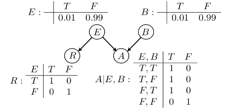
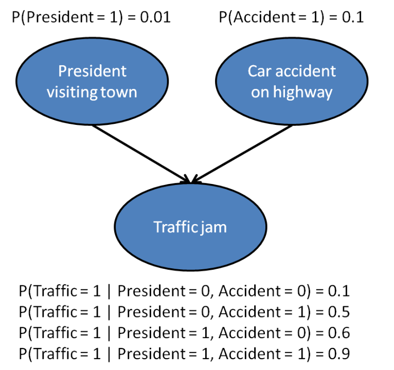

# Bayesian Networks

Bayesian networks are generative probabilities models that are developed for representing and using probabilistic information. Bayesian networks subsume mixture models, HMMs and many others.

1. Bayesian Networks are **Directed Acyclic Graphs** (DAG) over the variables. 
   - We usually generate the graph from $x_1$ first, and each node $x_i$ has a Conditional Probability Distribution $P(X_i | \arg P(X_i))$
   - If there is a directed edge from $x_1 \rightarrow$  $x_3$, then $x_1$ is a parent of $x_3$. And once we know the parents, we can write the probability distribution over all the variables with **chain rule** as

$$ P(X_1=x_1,...,X_d = x_d) = \prod_{i=1}^d P(X_i = x_i|\arg P(X_i))$$
> Cannot have cyclic graphs, as it will result in weird probabilities like $p(x_3|x_3)$. This is simply not valid!!
> Generative Models typically have DAGs.

2. The network will have the **associated probability distribution**.
   1. For each node $i$, we will attach a table of probabilities containing the combination of assignment of values that has been calculated up to node $i$. 
   2. As $i$ increases, the table of probabilities attached to node $i$ expands. 
   3. Each row in the table must add up to $1$.
   4. This is similar to $b_u(o)$.x

## Independence in Bayesian Networks

If there is a direct edge from A to B, influence can flow from X to Y regardless of whether other variables are observed. They would never be independent.

*Basic Independence Rule*

If A and B are conditionally independent,
$ P(A,B) = P(A)\cdot P(B) $
$P(A|B) = P(A)
$

To prove depedence, just show a case where $P(A|B) \not = P(A)$

### Summary: X and Z dependence

For the examples below,
-  ⚪️ refers to known variable, 
-  ⚫️ refers to unknown variable
-  $\rightarrow$: causal direction
-  $\leftarrow$: evidential direction

| Relationship                  | Y is not given                         | Y is given                             |
| ----------------------------- | -------------------------------------- | -------------------------------------- |
| X$\rightarrow$Y$\rightarrow$Z | ✔️: ⚪️$\rightarrow$⚪️ $\rightarrow$⚪️  | ❌: ⚪️ $\rightarrow$⚫️ $\rightarrow$⚪️  |
| X$\leftarrow$Y$\rightarrow$Z  | ✔️:⚪️ $\leftarrow$ ⚪️ $\rightarrow$ ⚪️ | ❌: ⚪️ $\leftarrow$ ⚫️ $\rightarrow$ ⚪️ |
| X$\rightarrow$Y$\leftarrow$Z  | ❌: ⚪️ $\rightarrow$ ⚪️ $\leftarrow$⚪️  | ✔️: ⚪️ $\rightarrow$ ⚫️ $\leftarrow$⚪️ |

> Just remember one column and you can derive the other column.

 ### Chain: X$\rightarrow$Y$\rightarrow$Z 

⚪️ $\rightarrow$⚫️ $\rightarrow$⚪️: to prove $X, Z$ are independent. (*This is hard to prove*)
$$ P(X,Z) = P(X) \cdot P(Z)  $$

⚪️$\rightarrow$⚪️ $\rightarrow$⚪️: to prove $X, Z$ are independent.

$$ 
\begin{aligned}
  P(X,Z|Y) &= P(X|Y) \cdot P(Z|Y) \\
\end{aligned}
$$

To prove that the conditional dependence of Z and Y is **not affected regardless of Y having a parent**, 
$$ P(Z|Y,X) = P(Z|Y) $$

We can calculate as follows:

$$  
\begin{aligned}
  P(X,Y,Z) &= P(X)\cdot P(Y|X) \cdot P(Z|Y) \\
  P(Z|Y,X) &= \frac{P(X,Y,Z)}{P(X,Y)} \\
  &= \frac{P(X)\cdot P(Y|X) \cdot P(Z|Y)}{P(X,Y)} \\
  &= \frac{P(X)\cdot P(Y|X) \cdot P(Z|Y)}{P(X) \cdot P(Y|X)} \\
  &= P(Z|Y) \\
\end{aligned}
$$

- Hence, Y is known as an **open gate**.

### Common Parent (Common Cause)

$Y$ has a directed edge to both $X,Z$

- ⚪️ $\leftarrow$ ⚫️ $\rightarrow$ ⚪️: we **cannot** prove that $X,Z$ are independent.

- ⚪️ $\leftarrow$ ⚪️ $\rightarrow$ ⚪️: : $X,Z$ are independent.

- Here, Y is an **open gate**.

### Common Child (Explaining Away)
> Explaining away is a common pattern of reasoning in which the confirmation of one cause of an observed or believed event **reduces the need to invoke alternative causes**. The opposite of explaining away also can occur, where the confirmation of one cause increases belief in another

Both $X,Z$ have a directed edge to $Y$

- ⚪️ $\rightarrow$ ⚫️ $\leftarrow$⚪️ : $X,Z$ are independent.

- ⚪️ $\rightarrow$ ⚪️ $\leftarrow$⚪️:  $X,Z$ are not independent.

- Hence, Y is a **open gate**.

### Examples

#### Earthquake + Burglary

Here, $E$ and $B$ have a common child $A$, and $E$ is the common parent of $R$ and $A$.

$$
\begin{aligned}
  P(B=T|A=T) &= \frac{P(B=T,A=T)}{\sum_{b\in\{T,F\}}P(B=b,A=T)} \\
  &= 0.5025\\
  P(B=b, A=T, E=T) &= P(E=T) \cdot P(A=T | E=T, B=T) \\
  &= 0.99 \cdot 0.01 \cdot 1 \\
  P(B=b |A=T, E=T) &= \frac{P(B=b, A=T,E=T)}{P(A=T,E=T)}\\
  &= \frac{0.01 \cdot 0.01}{0.99\cdot 0.01 + 0.01\cdot 0.01} \\
  &= 0.01 \\
\end{aligned}
$$

$P(B=T |A=T) \not ={P(B=T|A=T,E=T)} \Rightarrow \textbf{Conclusion: } \text{B and E are not independent given A}$

#### President and Traffic Accident

|             | President = 0, Accident = 0 | President = 1, Accident = 0 | President = 0, Accident = 1 | President = 1, Accident = 1 |
| ----------- | --------------------------- | --------------------------- | --------------------------- | --------------------------- |
| Traffic = 1 | 0.1                         | 0.6                         | 0.5                         | 0.9                         |
| Traffic = 0 | 0.9                         | 0.4                         | 0.5                         | 0.1                         |

## Bayes Ball Algorithm

As long we can find a path to connect $X$ and $Y$ that are open gates, we can conclude $X$ and $Y$ are dependent.

### Markov Net

A Markov Net comprises of a particular node $x_i$'s parents, coparents and children. Node $x_i$ is independent of all other nodes outside this markov net.

## Bayesian Information Criterion (BIC)

BIC is a model selection criterion for comparing 2 different Bayesian networks, where
- $dim(G) =$ the number of independent parameters in the model
- $m =$ the number of data points in the training set
- $r_j \forall j\in pa_i =$ the size of the probability table $\theta_i(x_i|\textbf{x}_{pa_i}) - \text{the number of associated normalization constraints}$
$$ 
BIC(D;\theta,G) = l(D;\theta,G) - \frac{dim(G)}{2} \log(m)
$$

We then  search for the graph $G$ that **maximizes** $BIC(D;\theta,G)$.

1. With the complete data, find conditional estimates for each variable  and the parent selection scores for each variable
$$\theta_i(x_i|x_{pa_i}) , score(i|pa_i;D)$$
2. Find the decomposable scoring function for graphs
$$ score(G;D) = \sum_{i=1}^d score(i|pa_i,D) $$
3. Find highest scoring **acylic** graph

$$\argmax_G score(G;D) $$