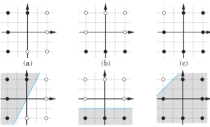
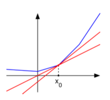

# Linear Classification 

A classifier *h* partitions space into decision regions that are separated by decision boundaries. In each region, all the points map to the same label. For linear classifiers, these regions are half spaces.

A linear classifier *h* takes the following form

$$ h(x;\theta) = sign(\theta^Tx) = to add  $$

## Algorithms

### Perceptron Update Rule (Mistake-Driven Updates)

**Theorem**

The perceptron update rule converges after a finite number of mistakes when the training examples are linearly separable through origin. This implies that zero training error can be achieved using perceptron update rule for linearly separable training examples.

> The algorithm will not converge for non-linearly separable data! Refer to [SGD](#stochastic-sub-gradient-descent) instead for such data.

#### How it works

Initialize weight $\theta = 0$. For each training sample $t$ in $S_n$, classify the instance with **mistake driven updates**. The Perceptron Update Rule will terminate when:
- Training error is 0 (Realizable)
- Predetermined number of iterations is completed (Non-realizable)

A mistaken is recognized with the following condition and the weight is updated as such:
$$\begin{aligned}
    \text{Mistake Condition : }  &y^t(\theta\cdot x^t) \leq 0 \\
    \text{Update Rule : } &\theta^{(k+1)} = \theta^{(k+1)} = y^{(t)}x^{(t)}
\end{aligned}$$

$y^t(\theta\cdot x^t)$ then becomes more positive and eventually becomes $> 0$ (Realizable). If the prediction is correct, continue.

#### Offset
- Set default prediction to +1/-1.
- The hyper-plane $\theta\cdot x + \theta_0$ is parallel to $\theta\cdot x = 0$.
- $\theta$ is still orthogonal to the decision boundary
- For training examples that are linearly separable through origin, they would also be linearly separable with offset. However, the converse is not true.
  

### Gradient Descent

Instead of checking if the value is classified wrongly, gradient descent aims to minimize the loss $R_n(\theta)$. 

$$ \nabla_\theta R_n(\theta) =\frac{1}{n} \sum_{t=1}^n max\{1 - y^{(t)} (\theta\cdot x^{(t)}), 0 \}  $$

We minimize the loss by finding $\nabla_\theta R_n(\theta)$. 

$$ 
\begin{aligned}
\nabla_\theta R_n(\theta) =& \nabla_\theta Loss_h(y^{(t)}\theta\cdot x^{(t)}) \\
 =& \nabla_\theta(1-y^{(t)}\theta\cdot x^{(t)}) \\
=& -y^{(t)}x^{(t)}
\end{aligned} $$

For values that are classified wrongly, the gradient will point in the direction where the error $R_n(\theta)$ increases, so we update the weight in the opposite direction and *descend* from the point accordingly. We will also add a learning rate $\alpha$ to control *the rate of descent*.

Thus the weight will be updated as such
$$ 
\begin{aligned}
\theta^{(k+1)} = & \theta^{(k)} - \alpha_k\nabla_\theta R_n(\theta)_{\theta=\theta^{(k)}} \\
\theta^{(k+1)} = & \theta^{(k)} + \alpha_k y^{(t)}x^{(t)}
\end{aligned} 
$$

**Limitations**

- However, $R_n(\theta)$ is not differentiable everywhere as hinge loss functions are piece-wise linear.
- There are several possible gradients at the kinks, which are collectively defined as sub-differential.
- To minimize $R_n(\theta)$, we randomly select one possible gradient. 

If there are many training examples, it is better to use Stochastic Gradient Descent (SGD). 

### Stochastic (Sub)-Gradient Descent

- random sample avoid oscillations
- keep track of best solution (the weights where the loss is minimum).
- near mistakes are penalized
- decreasing learning rate, for smaller updates, $\alpha_k = 1/(k+1)$

#### How it works
1. Initialize weight $\theta$ = 0
2. Select random data point, *t*.
3. If $y^{(t)}\theta^{(k)} \cdot x^{(t)} \leq 1$ then update weight.
4. Repeat steps 2-3 until stopping criterion is met.

### Closed Form Solution

Using least squares criterion, we can also minimize empirical risk directly by setting gradient to zero.

$$ 
\begin{aligned}
\nabla_\theta R_n(\theta) &= -b + A\theta 
\end{aligned}
$$
$$ 
\begin{aligned}
\text{where } &b = \frac{1}{n}\sum_{t=1}^n y^{(t)}x^{(t)} = \frac{1}{n}X^TY \\ 
    & A = \frac{1}{n}\sum_{t=1}^n x^{(t)}\cdot (x^{(t)})^T = \frac{1}{n}X^TX
\end{aligned}
$$

**If A is invertible**, we can find the weight directly
$$ 
\begin{aligned}
    
\theta &= A^{-1}b \\
&= (\frac{1}{n}X^TX)^{-1}(\frac{1}{n}X^T\vec{y})
\end{aligned}
 $$

- Note the cost of inverting matrix $A$ is usually $O(d^3)$ for normal gradient descent.

**If A is not invertible**, the training data will not be able to guide the model on setting parameter directions. Hence, we can choose to modify the estimation criterion, the mean squared error in this case, by adding a regularizatioon term. The regularization term $\lambda$ shifts emphasis away from the training data.
- Larger values of $\lambda$ will result in larger training error, but lower generalization error $J_n(\theta)$ as we are less swayed by noisy data. So, it is harder to over-fit to training data.
- But as $\lambda$ increases too much, it will bias the parameters too strongly towards zero.

Let's choose $||\theta||^2/2$ as the penalty for easier solvability. This means that we will aim to minimize

$$ J_{n,\lambda} = \frac{\lambda}{2}||\theta||^2 + R_n(\theta)$$
This is known as Ridge Regression.

### Ridge Regression

#### Using Gradient Descent
Using GD/SGD for learning parameters in this technique, the weight will be updated as such

$$ \theta^{k+1} = (1-\lambda\alpha_k)\theta^{k} + \alpha_k(y^{(t)} - \theta\cdot x^{(t)})x^{(t)} $$

The new factor $(1-\lambda\alpha_k)$ helps to shrink the parameters $\theta^{(k)}$ towards zero during each update.
Without regularization i.e. $\lambda = 0$, it will look the same as the original gradient descent.

#### Closed Form Solution

The regularization term only modifies the matrix $A = \lambda I + (1/n)X^TX$, where $I$ is the identity matrix. 
$$ 
\theta =  (n\lambda I + X^TX)^{-1} X^TY
$$
The identity matrix is always invertible if $\lambda$ > 0.