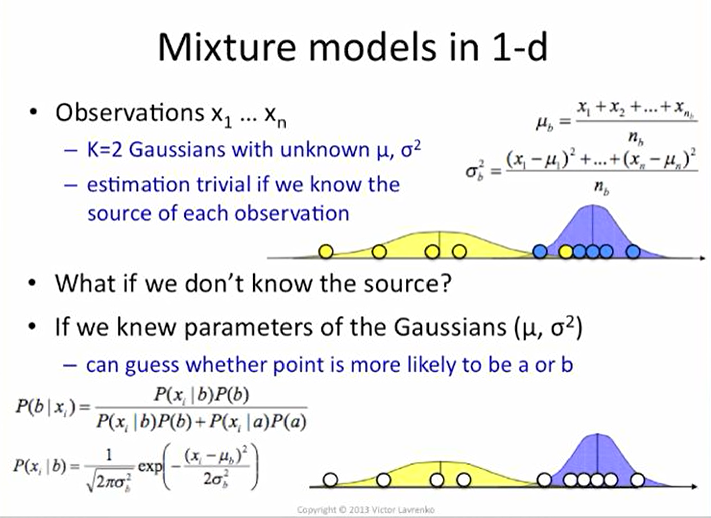
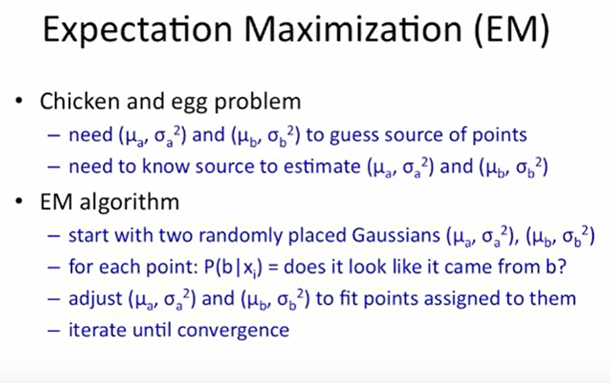

# Mixture Models and Expectation Maximization

## Spherical Gaussian

Spherical Gaussian Distribution is a simple spherically symmetric distribution around the centroid/mean $\mu$. 

Given:
- $x$: Point
- $\mu$: Mean
- $\sigma$: Variance
- $d$: Dimension

The distribution can be represented by a circle centered at mean $\mu$ with radius $\sigma$.
We can generate points from the following spherical Gaussian Distribution, each with a **likelihood** of

$$ 
\begin{aligned}
P (x|\mu, \sigma^2) &= N(x;\mu,\sigma^2I) 
&= \frac{1}{(2\pi\sigma^2)^{d/2}}exp(-\frac{1}{2\sigma^2}||x-\mu||^2)
\end{aligned}
$$

The probability of generating points away from the mean $\mu$ decreases as they get further away regardless of direction.

**Overall Objective Function** 

We try to find the best Gaussian that fits the data with the criterion of maximum likelihood (ML). The likelihood of the training data is calculated as follows

$$
\begin{aligned}
  \ell(S_n|\mu, \sigma^2) &= \prod_{t=1}^n p(x^{(t)}|\mu,\sigma^2)\\
  &= \sum_{t=1}^n \log p(x^{(t)} | \mu,\sigma^2) \\
&= \sum_{t=1}^n [-\frac{d}{2}\log(2\pi\sigma^2) - \frac{1}{2\sigma^2}||x^{(t)} - \mu||^2] \\
&= -\frac{dn}{2}\log(2\pi\sigma^2) - \frac{1}{2\sigma^2} \sum_{t=1}^n ||x^{(t)} - \mu||^2 \\
\end{aligned}
$$

To minimize this function and the corresponding Maximum Likelihood Estimators, we find the gradients respective to the parameters $\mu, \sigma^2$ and equate them to 0. 

$$ \frac{\partial\ell(S_n|\mu,\sigma^2)}{\partial\mu} = 0 $$
$$ \frac{\partial\ell(S_n|\mu,\sigma^2)}{\partial\sigma^2} = 0 $$

Deriving maximum likelihood estiamtor $\hat{\mu}$
$$ 
\begin{aligned}
  \frac{\partial\ell(S_n|\mu,\sigma^2)}{\partial\mu} &= -\frac{1}{2\sigma^2} \cdot 2 \cdot \sum_{t=1}^n \vec{\mu} - \vec{x}^{(t)} \\
  &= \vec{0}
\end{aligned}
$$

$$
\vec{\mu} = \frac{1}{n}\sum_{t=1}^n \vec{x}^{(t)}
$$

Deriving maximum likelihood estiamtor $\hat{\sigma^2}$

$$ 
\begin{aligned}
  &\frac{\partial\ell(S_n|\mu,\sigma^2)}{\partial\sigma^2} &= 
  -\frac{dn}{2}\cdot\frac{1}{\sigma^2}\cdot 2\pi - \frac{1}{2\sigma^4}\sum_{t=1}^n||x^{(t)} - \mu||^2 \\
\end{aligned}
$$
$$
\begin{aligned}
  \frac{dn}{2}\cdot\frac{1}{\sigma^2} &= \frac{1}{2\sigma^4}\sum_{t=1}^n||x^{(t)} - \mu||^2 \\
  dn &= \frac{1}{\sigma^2}\sum_{t=1}^n||x^{(t)} - \mu||^2 \\
  \sigma^2 &= \frac{1}{dn} \sum_{t=1}^n||x^{(t)} - \mu||^2
\end{aligned}  
$$

## Mixture of Gaussians

When the data are best described by multiply clusters instead of one, we need to specify multiple Gaussians, each for one cluster. 
Assuming $k$ clusters is optimal for describing the data, 

$$ P(x|\mu^{(i)}, \sigma_i^2), \text{for } i = 1,...,k $$

But we don't have the respective $\mu^{(i)}, \sigma_i^2$, so we have to  we have to somehow evaluate the probability each data point $x$ could come as sample from our mixture model, and adjust the model parameters so as to increase this probability. Each $x$ could be generated from any cluster, just with different probabilities.

For easier representation, we let $\theta$ specify all parameters for the mixture model

$$ \theta = \{\mu^{(1)},...\mu^{(k)}, \sigma^2_1,...,\sigma^2_k, p_1,...p_k \} $$

where $p_1...p_k$ specify the frequency of points we would expect to see in each cluster.

### Labeled Case

If data points are already labeled (assigned to a single cluster), we could estimate the Gaussian models same as before, and even evaluate the cluster sizes based on the actual number of points. 

Let $\delta(i|t)$ be an indicator that tells us whether $x^{(t)}$ should be assigned to cluster $i$. 

- $\delta(i|t) = 1$, if $x^{(t)}$ is assigned to $i$
- $\delta(i|t) = 0$, otherwise

**Maximum Likelihood Objective**
$$ \sum_{t=1}^n[\sum_{i=1}^k \delta(i|t)\log(p_i\cdot p(x^{(t)}|\mu^{i}, \sigma^2_i)] $$

Here, the inner summation selects the Gaussian that we should use to generate the corresponding data point consistent with the assignments. 

We can exchange the summations to demonstrate that the Gaussians can be solved separately from each other. The terms inside the bracket now represents the objective for all points in $i$-th cluster.

$$ \sum_{i=1}^k[\sum_{t=1}^n \delta(i|t)\log(p_i\cdot p(x^{(t)}|\mu^{i}, \sigma^2_i)] $$

Updating Model Parameters
$$
\begin{aligned}
  \text{number of points assigned to cluster i: } & & \hat{n}_i &= \sum_{t=1}^n \delta(i|t) \\
  \text{fraction of points in cluster i: } & & \hat{p_i} &= \frac{\hat{n_i}}{n} \\
  \text{mean of points in cluster i: } & & \hat{\mu}^{(t)} &= \frac{1}{n}\sum_{t=1}^n \delta(i|t)x^{(t)} \\
  \text{mean squared spread in cluster i: } & & \hat{\sigma^2}_i &= \frac{1}{d\hat{n_i}}\sum_{t=1}^n \delta(i|t)||x^{(t)}-\hat{\mu}^{(i)}||^2 \\
\end{aligned}
$$

### Unlabeled Case

Now $\delta(i|t)$ is not given, but we can apply the EM-algorithm to derive the respective $\delta(i|t)$.

## Estimating Mixtures: the EM-Algorithm

We  can use an iterative algorithm known as Expectation Maximization algorithm.

Here are some relevant slides from [a good video series by Victor Lavrenko](https://www.youtube.com/watch?v=REypj2sy_5U&list=PLBv09BD7ez_4e9LtmK626Evn1ion6ynrt) on EM that I recommend you to watch

### EM Algorithm Process

1. **Initialization**: Randomly initialize model parameters $p_i,\mu^{(i)},\delta_i^2$
2. **Expectation** + Evaluation(Testing): Find new assignments of $p(i|t)$ 
3. **Maximization** + Parameter Estimation (Supervised Learning): Update model parameters $p_i,\mu^{(i)},\sigma_i^2$

We now substitute  $\delta(i|t)$ with $p(i|t)$, the probability that $x^{(t)}$ is assigned to $i$. 

$$\sum_i^k p(i|t) = 1$$

$$ \sum_{i=1}^k[\sum_{t=1}^n p(i|t)\log(p_i\cdot p(x^{(t)}|\mu^{i}, \sigma^2_i)] $$

This simple algorithm is guaranteed to monotonically increase the log-likelihood of the data under the mixture model (cf. k-means). Just as in k-means, however, it may only find a locally optimal solution.