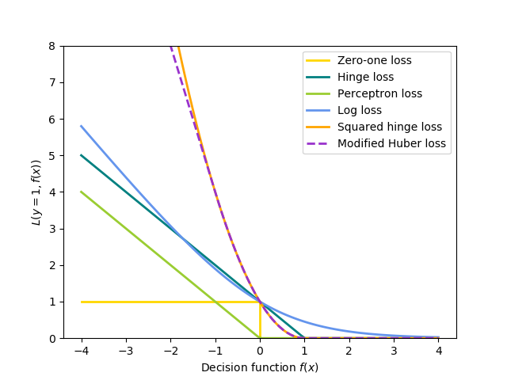

# Machine Learning Revision <!-- omit in toc -->

Table of Contents

- [Intro to Machine Learning](IntroToML.md)
- [Linear Classification](LinearClassification.md)
- [Logistic Regression](LogisticRegression.md)
- [Clustering](Clustering.md)
- [SVM](SVM.md)
- [Mixture Models](MixtureModels.md)
- [Hidden Markov Models](HiddenMarkovModel.md)
- [Forward Backward Algorithm](FowardBackwardAlgorithm.md)
- [Bayesian Networks](BayesianNetworks.md)
- [Reinforcement Learning](ReinforcementLearning.md)
- :bulb: [Finals Cheatsheet](final_cheatsheet.pdf)

> :warning: Beware notes for these concepts were **not written**, as I felt that they were pretty self-explanative when you learn them.
>- Neural Networks 
>- Generative Models

Below are some basic background info for Machine Learning.
- [What is Machine Learning](#what-is-machine-learning)
- [Recap on Convex Functions](#recap-on-convex-functions)
- [Empirical Risk](#empirical-risk)
- [Loss Functions](#loss-functions)
- [Types of Machine Learning](#types-of-machine-learning)

## What is Machine Learning

Machine learning revolves around **models**, which are trained via certain **techniques** and **learning algorithms** that are based on specific **loss functions**. They produce outputs based on **predictor functions**.

## Recap on Convex Functions 

 A convex function typically has a U-shape (there are boundary cases where the surface can be flat, though. In that case the function is both convex and concave). 

Properties: 
- $\frac{f(x_1)+f(x_2)}{2} ≥ f(\frac{x_1+x_2}{2})$
- Its local optimum is also a global optimum. 
- Sum of convex functions is also convex.

Some examples:
- $f(x) = (x-1)^2 $
- $f(x) = max(x^2, 2^x)$
- $f(x) = |x| - x$

The convexity of empirical risk allows us to find the minimum even in non-realizable case.

## Empirical Risk

Defined as the average loss on the training examples. 
$$ R_n(\theta) = \frac{1}{n} \sum_{t=1}^n Loss_h(y^{(t)}\theta\cdot x^{(t)}) $$

## Loss Functions

| Loss function                    | $Loss_h(z)$       |
| -------------------------------- | ----------------- |
| Squared Euclidean/ Least Squares | $\frac{1}{2}z^2$  |
| Zero-one loss                    |                   |
| Hinge Loss                       | $max\{ 1-z , 0\}$ |

## Types of Machine Learning

> Notice the resemblance in the problems from each category of tasks

Supervised Tasks
- Classification $f: R^n \rightarrow \{ 1...k \}$
  - LR,SVM, Perceptron NB
- Regression: $f: R^n \rightarrow R^m$
  - Ridge Regression, Logistic Regression
- Structured Prediction: $f: S_1 \rightarrow S_2$ where $\text{size}(S_1) >\text{size}(S_2)$ 
  - HMM, CRF, Structured Perceptron, Structural SVM

Unsupervised Tasks
- Clustering: $f: R^n \rightarrow \{ 1...k \}$
  - K-means, EM
- Dimensionality Reduction: $f: R^n \rightarrow R^m$
  - PCA, LDA, Autoencoder
- Structured Prediction: $f: S_1 \rightarrow S_2$
  - Unsupervised HMM