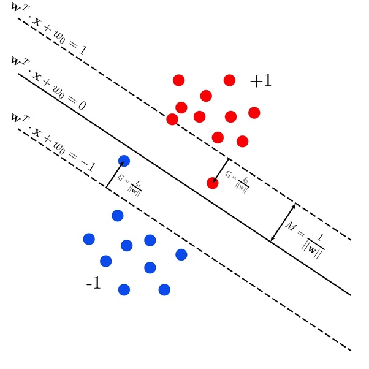

# SVMs

## Adding Slack Variables

Sometimes we get data which has two classes that are mostly separated except some small training data where the two categories overlap. In such cases, we would like to allow some points to intentionally be misclassified so as classify the rest correctly. 

To do so, for each training data point we can define a variable that measures the distance of the point to its marginal hyperplane, $\xi_t$, in terms ofthe hinge loss function.

$$
\begin{aligned}
\xi_t &= Loss_h(y^{(t)}(\theta\cdot x^{(t)} + \theta_0))\\ 
&= max\{1-y^{(t)}(\theta\cdot x^{(t)}),0 \} 
\end{aligned}
$$

We can define a separating hyperplane by minimizing such errors $\xi_i$

$$ \min_{\theta,\theta_0,\xi} \{ \sum_{i=1}^N \xi_i \} $$

Each individual training point has a different but parallel marginal hyperplane.

$$ 
\begin{aligned}
\theta\cdot x + \theta_0 \geq 1 - \xi_i & \text{if } y_i = +1 \\
\theta\cdot x + \theta_0 \leq -1 + \xi_i & \text{if } y_i = -1
\end{aligned}
$$

Combining these 2 equations we yield a single equation for the constraint of primal problem.
$$ y^{(i)}(\theta\cdot x^{(i)} + \theta_0) \geq 1 -\xi_i $$

### Updated Primal Problem
$$ \min \frac{\lambda}{2}||\theta||^2 + \sum_{t=1}^n \xi_t$$ 

$$
\begin{aligned}  
\text{such that } y^{(i)}(\theta\cdot x^{(i)} + \theta_0) \geq 1 -\xi_i,& \\
\xi\geq 0, &\\
t=1...n &
\end{aligned}
$$

Here, the slack variables are simply encoding the **hinge loss in the primal formulation.**

### Updated Dual Formulation

The Dual Problem remains the same, except that we limit how large the Langrange multipliers $\alpha_t$ can become. 

- Also the larger the value of $\lambda$ (the more we want to expand the margin at the expense of the constraints), the smaller the resulting $\alpha_t$ must be.

$$ \max \sum_{i=1}^n \alpha_t - \frac{1}{2} \sum_{i=1}^n\sum_{j=1}^n \alpha_i \alpha_j y^{(i)}y^{(j)}(x^{(i)}) $$

$$ \text{subject to } 0 \leq \alpha_t \leq 1/\lambda, \sum_{i=1}^n \alpha_i y^{(i)} = 0 $$

### Complementary slackness constraints

$$ 
\begin{aligned}
&\hat{\alpha}_i = 0 \rightarrow \text{non-support vectors: } &y^{(i)} (\sum_{j=1}^n \hat{\alpha}_j y^{(j)}(x^{(j)} \cdot x^{(i)}) + \hat{\theta}_0) \geq 1 \\
&\hat{\alpha}_i \Subset (0,1/\lambda) \rightarrow \text{support vectors: } &y^{(i)} (\sum_{j=1}^n \hat{\alpha}_j y^{(j)}(x^{(j)} \cdot x^{(i)}) + \hat{\theta}_0) = 1 \\
&\hat{\alpha}_i = 1/\lambda \rightarrow \text{margin violations: } &y^{(i)} (\sum_{j=1}^n \hat{\alpha}_j y^{(j)}(x^{(j)} \cdot x^{(i)}) + \hat{\theta}_0) \leq 1
\end{aligned}
$$

We can use $\alpha_i$ that lies in the interior of possible values to reconstruct $\hat{\theta}_0$