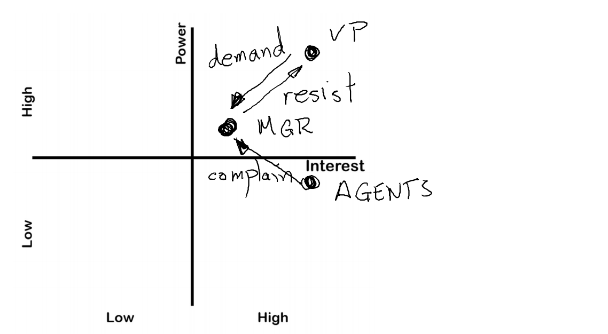
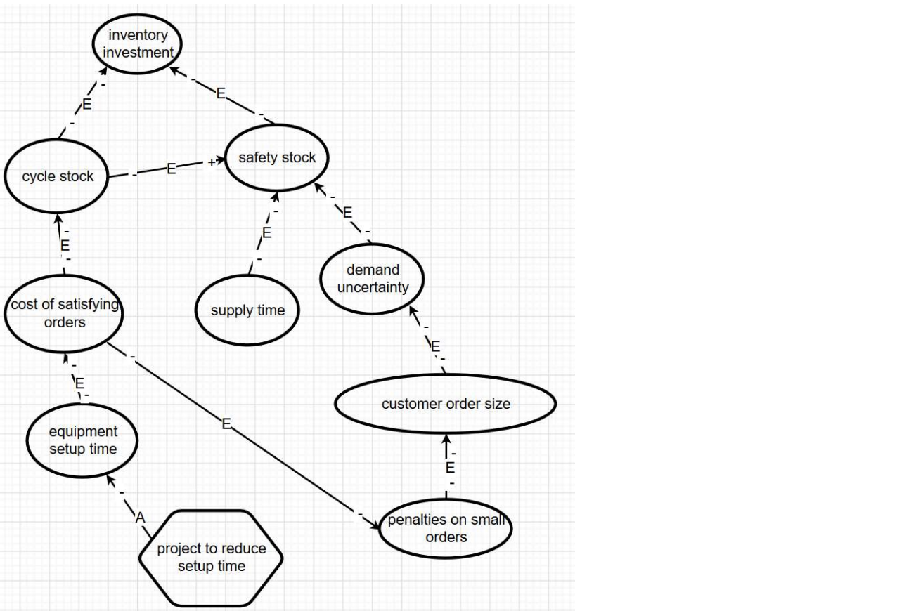
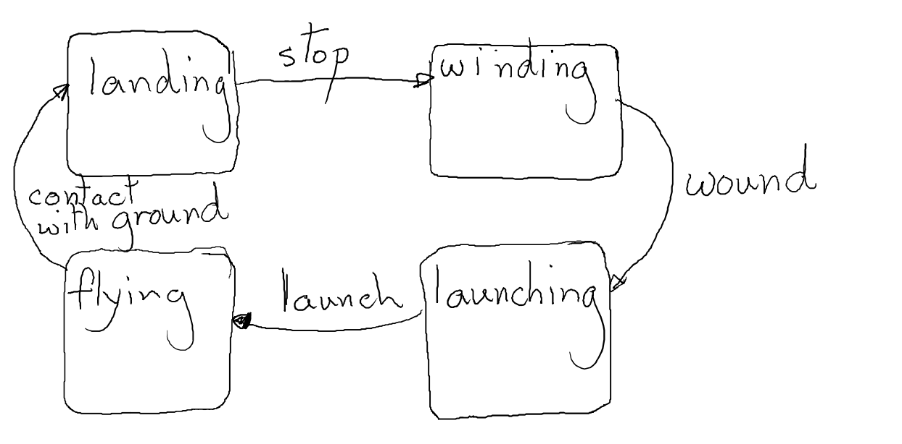

# Midterms revision

I am here studying the exam paper. Some instructions may not be present in the midterms but are still expected to be followed.

Bring a ruler to improve your quality of life.

### Architectural design concepts

- Modularity, Operational Analysis, Scenario Analysis, Structural Design, Operational Analysis, Concept Generation, Problem and Mission Statements, Use Cases
- Use common sense

### Identifying Stakeholders

- Your power-interest diagram require annotated arrows.

- One table explains the position of the power and interest in the diagram.
- One table explains the relationship between the different stakeholders. You only need to fill up cells with a relationship.

### Influence Diagrams

-  Sketch this argument using the Design Research Methodology notation. In particular, each arc should have two signs (either “+” or “-“), one at the tail end of the arc and the other at the head of the arc. Label each arc as “E”, for “Experience” or “A” for “Assumption”. 
- Points will be deducted if you use the words "increase" or "decrease" within a bubble - this information belongs on the arcs.
- Your proposal should be in the shape of a hexagon.

### Architectural DSM

- Rearrange rows and columns such that the "loss" is minimum. "Loss" is the distance of ones from the diagonal.
- You can sketch the relationships as a graph.

### Modularity

- Identify six functions
- Identify three subsystems
- Assign functions to the subsystems
- List the exchanges on a table "Exchange", "From Entity", "To Entity"
- Sketch a state change diagram for a typical cycle of events

### Trade Studies

- You need to draw a table.
- Headings: Attribute List, Relative Weighting, A Rating, A Weighted Rating, B Rating, B Weighted Rating.
- Summaries (after attribute list): Total, Rank, Recommend

