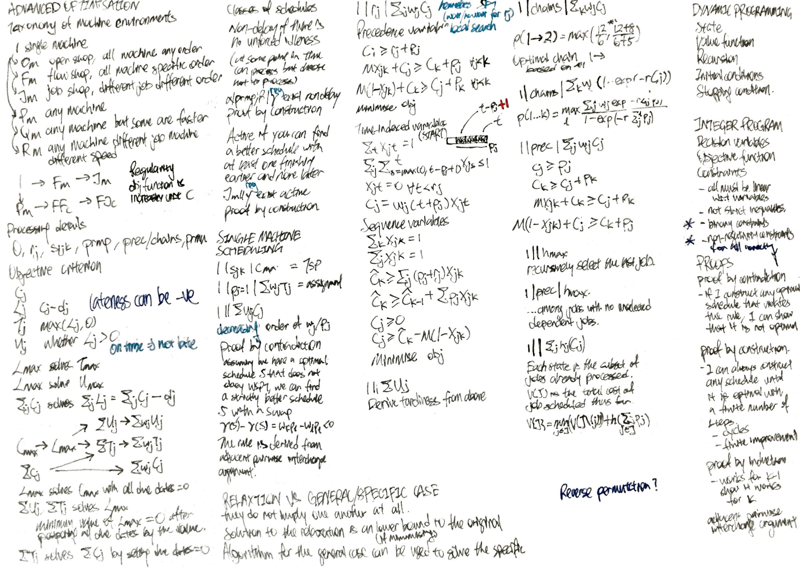
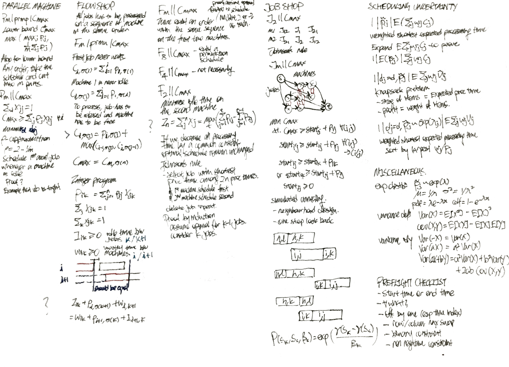
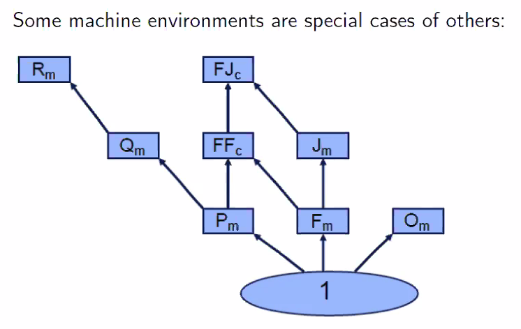
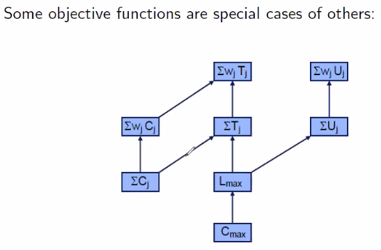
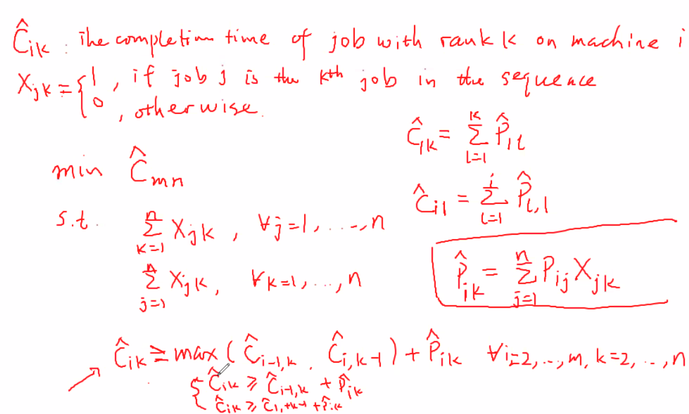
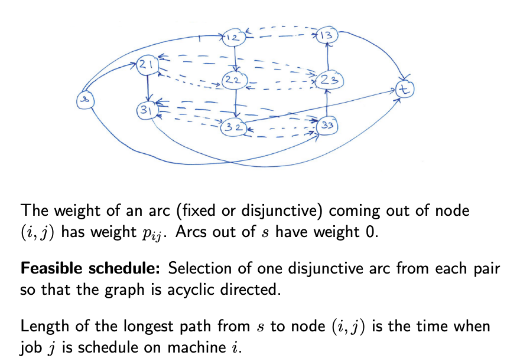
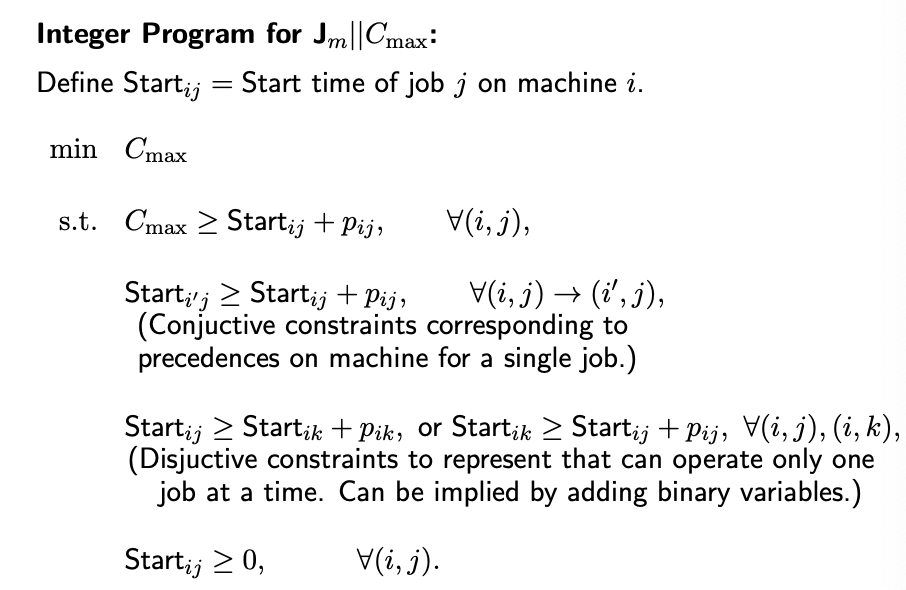

# Advanced Optimisation

* auto-gen TOC:
{:toc}

## Cheatsheet

## Scheduling Problem

Deals with distributing a set of jobs to machines over time subject to constraints with an objective one or more criterion.

- Each machine can process at most one job at a time
- Each job can be processed at most one machine at a time

Elements of a scheduling problem (and examples)

- Machines - Factory machines, CPUs, healthcare providers
- Jobs - Operations in a production process, computation programs, patients in a hospital
- Objectives - Minimising last completion time, maximise number of tasks completed on time, minimize waiting time, minimise energy

Sysmatic Description of the Scheduling Problem

- $\alpha$ - Machine environment
- $\beta$ - Constraints, processing, characteristics
- $\gamma$ - Objective (to be maximised)

Characteristics of jobs

- Set of machines $M = \{i\}$
- Set of jobs $N = \{j\}$
- Processing time $p_{ij}$
  - Processing time of job $j$ on machine $i$
  - Could be the same for all machines
- Release time $r_j$
  - Earliest startng time for job $j$
- Due date $d_j$
  - Completion after the due date incurs a penalty
- Deadline $\bar{d}_j$
  - Completion after the deadline is not allowed
- Weight $w_j$
  - Indicating the importance of job $j$

#### Machine Environment $\alpha$

 Symbol | Description                                                  
 ------ | ------------------------------------------------------------ 
 $1$    | All jobs need to be served once by single machine.           
 $P_m$  | Each job needs to be served by any of the machines.          
 $Q_m$  | Each job needs to be served by any of the machines. A machine may be faster, and is faster at processing at all of the jobs. 
 $R_m$  | Each job needs to be served by any of the machines. Each machine may process each job at a different speed. 
 $F_m$  | Each job needs to be served by all of the machines, in a specific order. 
 $FF_c$ | $F_m$ but stages may be served by any of many machines of the same stage. 
 $J_m$  | Each job needs served by specific order of the machines, which may be different and may have duplicates (recirculation). (to confirm) 
 $FJ_c$ | $J_m$ but stages may be served by any multiple machines.     
 $O_m$  | Each job needs to be served by any of many machines of the same stage. 

- Taxonomy of machine environments

- If you have an algorithm to solve the general problem, you can solve the specific problem with the same algorithm.
- The above should be true regardless of other environment ($\alpha | \beta | \gamma$)
- Both solutions should have the same optimal solution.
- Problems may be a relaxation of one another, but this does not mean either problem is a general solution of the other.

Why is $F_m$ not a special case of $O_m$

- You cannot use the algorithm for $F_m$ to solve $O_m$, because you need a specify a sequence for $F_m$
- A solution for $F_m$ is a feasible for solution for $O_m$. $O_m$ is a relaxation for $F_m$

#### Processing details and constraints $\beta$

$0$ Jobs only have processing times (which is present in all scheduling problems)

$r_j$ Release dates are given, Due dates are defined in the objective criterion.

$s_{ijk}$ Setup time between job $i$ and job $k$ (on machine $i$). If the setup time between all pairs of jobs all the same, you can incorporate the setup time in the processing time.

$\text{prmp}$ Preemption is allowed. It is possible to interupt the processing of a job on a machine at any point in time and process a different job. When the job is put back later, the machine needs to only spend the remaining processing time. This is defined to not have setup time. This is not a general case of $0$.

$\text{prec}$ Precedence constraints - One or more jobs have to be completed before a job can be started. The precedence constraints can be represented in a directed graph. The directed graph must be acyclic for the problem to have a feasible solution.
- $\text{chains}$ if each connected component is a line

#### Objective criterion $\gamma$

Terminologies

- $C_j$ Completion time of job $j$
- $L_j = C_j - d_j$ Lateness of job $j$, can be zero or negative
- $T_j = \max(L_j,0)$ Tardiness of job $j$ which can only be non-negative
- $U_j$ unit penalty of job $j$, one if completed after the due date.

$C_{max} = \max\{C_1, ..., C_n\}$ Make span

$L_{max} = \max\{L_1,...,L_n\}$ Maximum lateness

$\sum_j C_j$ Sum of completion times

$\sum_j T_j$ Total tardiness

$\sum_j U_j$ Number of tardy jobs

$\sum_j w_j C_j$ Total weighted completion time

$\sum_j w_j T_j$ Total weighted tardiness

$\sum_j w_j U_j$ Weighted number of tardy jobs

 Objective \ Variable | $C_j$ | $L_j$ | $T_j$ | $U_J$ 
 -------- | ----- | ----- | ----- | ----- 
 $\max$   |       |       | X    | X    
 $\sum$   |       | X    |       |       
 $\sum w$ |       | X    |       |       

Objective criterion not considered as they are duplicates

- Solving for $L_\max$ solves for  $T_\max$ as they are the same, just that the optimal value is zero if negative.
- Solving for $L_\max$ also solves for $U_\max$ by checking whether any jobs are late.
- Solving for $\sum_j C_j$ solves for $\sum_j L_j = \sum_j C_j - \sum_j d_j$ as the latter is a constant. The same applies the weighted variant.

- You can solve the unweighted instances of the weighted instances by setting all the weights to one.
- You can solve for $C_\max$ with $L_\max$ by setting all due dates to zero.
- You can solve for $L_\max$ with $\sum_j U_j$
	- $L_\max$ is the minimum value when $\sum_j U_j$ is zero after **postponing** all the due dates by the value.
  - In a similar logic, you can solve for $L_\max$ with $\sum_j T_j$.
  - Binary search can be used to speed up the search.
- You can solve for $\sum_j C_j$ with $\sum_j T_j$ with by setting all due dates to zero.

Regular objective functions

- An objective function is regular if it is in nondecreasing in all completion times.
- $\gamma(S) = f(C_1^S , ... , C_n^S)$
- In other words, completing any job eariler is never worse (but might not be feasible).

Non-regular objective functions
- Example
  - Each job $j$ should be processed in a time window, and we want to minimise the jobs processed outside of the time window.

#### Classes of Schedules

A machine is **idle** at a time instant if it is not processing any job.

- The idleness is **forced** if given the state of processing of the various jobs, no job can be assigned to that machine at that time instant. Else it is **unforced** (i.e. in the schedule there exists some job $j$ and machine $i$ at a time instant $t$ when $i$ can process $j$ but it is idle).

A feasible schedule is **non-delay** if there is no unforced idleness in the machine at any time instant.

Theorem - For any scheduling instance $\alpha \vert \text{prmp}, \beta \vert \gamma$, where $\gamma$ is a regular objective function, there exists a non-delay schedule among the optimal schedules.

- Proof by construction - If $S$ is optimal and has some unforced idleness, scheduling a fraction of $j$ at the time decreases the completion time of job $j$. Since $\gamma$ is regular, the objective function can never be worse, and is thus optimal.
  - Additional details - improvements will not result in a cycle, and there will not be infinite improvements.
- "Anomalities?"

A feasible non-preemptive schedule is **active** if it is not possible to construct another schedule, through (possible) changes in the order on processing on machines, with at least one operation finishing eariler and no operation finishing later.

For any scheduling instance $J_m || \gamma$, where $\gamma$ is a regular objective function, there exists an active schedule among the optimal schedules.

- Proof by construction - If $S$ is an optimal schedule and non-active, we can arrive at an active schedule that is not worse than $S$ (which is also optimal).

## Single machine scheduling

Homework

- $1 | s_{jk} | C_\max$ is the same as the travelling salesman problem.
- $1|p_j=1|\sum_j w_j T_j$ is the same as the assignment problem (I could express scheduling as assignment, but not vice versa)

#### Weighted sum of completion times

$1 || \sum C_j$ or $1 || w_j \sum C_j$

- (FYI) The optimal solution to $1 || C_\max$ is any non-delay schedule.
- Consider the optimal solution to $1 || \sum C_j$ - a non-delay schedule with short processing time first (SPT) rule.
  - Proof by contradiction 
    - Assuming we have an optimal schedule $S$ that does not obey SPT $p_k > p_l$ where job $k$ is processed before job $l$
    - We show that we can produce a strictly better schedule $S'$ with a swap $\gamma(S') - \gamma(S) = p_l - p_k < 0$
  - The SPT rule is derived from the **adjacent pairwise interchange argument**.
- Consider the optimal solution to $1 || w_j \sum C_j$ - weighted shortest processing time (WSPT) rule - in the increasing order of $w_j / p_j$.
  - Proof by contradiction 
    - Assuming we have an optimal schedule $S$ that does not obey SPT $w_k/p_k > w_l/p_l$ where job $k$ is processed before job $l$
    - We show that we can produce a strictly better schedule $S'$ with a swap $\gamma(S') - \gamma(S) = w_k p_l - w_l p_k < 0$

#### Weighted sum of completion times with job release dates

- $1 | r_j | \sum_j C_j$ or $1 | r_j | \sum_j w_j C_j$
  - Heuristics which does not provide the optimal solution
  - Heuristic A - at time $t$ process job $j$ which has the smallest processing time among all jobs released by $t$.
  - Heurisitc B - sort jobs in non-decreasing order of processing times. If job $j-1$ is finished at $C_{j-1}$ and $r_j > C_{j-1}$, then remain idle till $r_j$ and then process job $j$.
  - Heuristic C (Improvement) - attempt to swap locally, if feasible.
- Integer program formulation with precedence variable
  - Consider the earliest completion date $C_j \geq r_j + p_j$
  - Use big $M$ and precedence variable $X_{jk}$ to enforce the "or" constraint $C_j \geq C_k + p_j$ or $C_k \geq C_j + p_k$
    - Precedence variable $X_{jk} \in \lbrace 0,1 \rbrace$ 
    - $M X_{jk} + C_j \geq C_k + p_j \qquad \forall j < k$
    - $M (1-X_{jk}) + C_k \geq C_j + p_k \qquad \forall j < k$
    - The minimum size of $M$ is the sum of processing times plus the latest release date.
  - Minimise objective  $\sum_j w_j C_j$
- Integer program formulation with time-indexed variables
  - Time-indexed variables $X_{jt} \in \lbrace 0,1 \rbrace$ 
  - Each job starts exactly at one time instant $\sum_t X_{jt} = 1$
  - At most one job is processed at each time instant $t$.
    - $\sum_j \sum_{s=\max(0,t-p_j+1)}^t X_{js} \leq 1 \quad \forall t$ 
    - (note the +1 here)
  - A job cannot start before its release date $X_{jt} = 0 \quad \forall t < r_j, \forall j$  
  - Minimise objective $\sum_j w_j C_j = \sum_j \sum_t w_j (t + p_j) X_{jt}$
- Integer program formulation with sequence variables
  - Sequence variables $X_{jk} \in \lbrace 0,1 \rbrace$ 
  - Each job is assigned to one position $\sum_k X_{jk} = 1$
  - Each position is assigned to one job $\sum_j X_{jk} = 1$
  - The job $j$ in position $k$ must be completed after $p_j + r_j$
    - $\hat{C}_k \geq \sum_j (p_j + r_j)X_{jk}$
  - The job $j$ in position $k$ starts after job in $k-1$ has completed.
    - $\hat{C}_k \geq \hat{C}_{k-1} + \sum_j p_j X_{jk}$
  - Derive $C_j$ from $\hat{C}_k$ and $X_{jk}$
    - $C_j \geq 0$
    - $C_j \geq \hat{C}_k - M(1 - X_{jk})$
  - Minimise objective (now linear)
    - $\sum_j w_k \sum_k \hat{C}_k X_{jk} = \sum_j w_j C_j$

#### Number of tardy jobs

- $1 || \sum_j U_j$ (homework)
- Integer program formulation with precedence variable
  - Add the detection of tardiness.
- Integer program formulation with time-indexed variables
  - Derive tardiness from time-indexed variables.
  - Careful of off-by-one error.
- Integer program formulation with sequence variables
  - Add the detection of tardiness.

#### Weighted sum of completion times with precedence constraints

- $1|\text{chains}|\sum_k w_j C_j$
  - Consider the case if we have to process one chain $[1,...,k]$ fully before before than the other $[k+1, ..., n]$ - we use WSPT rule for the whole sequence.
    - For sequence $S = \lbrace 1,...,k,k+1,...,n \rbrace$, the weighted discounted completion time is $\gamma(S) = $
    - For sequence $S' = \lbrace k+1,...,n,1,...,k \rbrace$, the weighted discounted completion time is $\gamma(S') = $
    - We show that $\gamma(S) < \gamma(S')$ if $\dfrac{\sum_{j=1}^k w_j}{\sum_{j=1}^k p_j} > \dfrac{\sum_{j=k+1}^n w_j}{\sum_{j=k+1}^n p_j}$
  - Algorithm
    - We calculate $\rho(1,...,k) = \max_{l=1,...,k} \dfrac{\sum_{j=1}^k w_j}{\sum_j^k p_j}$ 
    - Whenever the machine is free, select among remaining chains with the highest $\rho$-factor. Process this chain without interruption up to and including the job that determines its $\rho$-factor. Repeat until all the jobs are scheduled.
  - Proof by contradiction
    - Assume that we have a optimal schedules, there subsequence $1, ..., l^*$ is interrupted.
    - **PLEASE STUDY THE PROOF** WK2 40/60
- $1|\text{chains}|\sum_k w_j (1-\exp(-rC_j))$ (homework)
  - Algorithm
    - What is the rule?
  - Proof by contradiction
    - TBC
- $1|\text{prec}|\sum_j w_jC_j$
  - Job $j$ is completed only after it is released and processed
    - $C_j \geq p_j$
  - Precedence constraint if $k$ precede $j$.
    - $C_k \geq C_j + p_k$ 
  - For other pairs of jobs with no precedence constraint
    - $C_k \geq C_j + p_k$ or $C_j \geq C_k + p_j$ 
    - Use big $M$ constraint
  - Minimise objective $\sum_j h_j(C_j)$
  - Why can't we use the $O(2^n)$ DP algorithm for $1||\sum_j h_j(C_j)$ instead?

#### Maximum of generic nondecreasing incurred cost

- $1||h_\max$
  - $h$ is a nondecreasing function of completion time (which could be $C_j$, $T_j$, $L_j$ or anything nondecreasing). $h_j$ can be different for different jobs.
  - $h_\max$ is the objective of minimising the maximum of $h_j$.
  - We know that the completion time of the last job.
  - We recursively select the last job with the minimum $h_j$ as the last job.
- $1|\text{prec}|h_\max$
  - Among the jobs with no dependent jobs, we recursively select the last element with the minimum $h_j$ as the last job.

#### Sum of generic nondecreasing incurred cost

- $1||\sum_j h_j(C_j)$
  - Dynamic programming fromulation
    - Each state $J \subseteq \lbrace 1, ..., n \rbrace$ is the subset of jobs that have already been processed
    - The value function $V(J)$ is the total cost of job scheduled optimally thus far.
    -  Initial condition
      - $V(\lbrace j \rbrace) = h_j(p_j)$
    - Recursion
      - $V(J) = \min\limits_{j \in J} (V(J\backslash \lbrace j \rbrace)) + h_j(\sum\limits_{k \in J} p_k)$
    - Termination condition
      - $V(\lbrace 1, ..., n \rbrace)$
    - Complexity
      - $O(2^n)$ as there are approximately $2^n$ states to be considered
      - An improvement over $O(n!)$ brute force
- $1|\text{prec}|\sum_j h_j(C_j)$
  - Same but the recurrence condition and the initial condition has precedence constraints?

## Parallel machine scheduling

#### Makespan with preemptions
- $P_m | \text{prmp} | C_\max$
  - A lower bound $\underline{C_\max^*}$ is a higher of
    - Processing time of the longest job $\max_j p_j$
    - The processing time if jobs are allocated evenly across machines $\dfrac{1}{m} \sum_j p_j$
  - Algorithm
    - Take the $n$ jobs and process them continuously on a single machine in any order
    - Take the schedule and cut it into $m$ parts, where each part is $\underline{C_\max^*}$ long. The last parts may be shorter or empty (untilised machines)
    - This is feasible solution because each job is only processed at one machine in an instant, and all jobs are processed.
    - As we shown an example that satisfies the lower bound is an optimal solution.

#### Makespan without preemptions
- $P_m || C_\max$
  - (This is a partition problem, which is NP-complete)
  - Integer program
    - Binary variable if job $j$ is assigned to machine $i$
      - $X_{ij} \in \lbrace 0,1 \rbrace$
    - Each job needs to be processed by one machine
      - $\sum_i X_{ij} = 1$
    - Compute the maximum completion time
      - $C_\max \geq \sum_j p_j X_{ij}$
    - Minimise $C_\max$
- $\rho$-approximation algorithm
  - Proven to be at most $\rho$ times worse than the optimal solution (a 2-approximation algorithm is a 3-approximation algorithm)
  - A valid lower bound is the lower bound presented in $P_m | \text{prmp} | C_\max$
- List scheduling $\rho = (2-1/m)$
  - Schedule the jobs in arbitrary order.
  - Schedule the first available job from the list of unscheduled jobs whenever a machines becomes idle.
  - Proof to show that that the $\rho$ of the algorithm is a lower bound and is a upper bound
    - **PLEASE STUDY THE PROOF**
  - An example that to shown that the approximation bound is tight for $m=2$.

## Flow shop

- All jobs have to be processed on a sequence of machines all in the same order.

#### Permutation Flow Shop Scheduling

- $F_m |\text{prmu}| C_\max$
  - Jobs have to be processed in the same order for all machines
  - A feasible schedule is given by a permutation $\sigma$
  - Computation of $C_\max$ of a given permutation $\sigma$
    - First job never waits
      - $C_{i,\sigma(1)} = \sum_{l=1}^i p_{l,\sigma(1)}$
    - Machine 1 is never idle
      - $C_{1,\sigma(j)} = \sum_{l=1}^j p_{1,\sigma(l)}$
    - To process a job, both the job has to be released from the previous stage and the machine has to be free.
      - $C_{i,\sigma(j)} = \max( C_{i-1,\sigma(j)}, C_{i,\sigma(j-1)}) + p_{i,\sigma(j)}$
    - $C_\max = C_{m,\sigma(n)}$
    - This is the longest path in the (reordered) matrix. The cost of the path is the sum of the cells that it traverses in the matrix. There is no idle time in the Gantt Chart.
  - Integer program formulation
    - $p_{i,\sigma(k)} = \sum_{j=1}^n p_{ij} X_{jk}$
    - Permutation binary variables
      - $\sum_j X_{jk} = 1$
      - $\sum_k X_{jk} = 1$
      - $X_{jk} = 1$
    - Idle time variables
      - $I_{ik} \geq 0$
      - No idle time on machine 1 $I_{1k} = 0$
    - Waiting time variables
      - $W_{ik} \geq 0$
      - No wait time for first job $W_{1l} = 0$
    - The interval between the job $\sigma(k)$ on machine $i$ and $job(k+1)$ on machine $i+1$ must be equal (see Gantt chart)
      - **TO BE COPIED**
    - Minimise $C_\max = \sum_{i=1}^{m-1} p_{i,\sigma(1)} + \sum_{k=1}^{n-1} I_{mk} + \sum_{k=1}^n p_{m,\sigma(k)}$
    - (this is the machine view, possible to take the job view)
  - Alternate integer program formuation

#### Flow Shop Scheduling

Theorems

- There exists an optimal schedule with the same sequence of jobs scheduled on the **first** two machines.
  - Proof: Fix the schedule on the first machine in the supposedly optimal schedule. The first machine is never idle. It is never worse for each of the completion time on the second machine if we process the jobs in the order of the first machine. The whole schedule remains feasible.
- There exists an optimal schedule with the same sequence of jobs scheduled on the **last** two machines.
  - Proof: Fix the schedule on the last machine in the supposedly optimal schedule. We can postpone the jobs while maintaining the value of $C_\max$ such that it is never idle until the last job is processed. The completion time for each job on the second-last machine is the latest possible if we process the jobs in the order of the first machine. The whole schedule remains feasible.
- There exists a permutation schedule that is optimal for $F_3 || C_\max$
  - Derived from the above two statements
- The same order for all machines may not be optimal for $F_4 || C_\max$ machines - example in the slides.

$F_2 || C_\max$

- Definition of idle time $I_n$ for jobs processed in sequence $1,...,n$ on both machines 
  - $I_n = \sum_{j=1}^n X_j = \max\limits_{t=1,...,n} (\sum_{j=1}^t p_{1j} - \sum_{j=1}^{t-1} p_{2j})$
  - $X_j$ is the idle time between job $j-1$ and $j$ on machine 2
- Ideas
  - Minimising $C_\max$ is equilvalent to minimising the idle time on machine 2
  - If we decrease all the processing times by a common constant, the optimal schedule remain unchanged.
- Algorithm - Johnson's Rule
  - List of jobs and processing times at each of the two machines
  - Select the job with shortest activity among the $2n$ processing times.
    - If that processing time is for the machine, schedule the job first.
    - If that processing time is for the second machine, schedule the job last.
    - Break ties arbitrarily
    - Delete that job from the list
  - Repeat the steps on the reduced list of $2n-2$ processing times.
- Proof
  - If $p_{1j} = 0$ for some job $j$, there exists an optimal schedule in which job $j$ is the first job processed on machine 1
  - If $p_{2j} = 0$ for some job $j$, there exists an optimal schedule in which job $j$ is the last job processed on machine 2
  - Induction
    - If we have only one job, any schedule with no idle time is optimum
    - Assume Johnson's rule is optimal for $k-1$ jobs and consider an instance with $k$ jobs.
    - **PLEASE STUDY THE PROOF**

## Job shop

#### Makespan of job shop on two machines

$J_2 || C_\max$

- There are $J_{12}$, $J_{21}$, $J_{1}$ and $J_{2}$ jobs. For this course, we do not consider recirculation.
- We do not consider circulation
- An optimal will have this arrangement
  - Machine 1: $[J_{12}]$, $[J_{1}]$, $[J_{21}]$
  - Machine 2: $[J_{21}]$, $[J_{2}]$, $[J_{12}]$
- Assignments of jobs within $J_{12}$ - same order for both machines, use Johnson's rule. Same for jobs $J_{12}$

#### Makespan of job shop on many machines

$J_m || C_\max$

- Integer program
  - Each starting time of each job on a machine is a variable value on a node. The processing time is cost of every edge coming out of the node.
  - The source connects to the start of the each job path.
  - The sink connects to the end of the each job.
  - Within each machine, for each job pair, one job has to start eariler than the other. Disjuntive arcs connect these nodes - and we must implement either of these disjunctive arcs.
- We calculate the length of the longest path.

- Simulated Annealing metaheursitic
  - Current solution $S_k$
  - Next neighbourhood solution $S_c$
    - If $S_c$ is better ...
  - Updating solution
    - If $S_c$ is better, move to $S_c$
    - If $S_c$ is worse, move with a probability depending on $S_k$, $S_c$, $\beta_k$
      - Example of acceptance function
        - $P(S_k, S_c, \beta_k) = \exp\left(\dfrac{\gamma(S_k)-\gamma(S_c)}{\beta_k}\right)$
      - otherwise stay at $S_k$ if not moving
      - $\beta_k$ usually decreases as iteration progresses
  - Return the best feasible solution $S_0$
- A neighbourhood solution of a feasible solution is obtained with one-step look-back interchange. 
  - We choose two adjacent jobs in a machine and swap their order.
    - The two jobs could be random or organised (prefer jobs with the most impact on the objective function value)
  - We "look back" to see if violates any other precedence constraints. We swap those as well. If swapping those alone will not make the solution feasible, we skip this swap.

## Uncertainty in scheduling

Model of uncertainty

- The distribution of the processing times is known
  - (We need to have something to solve from)
  - We might have more information at a later time - e.g. if the job does not complete after 1 unit of time, we know that it will take 3 units.
  - If the distribution of the remaining processing time does not change given that it is not completed, it has a distribution of exponential processing time with rate $\lambda$ is referred to be memoryless.

#### Sum of completion times over uncertain jobs

$1 | \tilde{p}_j | E(\sum_j w_j \tilde{C}_j)$

- WSEPT (weighted shortest expected processing time rule)
  - Expand $E(\sum_j w_j C_j)$ to prove 
  - Can be transformed to $1|E(\tilde{p}_j)|\sum_j w_j C_j$
- (No preemption here. If there is preemption you can exploit)

#### Number of uncertain tardy jobs with common due date

$1|d_j = d, \tilde{p}_j | E(\sum_j w_j \tilde{U}_j)$

- Note that the due date is common
- Equivalent to a knapsack problem.
  - Size of the items - the processing times of jobs
  - Profit - weights of the items

#### Number of exp-distributed tardy jobs with common due date

$1|d_j = d, \tilde{p}_j \sim \exp(\lambda_j) | E(\sum_j w_j \tilde{U}_j)$

- WSEPT rule is optimal consider (sort by largest $w_j/p_j$ first)
- The stochastic version of the problem is easier than the deterministic problem.
  - How do we solve the deterministic problem?
- Refer to the slides for proof
  - **PLEASE STUDY THE PROOF**

## Stochastic Scheduling

We want to consider costs involved from various sources.

#### Healthcare operations

- Assumptions
  - Single operating room
  - Sequence of surgeries is fixed
  - Probability distribution of surgery times is known
  - Patients arrive puntually at appointment times to be scheduled
- Tradeoff
  - Early start times - high server utilisation, high waiting times
  - Late start times - high server idleness, low waiting times
- Decision variable
  - Length of time allocated to surgery $j$
- Objective
  - Minimise a weighted sum of
    - Weighted waiting cost per unit time for customer
    - Idling cost per unit time for server between jobs
    - Tardiness (w.r.t due date $d$) cost per unit time
- Solution approach (no due date)
  - For two surgeries
    - Mathematical solution
  - For many surgeries
    - Approximation. Take $K$ samples and optimise w.r.t. these samples.

## Miscellaneous

Please study the proofs
- List scheduling $\rho = (2-1)/m$
- Minimize the Weighted Sum of Completion Times given Precedence Constraints
- $1|\text{chains}|\sum_k w_j C_j$ (two of them)
- Johnson's rule for induction
- Minimising the expected number of tardy jobs ...

Questions to answer in a scheduling problem

- Which machine take which jobs?
- In what order should the machine to the job?

Elements of dynamic programming

- State
- Value function
- Initial conditions
- Value function
- Termination condition

Elements of a integer linear program formuation

- Decision Variable
- Objective Function
  - Could be just a decision variable
- Constraints
  - No strict inequalities allowed
  - Remeber to specify lower bound limits
  - Please specify if integer or binary constraints
- (All expressions should be linear w.r.t decision variables)

Preflight checklist

- Note which row is weight and which row is processing time 
- Off by one errors (e.s.p. time-indexed variables)
- (also see comments on constraints)

Proving techniques

- You need to address all parts of the solution
  - 
- Proof by contradiction - if I construct a schedule that violates the rule, I show that it does not make sense
- Proof by construction - I can always construct a strictly better schedule until it is optimal with a finite number of steps.
  - Consider cycles
  - Counter argument to possibility of infinite steps 
- Proof by induction - e.g. Johnson's rule
- Adjacent pairwise interchange arguement

Miscellaneous comments and question

- Upper bound can be shown with an example. 
- Lower bound can be shown with a proof.
- Some constraints can be relaxed because we are working with real numbers
- Beware of row and column swap
- Reverse permutation.
- Do release time constraints make the problem non-regular, any make it hard?

