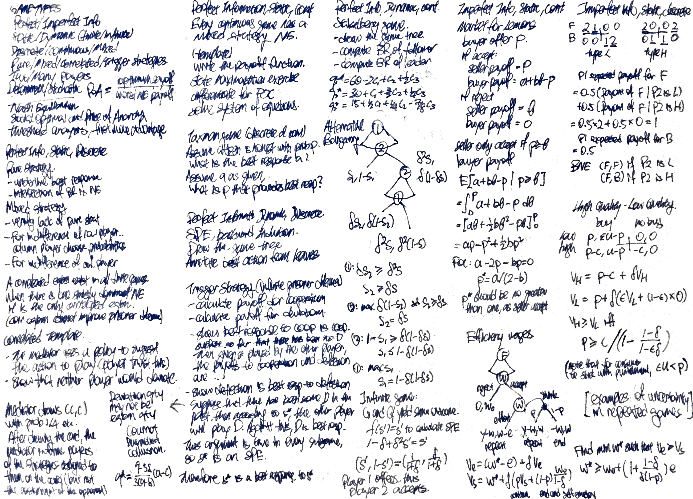
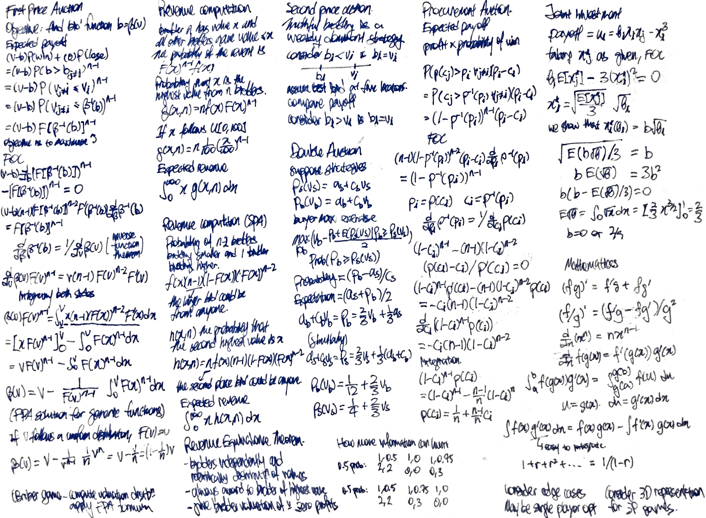
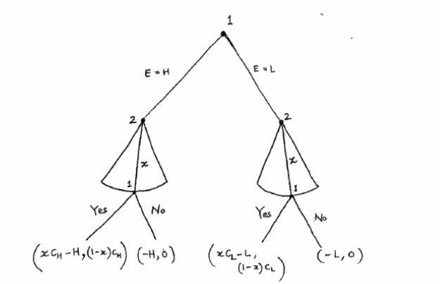

# Game Theory

* auto-gen TOC:
{:toc}

- Class participation - 10%
- Homework - 30%
- Project - 30%
- Finals - 30%

## Cheatsheets

## Introduction

Project requirements

- Form groups by Week 6
- Present project slides and submit group report
- Rubrics
  - Novelty of the idea/problem to investigate
  - Relevance to Game Theory topics
    - Multiple agents is required, otherwise it is just an optimisation problem
  - Clarify and quality in presentation/report
  - Technical depth or possible data analysis
  - Impact and contribution to society
- Notable projects
  - Is it rational for governments to open up their borders unilaterally?
  - Modelling football penalty shootout, and effect of knowledge on the type of players

Examples of applications of game theory

- Economics
- Political science
- Biology
- Federated learning
- Network economics
- (example - US upgrading of 5G network and why Telco delay upgrading due to expected improvements in technology)

A strategic game consists of

- Players
- Actions
- Perferences and payoff functions

Taxonomy of game theory problems

- Static vs dynamic games
- Complete and incomplete information

Formulation

- Players
- Action
  - Discrete strategy - players can only choose one from numbered options
  - Continous strategy - players can only choose one from infinite (continuous?) options
- Strategy
  - Pure strategy - decided to do only one action
  - Mixed strategy - assigns a probability for each action
- Payoff 
  - For each action combination, for each player
  - If the strategy is mixed, we evaluate the expected payoff

## Static games of complete information

Static - each player chooses their move simultaneously

Complete information - all game information are common knowledge. Common knowledge is information that known to each party, and that each party knows about the knowledge of the other party and so on.

Simplest game

- Two player, two options 
- **The row player that chooses which row to play**
- **The first number in the payoff is for the row player**
- Fix row, underline the highest second value
- Fix column, underline the highest first value
- If both the first and second value is underlined, it is a Nash Equilibrium

Beliefs - the belief of the probability distribution of the actions of the other players.

Rationality - the player selects the (possibly mixed) strategy (best response) to maximise their expected payoffs, given their beliefs about the strategies of the other players.

#### Pure strategy Nash Equilibrium

- When all other players use these strategies, no player can obtain a strictly higher payoff by choosing a different strategy. There may be none or many Nash Equilibriums. 
- "Pure" refers to a non-mixed strategy.
- One Nash Equilibrium - Prisoner Dilemma
- Multiple Nash Equilibrium - Opera versus Football
- No Nash Equilibrium - Differentiation
- "Under what conditions is there a Nash Equilibrium?"

Types of Nash Equilibrium

- Stable? Unstable?

#### Static Games with **discrete** action space

- Prisoner Dilemma
  - Better if collaborate, but the Nash equilibrium is to betray
- Opera versus Football (Battle of the Sexes)
  - Two Nash equilibirums, when parties choose the same option
- Dinner Party
  - Two Nash equilibirums, when parties choose differently
- Differentiation
  - No Nash equilibirum
- Two bars game
  - Given a set of prices, what is the equilibrium price

#### Static Games with **continuous** action space

- Continuous effort game
  - $u_1 = a_1 (c_1 + a_2 - a_1) = ca_1 + a_1 a_2 - a_1^2$
  - $u_2 = a_2 (c_2 + a_1 - a_2) = ca_2 + a_1 a_2 - a_2^2$
  - Best response function maximise $u_1$ wrt $a_1$ with first order optimisation (FOC)
    - $BR_1(a_1) = \dfrac{1}{2}(c_1+a_2)$
  - To maximise $u_1$ wrt $a_2$, best response function
    - $BR_1(a_2) = \dfrac{1}{2}(c_2+a_1)$
  - The Nash equilibirum is the intersection of the best response functions
    - $(a_1^*, a_2^*) = (\dfrac{1}{3}(2c_1+c_2), \dfrac{1}{3}(c_1+2c_2))$
    - **Please understand the difference between the Nash equilibirum and the payoff associated Nash equilibirum**
- Voluntary contribution game
  - Every dollar contributed provides 40 cents of benefits to all.
  - Nash equilibirum is not to contribute.
- Location game
  - Voters vote for the player that has the closest policy stance. Each of two players choose their position to maximise voter share.
  - The nash equilibirum is the **median** of the distribution of the voter position.
- Hotelling game
  - Two hotels are located at each end of an interval
  - Find the indifferent customer to determine demand for charged prices
  - Equilibrium prices increases linearly with $t$.
  - Consider the case where $t$ is zero.
- Final Offer 
- Cournot Production (Scooters)
  - Three players choose their production of scooters
  - Modeled market demand (linear)
  - Players choose how much to produce
- Cournot Production (Exponential)
  - Modeled market demand (exponential)
  - As the number of firms increase, the total output quantity increases while price decreases
  - (Cournot competition and Bertrand competition)
- The Problem of the Commons
  - We limit the decision space to $[0,G)$ from $[0,\infty)$ so that it is relevant.
  - Working with a generic function $v(G)$ that is decreasing and convex
  - How to show that equality condition may follow symmetry - take the difference
  - First order condition may not be an expression
  - Prove by contradiction for the 
    - Suppose that $G^* > G^{**}$
    - $v(G^*) \geq v(G^{**}) > 0$ due to $v' < 0$
    - $0 > v'(G^*) \geq v'(G^{**})$ due to $v'' < 0$
    - Show that the FOC cannot be satisifed.

- - Price of anarchy
  - Ratio of social welfare between social optimum and the worse Nash Equilibrium (if there is)
  - $\dfrac{SW(\text{Social Optimum})}{SW(\text{Worst NE})} \geq 1$
  - What is the worse NE is negative or zero?
  - This is a ratio that is at least one.
- Selfish routing
  - What if the unit constant is not a unit? How does it affect NE?
  - How the augmented network perform worse for all compared to the initial network - Braess Paradox

#### Mixed Strategies in **discrete** action space

- Matching pennies
  - Row player wins if the pennies are matched
  - Column player wins if the pennies are matched
  - Consider the best response functions (forms a swastika)
  - Observe that the intersection of the best response functions is the Nash Equilibrium
  - **This is not a symmetric game.**
- Activity 2
  - From the standard analysis, we only choose one mixed strategy.
  - **TO REVISE**
  - However, on analysis, there are many other mixed strategy Nash Equilibrium - **but shouldn't it provide the set of mixed strategy NE from the onset?**
- Two rows and three columns
  - Assume that row player chooses a mixed strategy. Consider the possible mixed strategies the column player would play (i.e. ABC, AB, AC, BC). Check if the row player would still choose a mixed strategy
  - We can analyse the payoffs for dominated strategies, and eliminate the dominated strategies. However, dominated strategies may still be chosen?
  - Question, for the second example - there is only one mixed strategy Nash Equilibrium?
- Entry Game
  - Counter intutitive result that the probability of entrance depends on ??? 

 

#### Template to solve Mixed Strategy Problems

- Row player chooses row 1 with probability $p$
- Column player chooses column 1 with probability $q$
- For indifference of row player, column player chooses $q$ 
  - $q$ is chosen such that the expected payoff the row player is indifferent regardless of his choice of $p$
  - Make an equation in terms of $q$. If there are more than two actions for row player, the equation will have more than two expressions
  - Check that there are valid solutions for $q$ is valid
- For indifference of column player, column player chooses $p$ 
  - $p$ is chosen such that the expected payoff the column player is indifferent regardless of his choice of $q$
  - Make an equation in terms of $p$. If there are more than two actions for column player, the equation will have more than two expressions

#### Mixed strategy Nash Equilibrium

- A mixed strategy is a probability distribution over the pure strategies
  - At Nash Equilibrium, my mixed strategy is a best response to your mixed strategy (and vice versa)
  - You choose probabilities for your action such that the payoff of all the non-dominated options of the other player is constant
- Partially mixed strategy Nash Equilibrium - there is one player with mixed strategy and another player with pure strategy
- Completely mixed strategy Nash Equilibrium - all players in the game plays a mixed strategy
- Theorems
  - If we allow mixed strategies, it is possible in the Nash equilibrium that one player may settle for a pure strategy and the other chooses mixed strategy.
  - We can have multiple mixed strategy Nash equilibriums
  - Do all games have at least one mixed strategy Nash equilibrium?

- Interpretations
  - "We have two pure-strategy Nash Equilibrium"
    - "If we allow only pure strategies, there are two pure strategy Nash Equilibrium"
  - "We have one mixed-strategy Nash Equilibrium"
    - "If we allow mixed strategies, there are one mixed-strategy Nash Equilibrium"

#### Symmetric Game

A two player game is symmetric if the players' sets of actions are the same and the player's preferences are represented by payoff functions $u_1$ and $u_2$ for which $u_1(a_1, a_2) = u_2(a_2,a_1)$ for every action pair $(a_1, a_2)$.

Symmetric pure-strategy Nash Equilibrium - both players choose the same action. Not all symmetric games contains pure-strategy Nash Equilibrium.

All symmetric games will have at least one symmetric mixed-strategic Nash Equilibrium.

### Multi-player symmetric games

- Multi-player symmetric entry game
  - The firm's entry probability is assumed to be the same as the entry probability of other firms.
  - Maximise $C_0 \cdot (1-p)^2 + C_1 \cdot 2p(1-p)^2 + C_2 \cdot p^2$
    - Where $C_n$ is the payoff if $n$ other firms are joining
- The tax man problem
  - The tax man spends $100a^2$ effort where  $a \in [0,1]$, which catches the citizen at probability $a$ if the citizen is cheating.
  - Even if the tax man believes that the citizen is cheating, the tax man will not spend all his effort to catch the citizen.
  - Given $p$, the taxman maximises
    - $p(-100a^2) + (1-p)(100a-100a^2)$
  - Best response of the taxman
    - $a^*(p) = \dfrac{1-p}{2}$
  - The best response of the citizen
    - Cheat if $a < 1/3$
    - Honest if $a > 1/3$
    - Indifferent at any probability if $a = 1/3$ 
  - There is no pure-strategy Nash equilibrium
    - If the citizen definitely cheat, tax man will apply $a = 1/2$
    - Then the citizen would not cheat because $a > 1/3$
    - Now that the citizen do not cheat, tax man will apply $a = 0$
    - Then the citizen would cheat because $a < 1/3$
    - There is no equilibrium
  - The mixed-strategy Nash equilibrium is $a = 1/3$ and $p = 1/3$
- Continuous all-pay auction game
  - The winning bidder will get a benefit of 1. However, you lose the amount that you bid with regardless of the result.
  - There is no pure strategy Nash Equilibrium
    - If $s_i = s_j < 1$, player $i$ would increase his bid by $\varepsilon$
    - If $s_i = s_j = 1$, player $i$ would just bid $0$ as $0 > -1/2$
    - If $s_i > s_j \geq 0$, player $i$ would decrease his bid by $\varepsilon$
  - Uniform distribution over $[0,1]$ is a symmetric Nash Equilibrium of this game
    - Payoff of any selected bid $x$ is a constant
      - You bid $x$, you win at probability $x$
      - Your payoff is $0$ regardless of $x$
    - This implies that player 1 is willing to bid any value in the $[0,1]$ interval.
  - **Is it possible for a mixed-strategy Nash Equilibirum that is not a uniform distribution?**

Every continuous game has a mixed-strategy Nash Equilibirum

#### Correlated Equilibrium

Theorem. A correlated equlilbirum exists in all finite games.

Benefits of correlated equilibirum

- Poor payoff outcomes are avoided
- Fairness is achieved
- Sum of social welfare can exceed that of any Nash equilibrium

Correlated equilibirum can be viewed as a randomised assignement of potentially correlated action recommendations to players such that nobody wants to deviate

Example games

- Minimum effort
  - Payoff = 2 $\times$ minimum effort - your effort
- Coin flip
  - Consider the pure strategy Nash Equilibrium
    - It is unfair
  - Mixed-strategy Nash Equilibrium is 2.5
    - There is a chance of the most inefficient outcome
  - Correlated Equilibrium 1
    - Two players first communicate and agree to flip a coin
    - Both players have no incentive to deviate from the recommendation
    - Expected payoff is 3
  - Correlated Equilibrium 2
    - The mediator draws one of three cards in equal probability, one that instructs one of each outcomes except U, L
    - Does not work if the message is broadcast, becase it is back to mixed-strategy Nash Equilibrium
    - If the row player is told to play U, it is confirmed that column player is told to player L, and row player will stick to U
    - If the row player is told to play D, the row player knows that there is 1/2 probability that the column player hears L and 1/2 probability that the row player hears R. Deviating from the recommendation does not provide a strictly greater payoff.
    - Expected payoff is 10/3, because U, L is never played
- Dare versus Chicken Out
  - Mixed-strategy Nash Equilibrium is 14/3 = 4.67
  - Design the optimal Correlated Equilibrium
    - CD, DC are each assigned $\dfrac{1-p}{2}$
    - CC is assign probability $p$. We want to maximise $p$.
    - If the row player is told to play D, it is confirmed that column player is told to player C, and row player will stick to D
    - If the row player is told to play C, the row player knows that there is $\frac{p}{\frac{1-p}{2} + p} = \dfrac{2p}{1+p}$ probability that the column player hears D and $\dfrac{1-p}{1+p}$ probability that the row player hears C.
      - The payoff for following the instruction has to be higher than the payoff from deviation
      - The payoff is $2 \cdot \dfrac{1-p}{1+p} + 6 \cdot \dfrac{2p}{1+p} \geq 0 \cdot \dfrac{1-p}{1+p} + 7 \cdot \dfrac{2p}{1+p}$
      - This simplifies to $p \leq 1/2$
      - Expected payoff is 21/4 = 5.25
- Troublemaker player 3
  - Player 1 and 2 toss a fair coin, if heads they play T,L, if tails they play B,R.
  - Player 3 would not deviate for a smaller playout of 1.5 instead of 2.
  - Visualisation
  - 
- Prisoner Dilemma
  - When there is one strictly dominant Nash equilibrium for a game, there is only one correlated equilibrium

## Dynamic games of complete information

Dynamic games is described with a game tree with
- decision nodes
- terminal nodes about payoffs
- strategy for each player as a complete contingent plan of action for each decision node

Solution approaches

- Normal form analysis
  - Assume that the strategy is fixed and executed without deviation, and you may not be sequentially rational
  - Compares strategies against strategies in a table

- Backward induction
  - Produces the (?) subgame perfect equilibrium by assuming that players are sequentially rational
  - Produces subgame perfect equilibrium (reasonable Nash equilibrium)
  - Are all subgame perfect equilibrium will be identified from normal form analysis.
  - If there are infinitely many action (i.e. continuous) - just take the maximum payoff?
  - What happens if there is a tie
    - Consider two cases of the game, one for each option that the player have chose. Multiple SPE may be possible for the game.
    - Or make an assumption (e.g. if the player is getting zero, it does not matter how much the other person is getting)

Example games

- Zombie Negotiation
  - Each of the three players submits a proposal on how to split 25 humans.
  - The proposal is voted by the players, majority to win.
  - If the proposal fails, some human escape
  
- Game of Entry
  - You cannot analyse the game normally
  - The threat does not make sense since by the assumption that each player will maximise their payoff, the first player will never launch a price war
  - The normal form provides an equilibirum that is unreasonable
  - (Is it possible for to adopt a static strategy to scare the other player?)
  
- Ultimatum Game
  - The first player chooses the allocation on how to divide a dollar, the second player chooses whether to accept. If the second player rejects, no one gets the money.
  - The unique SPE is (1,0)
    - With the **assumption** that player 2 is indifferent between accepting and rejection when $x=0$
  
- Hold-up Game
  - One player spends effort making a pie
  - The second player chooses the portion of the pie to take
  - The first player chooses whether to accept or reject the offer (incurring the cost)

  - Draw the outcome tree

    

  - The subgame is the Ultimatum Game, and the first player would always choose a low effort to make the pie

- Centipede Game
  - The player would always choose $(0,1)$
  - The outcome is inefficient (and price of anarchy is a measure)
  - If the game is extended to 100 cycles, the price of anarchy is much larger as well.
  - Conclusion - sometimes it is players to be irrational for the benefit of other players to achieve a better outcome

- Stackelberg model
  - The price is $12 - q_1 - q_2$
  - Compute the optimal quantity of the second player in terms of the quantity of the first player
  - Given that the second player will always subscribe to $q_2 = (12-q_1)/2$, compute the optimal quantity of the first player $q_1 = 6$.
  - (To solve the static game, find the first order condition of $q_1$ in terms of $q_2$ and vice versa, and solve the simultaneous equations. $q_1 = q_2 = 4$)
  
- Stackelberg model (3 players)

  - The price is $120 - q_1 - q_2 - q_3$
  - $q_1 = 60, q_2 = 30, q_3 = 15$
  - What if there are more players - the pattern follows
  - What if the costs are different for each player?
    - Decreasing in its own cost, increasing in subsequently player cost
    - Assumes that players may be able to buy if quantity is negative

- Committee voting

  - Each of the three players have a ordered preference of 4 candidates
  - The players successively veto candidates
  - You do not veto your least preferred candidate
  - Will a member ever eliminate his most preferred candidate?

## Repeated Games

Discount factor $\delta$

- Reflects the time value of money
- After each round, the payoff decreases by $\delta$

Finite or infinite horizons

Examples

- Finite horizon alternative bargaining
  - Player one offers $(s_1,1-s_1)$
  - If player two rejects, player two offers $(\delta s_2, \delta(1-\delta s_2))$
  - If player one rejects, the payoff is $(\delta^2 s,\delta^2 (1-s))$
  - Solution approach - players would make a bargain that the other other player would accept
    - Player two would offer need to offer $s_2 \geq \delta s$ for the other player to accept the offer. Player two would make the offer at the boundary.
    - Player one would offer $s_1 \leq 1 - \delta(1-\delta s)$ for the other player to accept the offer. Player one would make the offer at the boundary.
    - SPE payoff for first player $f(s,\delta) = 1 - \delta(1-\delta s)$

- Infinite horizon alternative
  - The game round 3 can be considered a repeat of the game at round 1, just that the payoffs of each player is reduced by $\delta^2$
  - Assume that the payoff of the infinite game is $s'$
    - The payoff of the first player of the truncated game is $f(s,\delta) = 1 - \delta(1-\delta s)$
    - The payoff of the first player of the infinite game is $s'$ as assumed.
    - The above two are equal providing $s' = \dfrac{1}{1+\delta}$

Non-forgiving trigger strategy - punishment is involved forever after a single deviation

Examples

- Twice Repeated Game
  - Propose to (AA) and then (BB), if one players deviates and choose B for the first round, the other player would choose C for the second round.
    - This policy is effective because you do not gain from deviating in the first round
  - Can the player choose not to punish for better payoff - strategy are assumed to be fixed at the start of the game, and the fixed strategy provides credible threat.
    - If the strategy is fixed - can anyone even deviate?
- Infinitely Repeated Prisoners' Dilemma
  - Cannot be encouraged to collaborate by the correleated equilibrium (why?) - but can be encouraged to collaborate when the game is repeated infinitely
  - Cooperation is the best response to cooperation
    - Suppose there has so far been no deviation
    - Payoff from C = $1 + \delta + \delta^2 + \dots = \dfrac{1}{1 - \delta}$
    - Payoff from D = 2
    - Cooperation is better as $\delta \geq 1/2$  
  - Deviation is the best response to deviation
    - Because they know that they other player will always follow the non-forgiving trigger strategy
  - SPE outcome
    - Players will cooperate for a large enough $\delta$
  - Reasoning not work if the number of rounds is finite
    - You can reason by induction from the last round
    - What if the number of rounds is an unknown?

- Push Pull

  - Push to give 400, Pull to take 300
  - Best strategy is actually to pull all the way

- High Quality or Low Quality

  - Firm produces high quality or low quality. If the product is low quality, it is considered to be high quality with probability $\varepsilon$
  - If $\varepsilon \bar{U} > p$ then the Nash Equilibirum is (low quality, buy) and the problem is trivial
  - In the one shot game, the firm always produce low quality and customers will not buy
  - To show trigger strategy works
    - Need credible threat
    - No profitable deviation under the threat
  - Condition for the firm to stick to producing high quality
    - Discounted long-term benefit for producing high quality
      - $V_H = \dfrac{p-c}{1-\delta} = (p-c) + \delta (p-c) + \delta^2 (p-c) + ...$
    - Discounted long-term benefit for producing low quality
      - Using mathematical induction
      - $V_L = p + \delta \times (\varepsilon V_L + (1-\varepsilon) \times 0)$
      - $V_L = \dfrac{p}{1-\varepsilon \delta}$
    - Condition
      - $V_H > V_L$
  - Condition for the customer to stick with punishment
    - $\varepsilon \bar{U} < p$

- Efficiency Wages

  - The firm choose a wage $w$ for the worker to accept. If the worker rejects, the worker will be self employed wage $w_0$.  If accepted, the worker works can choose to effort or shirk. If shirk, the worker output is $0$ with probability $y$.
  - Assume $w_0 > w$ otherwise the worker might as well be self-employed
  - SPE
    - Firm employs worker at wage $w_0$ and the worker shirks
  - Assume $y - e > w_0 > py$  so that
    - It is efficient for the worker to be employed by the firm and supply effort
    - It is better that the worker is self-employed than employed by the firm and shirking
  - Condition for the worker to effort
    - Discounted long-term benefit for produce high effort
      - $V_e = (w^* - e) + \delta V_e$
    - Discounted long-term benefit for shirking
      - $V_s = w^* + \delta \left( p V_s + (1-p) \dfrac{w_0}{1-\delta} \right)$
    - Condition
      - $V_e \geq V_e$
      - $w^* \geq w_0 + \left(1 + \dfrac{1-\delta}{\delta(1-p)}e \right) $
      - We see the wage premium
      - If shirking is not easily detectable, the wage premium will be very high
      - However, if the wage premium is too high, it is not worth it for the company to hire the worker

- Cournot competition

  - When the firms collude, they would act like a monpoly and each will produce $q_m = \dfrac{a-c}{4}$

  - When they compete, they would produce $q_c = \dfrac{a-c}{3}$

  - Acting like a monopoly will result in more payoff $\pi_m ={(a-c)^2}/{8}$ compared to competition $\pi_c = {(a-c)^2}/{9}$ 

  - When one firm decide to deviate, the firm will produce more than $q_c$ at $q_d = 3(a-c)/8$ for a one turn payoff of $\pi_d$

  - For the trigger to work, the discounted payoff of cooperation should be better than deviation

    $\dfrac{\pi_m}{1-\delta} \geq \pi_d + \delta \dfrac{\pi_c}{1-\delta}$

  - What is $\delta$ is less than required? Is the benefit for the firms to collude?

    - When firms collude at $q^*$ they get payoff $\pi^* = (a-2q^* - c)q^*$
    - To deivate they will produce $q_d = (a-c-q^*)/2$ and they will obtain $\pi_d = (a-c-q^*)/4$
    - For the trigger to work $\dfrac{\pi_m}{1-\delta} \geq \pi_d + \delta \dfrac{\pi_c}{1-\delta}$
      - $q^* = \dfrac{9-5\delta}{3(9-\delta)}(a-c)$
      - $q^*$ approaches $q_m$ when $\delta$ approaches $9/17$
      - $q*$ approaches $q_c$ when $\delta$ approaches $0$

- Bertrand Competition

  - If delta is larger than $1/2$, you may be able to implement a limited round punishment strategy (punish for $k$ rounds if they deviate)
  - Required delta for the $k$-round trigger strategy to work
    - If you choose to deviate in the first round, you will choose to deviate again
    - The discounted payoff from cooperation must be better than deviation
    - $2 \delta - \delta^{k+1} \geq 1$

## Static games of incomplete information

Bayesian game must specify the probability distribution of the different types of player.

- Market for Lemons

Bayes-Nash equilibrium (BNE)

A Bayseian game is defined as $G = \left< N, \Omega, p, \left< T_i, A_i, u_i \right>_{i \in N} \right>$

- $N$ is the set of players
- $\Omega$ is the states of nature 
- $p$ is the probability distribution over $\Omega$
- $T_i$ is the realised type of player $i$
- $A_i$ is the set of actions for player $i$
- $u_i: \Omega \times A \to R$ is the payoff function for player $i$

- A pure strategy for agent $i$ is a function from his type to his action space $s_i: T_i \to A_i$
- $S_i$ is the set of pure strategies $S_i = \left\{ s_i : T_i \to A_i \right\}$
- The expected payoff of player $i$ for such a strategy profile is $u_i(S) = E_{t \sim p} [u_i (s_1(T_1, \cdots, s_N(T_N))]$

For any finite game $G$ (finite actions and finite actions), BNE always exist (which may be mixed?)

#### Games with asymetrically complete information

- UDLR
  - Three steps
    - Compute the strategy profile of the player with complete information
    - Compuate the strategy profile of the player with incomplete information, given the above
- Public goods game
  - Player 2 will not contribute if $c = c_\text{high} > 1$
  - Player 1 will contribute if $1 - c_1 > p$, which is true in the question
- Market of Lemons
  - Quality of the car $\theta$ follows a uniform distribution $U[0,1]$
  - The exact realisation of the quality is known to the seller but not known to the buyer
  - The buyer can make an offer to the seller $p \in [0,1]$, and the seller announces the minimum offer that she will accept, at the same time. If the minimum offer is greater than the price, transactions occurs at $p$.
  - Seller payoff
    - Seller will sell if $p \geq \theta$
    - If there is a deal, payoff $= p$
    - If there is no deal, payoff = $\theta$
  - Buyer payoff
    - $a + b\theta - p$
    - $\int_0^1 \mathbb{1}_{\theta \leq p} (a+b \theta - p) d\theta = p(a+\dfrac{1}{2}bp - p) $ 
    - $p = \min \left(1, \dfrac{a}{2-b} \right)$
  - Analysis
    - If $a = 0$ and there is no instrinic value of the product, the buyer will offer $0$. The social payoff is $\theta$. 
    - If we force a sale, we get the social optimum $b \theta$. The price of anarchy is $b$.
    - If $b$ is large, the loss in efficiency is large.
- Sheriff Dilemma
  - Find the probability $p$ that is
  - Just the UDLR formulation with $p$ as an unknown
- Some question that would be covered in the homework
  - TBC

#### Games with symetrically complete information

Harder to compute because there is no starting point

- R&D Game
  - Define your strategy $s_i(\theta_i)$ as a function of benefit
    - The strategy is a step function
    - $\theta_i^*$ is the minimum benefit that you would choose develop
  - If firm $i$ develop the product when its type is $\theta_i$
    - The payoff is $\theta_i^2 - c$
  - If firm $i$ decides not to develop the product when its type is $\theta_i$
    - The payoff is $\theta_i^2 P(s_j(\theta_j) = 1) + 0$
  - The strategy is to develop when the former is at least larger than the latter, i,e develop when
    - $\theta_i \geq \sqrt{\dfrac{c}{1-P(s_j(\theta_j) = 1)}} = \sqrt{\dfrac{c}{\theta_j^*}}$
  - Considering the critical point
    - $\theta_i^* \geq \sqrt{\dfrac{c}{\theta_j^*}}$
    - Show that $\theta_i^*$ and $\theta_j^*$ are equal

- How more information may hurt
  - Benchmark case
    - Just construct a payoff table with the average of the two payoff tables
    - The only NE is DL, with payoff (2,2)
  - Case where Player 1 knows the state
    - Do the UDLR analysis
    - See that the row player would choose U instead of D

- Voting Game
  - The obvious BNE is where Citizen 2 does not vote, and Citizen 1 vote for the better candidate 
    - To show that it is a BNE, show that each citizen would not deviate from the response
  - There is another BNE is where Citizen 2 vote for state 1 and Citizen 1 does not vote if state is A and vote if state is B
    - This is also a BNE
    - Not a BNE - Citizen 1 always voting for the better candidate (while Citizen 2 vote for state 1)
    - Takeaway - there may be another BNE even it might not make sense

#### Interpretation of BNE

Examples

- Battles of the Sexes with imcomplete infromation
  - There is a t-value that you will be indifferent between the options
  - Express indifference in terms of the other t
  - How to show symmetric expressions are equal
  - When the incomplete information disappears, behaviour in the pure strategy BNE of the incomplete information game approaches their behaviour in the MSNE game with complete information
  - Application - sensitivity analysis

#### Private Value Auctions

- Second price sealed bid auction
  - Let $\bar{b}$ be the equal to $b_i$
  - Show that the player will not bid lower than his own valuation
    - Consider five cases of where $\bar{b}$ will be in $b_i$ and $v_i$
  - Show that the player will not bid higher than his own valuation
    - Consider five cases of where $\bar{b}$ will be in $v_i$ and $b_i$
  - Therefore truthful bidding is a weakly dominant strategy
    - Regardless of any distribution of valuation, regardless of opponent strategy
    - Popular in the real world because it results in very predictable behaviour from participants
  - Revenue analysis
    - Probability density one having a value $x$ and one who is bidding higher and all other bidders bidding a lower value.
      - $f(x)(n-1)(1-F(x))(F(n))^{n-2}$
    - Probability density that the second highest value is $x$
      - $h(x,n) = nf(x)(n-1)(1-F(x))(F(x))^{n-2}$
    - The expected value of the second highest bid
      - $\int x \cdot h(x,n) dx$
      - Revenue if the distribution is unit uniform $\dfrac{n-1}{n+1}$

- First price sealed bid auction
  - You will not bid truthfully because you get a payoff of zero for winning
  - Payoff demends on probability to win and the difference
    - Assumes an bidding strategy $\beta(v)$
    -  $(v-b)[\text{P}(v_j \leq \beta^{-1}(b))]^{n-1}$
    - $\beta(v) = (1-\dfrac{1}{n})v$
    - As the number of bidders increases, the extent of bid-shading goes down.
  - Revenue analysis
    - Probability density one having a value $x$ and all other $(n-1)$ bidders to have value less than $x$
      - $f(x) F(x)^{n-1}$
    - Probability density that $x$ is the highest value from $n$ bidders
      - $g(x,n) = nf(x)F(x)^{n-1}$
    - The expected value of the highest bid
      - $\int x \cdot g(x,n) dx$
      - Revenue if the distribution is unit uniform $\dfrac{n-1}{n+1}$

- All-pay auction
  - All bidder will need to pay with the amount they bid
  - Homework question
  - Integration by parts (i.e. integrate by guessing the integral)
  - Uniform distribution $F(v) = v$ (which is defined between $[\underline{v}, \overline{v}]$)
  - Inverse function theorem $\dfrac{d}{db} \beta^{-1}(b) = \dfrac{1}{\dfrac{d}{dv}\beta(v)}$
  - $\beta(v) = \dfrac{n-1}{n}v^n$
  - Revenue analysis
    - Should be the same right

- Regardless of bidding scheme, the expected revenue to the auctioneer is the same (Revenue Equivalence Theorem)

- Procurement auction
  - Payoff demends on probability to win and the difference
  - Refer to the slides for derivation
  - The player linear strategies are
    - $p(c_i) = \dfrac{1}{n} + \dfrac{n-1}{n}(1-c_i)^n$
  - Revenue analysis
    - ???

#### Double Auction

- Buyer has private information about their valuation $v_b$ from a unit uniform distribution
- Seller has private information about their valuation $v_s$ from a unit uniform distribution
- Buyer will specify the price $p_b(v_b) = a_b + c_b v_b$ specifying the price the buyer will offer
- Seller will specify the price $p_s(v_s) = a_s + c_s v_s$ specifying the price the seller will offer
- We assume that strategy is a linear function
  - By showing a linear response is the best response to a linear strategy in both ways, we show that a pair of linear responses is a BNE
  - Does not show uniqueness however
- Buyer maximisation exercise is to maximise
  - $\left[v_b - \dfrac{p_b + E[p_s(v_s) \vect p_b \geq p_s(v_s)]}{2} \right] P[p_b \geq p_s(v_s)]$
  - The expecation is the expected price the seller will ask, conditional on the ask being less than the buyer's offer of $p_b$
  - By considering that seller strategy is linear
    - $P[p_b \geq p_s(v_s)] = \dfrac{p_b-a_s}{c_s}$
    - $E[p_s(v_s) \vect p_b \geq p_s(v_s)] = \dfrac{a_s + p_b}{2}$
    - $p_b = \dfrac{2}{3} v_b + \dfrac{1}{3}a_s$
- Seller maximisation exercise is to maximise
  - $\left[\dfrac{p_s + E[p_b(v_b)  \vect  p_b(v_b) \geq p_s]}{2} - v_s \right] P[p_b(v_b) \geq v_s]$
  - The expecation is the expected price the buyer will offer, conditional on the offer being greater than the seller's ask of $p_s$
  - By considering that buyer strategy is linear
    - $P[p_b(v_b) \geq v_s]$
    - $E[p_b(v_b)  \vect  p_b(v_b) \geq p_s]$ 
    - $p_s = \dfrac{2}{3}v_s + \dfrac{1}{3}(a_b + c_b) = a_s + c_s v_s$
- The player linear strategies are to be the best responses to each other
  - Equate the coefficients in $v_s$ and $v_b$ and solve for $a_b, a_s, c_b, c_s$
  - $p_b(v_b) = \dfrac{1}{12} + \dfrac{2}{3} v_b$
  - $p_s(v_s) = \dfrac{1}{4} + \dfrac{2}{3}v_s$
  - Trade only occurs if and only if $p_b \geq p_s$
    - This happens at $v_b \geq v_s + 1/4$
    - For effeiciency, trade must occur for $v_b \geq v_s$. Therefore the BNE is inefficient

#### Joint Investment

- Payoff $u_i = \theta_i x_i x_j - x_i^3$
  - $\theta_i$ is private information uniformly distributed on [0,1]
- Derivation of BNE
  - We arrive at $x_i^* = \sqrt{\dfrac{E[x_j^*]}{3}} \sqrt{\theta_i}$
  - Assuming that strategies are symmetric $x_i^*=a+b\sqrt{\theta}$
  - $b = \sqrt{\dfrac{E[x_j^*]}{3}} = \sqrt{\dfrac{b E[\sqrt{\theta_i}]}{3}}$
- Solutions
  - $b = 0$ or $\frac{2}{9}$
  - If the other player invest $0$ regardless of $\theta$, you will not deviate from investing zero
  - Each player invest by following $x(\theta_i) = \frac{2}{9} \sqrt{\theta}$

#### Private Value Auctions on non-uniform distribution

- Valuation is equal to $v_i = \dfrac{(1-c_i)^2}{4}$ where $c_i$ is drawn from the uniform distribution
- The standard formula of uniform FPA is not applicable because ...
- We assume that the bribe $b_i = \beta(c_i) = \alpha + \gamma(1-c_i)^2$ 
- $U_i(b_i  \vect  c_i) = (v_i - b_i) P[b_j(c_j) < b_j]$
- $P[b_j(c_j) < b_j] = \sqrt{(b_i - \alpha)/\gamma}$
- Can solve $\beta(v) = v - \dfrac{1}{F(v)^{n-1}} \int_\underline{v}^v F(v)^{n-1} dx$ directly without assumptions also (please check)

#### Acquirer Game

Firm A makes a bid $b$ on a firm with hidden value $x$ from from a uniform distibution. The bid is accepted if $b$ is larger than $x$, and the payoff will be $1.5x - b$

- The Nash Equlibrium bid will be 0
- Maximise (objective from the slides)
- Overbidding with 100 will result in a negative expected payoff of $-0.25$

What if the payoff is $2.5x - b$

- Overbidding with 100 will have a positive payoff of $0.25$

#### Facility location games

- Each agent has a preferred location $x_i$
- The principal will place the facility at $y$
- Each agent has cost $c_i(y,x_i)$ if the facility is placed at $y$
- Each agent report a location $x_i'$ simultaneously to the principal to select a location with a predefined procedure for a predefined objective (minimise sum of cost or max of cost)
- Minimise sum of cost
  - Locating at the mean location
    - Consider the case of two agents, there is no equilibrium
  - Locating at the median location
    - If the number of players is even, locate at the smaller of the middle two location
    - This is an equilbirum
    - Analyse the price of anarchy
- Minimise max of cost
  - Location at the first location
    - This is an equilbirum
- Use of a p-th percentile mechanism is a truthful mechanism

