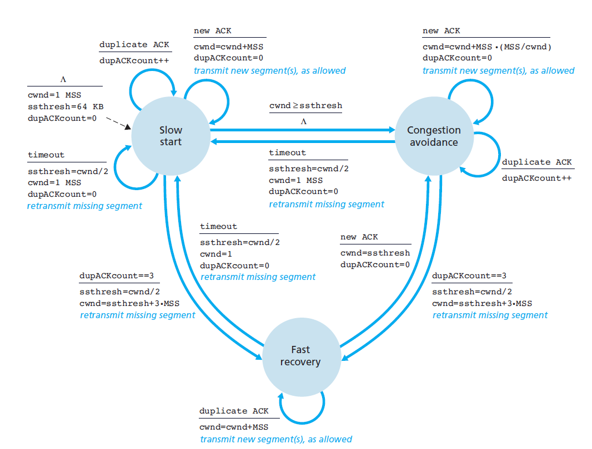
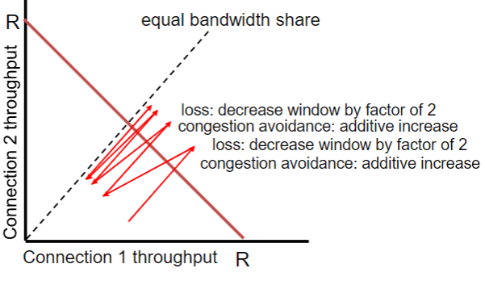

- [TCP Congestion Control](#tcp-congestion-control)
  - [Start Connection: Slow Start](#start-connection-slow-start)
  - [Congestion-avoidance state](#congestion-avoidance-state)
  - [Explicit Congestion Notification (ECN)](#explicit-congestion-notification-ecn)
    - [Network-assisted congestion control](#network-assisted-congestion-control)
  - [Calculating TCP Throughput](#calculating-tcp-throughput)
    - [Calculating Segment Loss Probability $L$](#calculating-segment-loss-probability-l)
  - [TCP Fairness](#tcp-fairness)
- [TCP Connection Management](#tcp-connection-management)

# TCP Congestion Control

A summary code for the sections discussed below
```python
cwnd = MSS
while connected:
  if time < slow_start_duration:
    cwnd *= 2
    if receive_ACK: 
      cwnd+=MSS
  else: # congestion-avoidance state
    if receive_ACK:
      cwnd += MSS*(MSS/cwnd)
```



## Start Connection: Slow Start
When connection begins, increase rate exponentially until first loss event. (Initial rate is slow but ramps up very fast)

1. Initial `cwnd`: 1 MSS (maximum segment size)
2. Double `cwnd` every RTT
   - It is doubled with the formula: $cwnd = cwnd + MSS * \frac{cwnd}{mss}$
3. Increment `cwnd` for every ACK received

## Congestion-avoidance state

Window grows exponentially in *slow start* to threshold, then grows linearly during the congestion-avoidance (CA) state. 

- The inexponential increase is switched to linear when `cwnd` gets to half of its value before timeout.
- On loss event, `ssthresh=1/2*cwnd` before loss event.

In the CA state, the congestion window is increased by $1/k$.
- where $k$ = $\frac{cwnd}{mss}$

## Explicit Congestion Notification (ECN)

### Network-assisted congestion control

- 2 bits in IP header (ToS field) marked by network router to indicate congestion
- Receiver sets ECE bit on ACK to notify sender of congestion

## Calculating TCP Throughput

Ignoring slow start and assuming there is always data to send,

$$ TCP Throughput = \frac{3}{4}*\frac{W}{RTT} $$
where 
- $W$: window size in bytes where loss occurs


### Calculating Segment Loss Probability $L$ 
e.g. given 1500 byte segments, 100ms RTT, 10Gbps throughput, requires average 83,333 in-flight segments

$$ 10^7 =  \frac{1.22*1500}{100*10^{-3}*\sqrt{L}}$$
$$ L = 2 * 10^{-10} $$

## TCP Fairness

- Goal: For n TCP sessions sharing same bottleneck link of bandwidth R, each should have $\frac{R}{K}$ rate.
- Implementation via Additive Increase and Multiplicate Decrease



# TCP Connection Management

