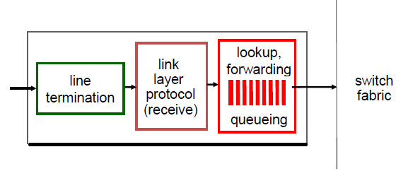
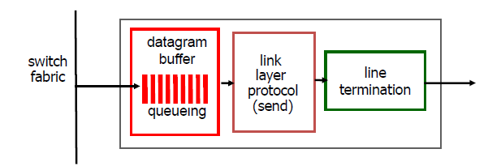
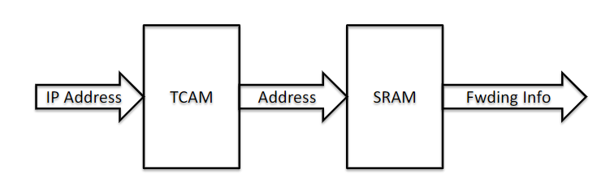
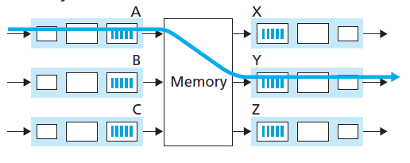
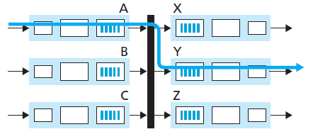
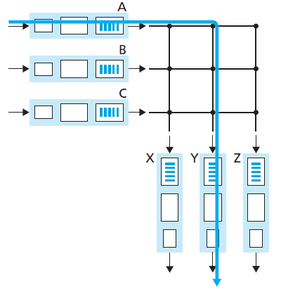
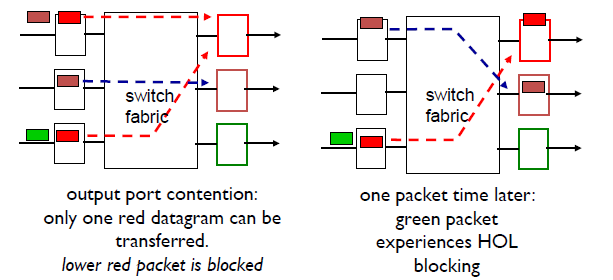

Table of Contents

- [Two Key Network-Layer Functions](#two-key-network-layer-functions)
- [Input Processing](#input-processing)
  - [Switching Fabrics](#switching-fabrics)
  - [Input Port Queueing](#input-port-queueing)
  - [Output Processing](#output-processing)
- [Routing Algorithms](#routing-algorithms)
  - [TCAMs](#tcams)

# Two Key Network-Layer Functions

1. *Forwarding*: Router-local action of transferring a packet from an input link interface to the appropriate output link interface. (Data Plane)
2. *Routing*: Network-wide process that determines the end-to-end paths that packets take from source to destination. (Control Plane)

Control Plane Approaches:
1. Traditional Routing Algorithms: Implemented in Routers
   - Per-router control plane: Individual routing algorithm components in each and every router interact in the control plane
2. Software-defined Networking (SDN): Implemented in remote servers
   - A distinct controller interacts with local control agents

Overview

| Input port functions          | Output port functions         |
| ----------------------------- | ----------------------------- |
|  |  |

# Input Processing

Typical Forwarding Process:

1. Every router has a **forwarding table**, which is computed and updated by its routing processor, and **stored at the input port**.
   - A router forwards a packet by examining the value of a field in the arriving packet’s header, and then using this header value to index into the router’s forwarding table. 
   - The value stored in the forwarding table entry for that header indicates the router’s outgoing link interface to which that packet is to be forwarded.
   - The value to be examined in the packet's header is determined by the [routing algorithm](#routing-algorithms).

2. The routing processor also stores a ***shadow copy***, typically stored at each input port. 
   - With a shadow copy, forwarding decisions can be made locally, at each input port, without invoking the centralized routing processor on a per-packet basis
   - This helps to avoid a centralized processing bottleneck.

3. After determining the outgoing link interface, the packet is forwarded from the the router's input ports to its output ports via **switching fabrics**. 

## Switching Fabrics
There are 3 types.
1. Memory 
   - An input port with an arriving packet first signaled the routing processor via an *interrupt*. The packet was then copied from the input port into processor memory. 
   - The routing processor then extract the destination addr from the header, looked up the appropriate output port in the forwarding table, and copied the packet to the output port’s buffers. 
   - If the memory bandwidth is such that B packets per second can be written into, or read from, memory, then the ***overall forwarding throughput*** (the total rate at which packets are transferred from input ports to output ports) ***must be less than B/2***. 
   - Two packets cannot be forwarded at the same time, even if they have different destination ports, since only one memory read/write over the shared system bus can be done at a time.  

   

2. Bus 
  - The packet is transferred directly from the input port to the output port over a shared bus, without intervention by the routing processor
  - The input port pre-pend a switch-internal label (header) to the packet to indicate the local output port for the packet
  - The packet is received by all output ports, but only the port that matches the label will keep the packet. The label is then removed at the output port.
  - **Bus Contention**: Only one packet can board the bus at a time. Hence, the switching speed of the router is limited to the bus speed and transmitting the packet onto the bus

3. Crossbar 
   -  An interconnection network consisting of 2N buses that connect N input ports to N output ports
   -  There is a switch fabric controller to open/close cross points of the horizontal and vertical bus
   -  Capable of forwarding multiple packets in parallel.
   -  Initially developed to connect processors in multiprocessor.

## Input Port Queueing

Since the switching fabric operates slower than the input ports, queueing at input queues may cause the input buffer to overflow. Packet loss will then occur when no memory is available to store arriving packets.

**Head of the Line (HOL) Blocking**

Queued datagram at front of queue prevents others in queue from moving forward
 

## Output Processing

Output port processing takes packets that have been stored in the output port’s memory and transmits them over the output link. This includes selecting and de-queueing packets for transmission, and performing the needed linklayer and physical-layer transmission functions.

If the datagrams arrive from fabric faster than the transmission rate, buffering will be required. **Packet loss may occur** due to congestion and lack of buffers.

# Routing Algorithms

- *Destination-based forwarding*
  - Destination address range is the index for a particular link interface
  - However there are times ranges don't divide up nicely
- *Longest Prefix Matching*
  - Longest address prefix is the index for matching destination addr
  - Performed using Ternary Content Addressable Memories (TCAMs)

e.g of longest prefix matching. given

| Destination Address Range             | Link Interface |
| ------------------------------------- | -------------- |
| 1100 1000 0001 0111 0010*** **** **** | 0              |
| 1100 1000 0001 0111 0011*** **** **** | 1              |
| 1100 1000 0001 0111 0011000 **** **** | 2              |
| otherwise                             | 3              |

a) **1100 1000 00010111 0010**110 1011 0110: 0
b) **1100 1000 00010111 0011000** 1011 0110: 2
c) **1100 1000 00010111 0011**001 1011 0110: 1

## TCAMs
- A specialized type of high-speed memory that searches its entire contents in a single clock cycle. 
  - More power, more area and higher latency than SRAM
  - To retrieve data on RAM, the operating system (OS) must provide the memory address where the data is stored. 
  - Data stored on CAM can be accessed by performing a query for the content itself, and the memory retrieves the addresses where that data can be found.
  - Performs parallel processing 
- Able to store and query data using three different inputs: 0, 1 and X (Ternary).