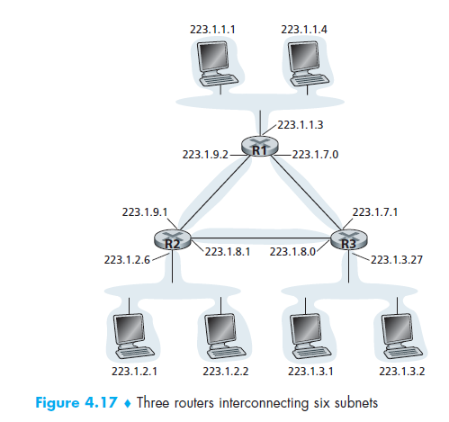

Table of Contents
- [Intro to IPv4 Addressing](#intro-to-ipv4-addressing)
  - [Classless InterDomain Routing (CIDR)](#classless-interdomain-routing-cidr)
  - [Dynamic Host Configuration Protocol (DHCP)](#dynamic-host-configuration-protocol-dhcp)
  - [Network Address Translation (NAT)](#network-address-translation-nat)

# Intro to IPv4 Addressing

Hosts/Routers typically has interfaces such as wired Ethernet, wireless 802.11. Interfaces are connections between the host/router and the physical link.

Since every host and router is capable of sending and receiving IP datagrams, IP requires each host and router interface to have its own IP address. Thus, an IP address is technically associated with an interface, rather than with the host or router containing that interface

- Each IP is 32 bits long (4 bytes)
  - Each byte of the address is written in its decimal form, separated by a period from other bytes in the address. Example: 193.32.216.9 
  - Total of $2^{32}$ possible IP addresses.
- Each IP address can be assigned to a **subnet**. Example 223.1.1.0 */24*
  -  The *leftmost*  24 bits of the 32-bit quantity define the subnet address
  -  So any host that has an IP address of 223.1.1.x can be identified to be under the same subnet. Any additional hosts will also be required to have the address of this format. 

To determine the subnets, detach each interface from its host/router, creating islands of isolated networks. An example is shown below.

> Core routers in Singapore are running on IPv4. Singtel currently has  Singtel has OLT vendors which operate on IPv6, and most of their services are IPv6 ready. They have a tunneling protocol for translating IPv6 internally within the Singtel network to IPv4 to these core routers.

## Classless InterDomain Routing (CIDR)

- Address format: `a.b.c.d/x`
  - *x* most significant bits in the address (the prefix) constitute the network portion of the IP address. 
    - Organizations usually use a range of addresses with a common prefix. 
    - Hence, when a router outside the organization forwards a datagram whose destination address is inside this organization, they only care about the prefix.
    - This **reduces the size of the forwarding table** in the routers, since a single entry of the form `a.b.c.d/x` will be sufficient to forward packets to any destination within organization.
    - Sometimes organizations may come together under a subnet for **route aggregation/ route summarization**.
  - The remaining *($32-x)* bits are used to distinguish among the devices within the organization. 

> Currently there is around 800k prefixes! 60k networks around the world. Singapore comprise of ~1k networks.

## Dynamic Host Configuration Protocol (DHCP)

DHCP allows host to dynamically obtain its IP address froma network server when it join its network.

**How it works - DORA**

1. Host broadcast "DHCP **D**iscover" msg [optional]
2. DHCP server hears the broadcast and responds with "DHCP **O**ffer" msg [optional]
3. Host requests IP address: "DHCP **R**equest" msg
4. DHCP server sends address: "DHCP **A**ck" msg

*Example*

1. New connecting host sends a DHCP *request* encapsulated in UDP, IP and Ethernet.
2. The Ethernet frame *broadcast* on LAN, received at router running DHCP server
3. Ethernet demuxed to IP demuxed, UDP demuxed to DHCP
4. DHCP server formulates an ACK containing
   -  client's IP address
   -  First-hop router for client (if requested)
   -  Name & IP Address of DNS Server (if requested)
   -  MASK to determine which portion is the network/host (if requested)
5. Encapsulation of DHCP server, frame forwarded to client, demuxing up to DHCP at client
6. Client obtains the info inside ACK.

## Network Address Translation (NAT)

- All datagrams leaving local network must have the same single source NAT IP address, but with different src port numbers
  - Replace `(src IP addr, port#)` of every outgoing datagram to `(NAT IP addr, new port#)`
  - Record every `(src IP addr, port#)` to `(NAT IP addr, new port#)` translation pair in NAT translation table.
- Allows local network to use just 1 IP for all devices in the network
  - The local network can change address of devices in local network without notifying outside world.
  - Security: Devices inside local net not explicitly addressable & visible by outside world. 
- Allow local network to change ISP without changing addresses of devices in local network