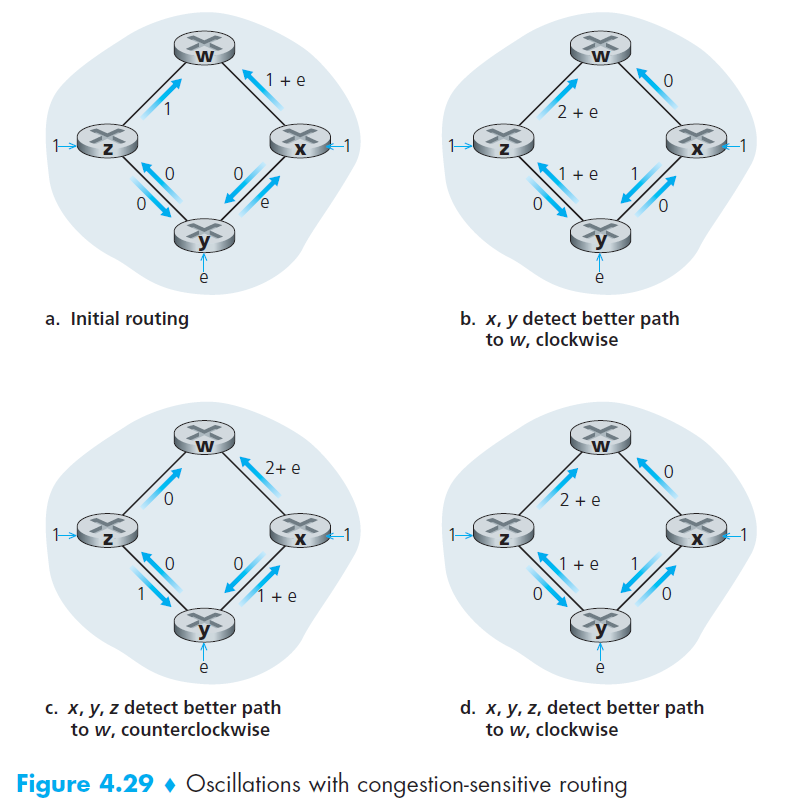

Table of Contents

- [Routing Algorithms](#routing-algorithms)
  - [Link-state Broadcast Algorithm (LS Algorithm)](#link-state-broadcast-algorithm-ls-algorithm)
    - [Properties of the Algorithm](#properties-of-the-algorithm)
    - [How it works](#how-it-works)
    - [*Time Complexity*](#time-complexity)
    - [*Possible Pitfall Scenario - Unequal link costs $c(u,v) \not ={} c(v,y)$*](#possible-pitfall-scenario---unequal-link-costs-mathsemanticsmrowmicmimo-stretchy%22false%22momiumimo-separator%22true%22momivmimo-stretchy%22false%22momo%cc%b8momrowmrowmicmimo-stretchy%22false%22momivmimo-separator%22true%22momiymimo-stretchy%22false%22momrowannotation-encoding%22applicationx-tex%22cuv-not--cvyannotationsemanticsmathcuv%ee%80%a0%e2%80%8bcvy)
  - [Distance Vector (DV)](#distance-vector-dv)
    - [Properties of the algorithm](#properties-of-the-algorithm-1)
    - [Bellman-Ford equation for Least Cost](#bellman-ford-equation-for-least-cost)
    - [How it works](#how-it-works-1)
    - [Pitfall - Count to infinity problem when a link cost increases](#pitfall---count-to-infinity-problem-when-a-link-cost-increases)
  - [Comparison of LS and DV Algorithms](#comparison-of-ls-and-dv-algorithms)

# Routing Algorithms

## Link-state Broadcast Algorithm (LS Algorithm)

### Properties of the Algorithm

- Centralized: Use global information. Requires each node to first obtain a complete map of the network before running the Dijkstra algorithm.

### How it works
Watch this for explanation of how it the algorithm works: https://www.youtube.com/watch?v=ue-BDS-7Ikw. 

### *Time Complexity*

- Total number of nodes we need to search through over all the iterations is $n(n + 1)/2$
  - First iteration n, 2nd iteration n-1 and so on. 
  - $n + n-1 + ... + 1 = n(n+1)/2$
  - Hence, **worst case time complexity** = $O(n^2)$
  - If we implement the data structure as a heap, can reduce to logarithmic complexity.

### *Possible Pitfall Scenario - Unequal link costs $c(u,v) \not ={} c(v,y)$*

For most algorithms, it is assumed that the link costs depend on the traffic carried. And here, the load carried on both directions are not equal.

- Initialization
  - Both *x and z* originates a unit of traffic destined for *w*, 
  - *y* injects an amount of traffic equal to e, also
  destined for *w*. 
- 1st run
  - *y* 
    - determines that the clockwise path to *w* has a cost of 1, while the counterclockwise path to *w* (which it had been using) has a cost of 1 + e. 
    - So the least-cost path for *y* is now clockwise.
  - *x*
    - determines that the least-cost path is also clockwise.
- 2nd run
  - *x, y, and z* all detect a zero-cost path to *w* in the
counterclockwise direction, and all route their traffic to the counterclockwise routes.
- 3rd run
  - *x, y, and z* all detect a zero-cost path to *w* in the
clockwise direction, and all route their traffic to the clockwise routes.

*Solutions*

1. Mandate that link costs do not depend on the amount of traffic carried
2. Not all routers run the LS algorithm at the same time
   - even though they initially execute the algorithm with the same period but at different instants of time, the algorithm execution instance can eventually become, and remain, synchronized at the routers. To avoid this, randomize the time it sends out a link advertisement.

## Distance Vector (DV)

### Properties of the algorithm
- Iterative
  - this process continues on until no more information is exchanged between neighbors
  - requires no signal to ask it to stop
- Asynchronous
  - does not require all of the nodes to operate in lockstep with each other
- Distributed
  - each node receives some information from one or more of its directly attached neighbors, performs a calculation, and then distributes the results of its calculation back to its neighbors.

### Bellman-Ford equation for Least Cost
$$ d_{x,y} = \min_v \{ c(x,v) + d_v(y) \} $$

### How it works

Watch this: https://www.youtube.com/watch?v=x9WIQbaVPzY

- A node *x* updates its distance-vector estimate when it
either sees a cost change in one of its directly attached links or receives a distancevector update from some neighbor. 
- To update its own forwarding table for a given destination *y* 
  - what node x really needs to know is not the shortest-path
distance to y but instead the neighboring node v*(y) that is the next-hop router along the shortest path to y.

### Pitfall - Count to infinity problem when a link cost increases
*Good news travel fast (Lower cost), Bad news travel slow (Higher cost)*

*Solution*

- Poisoned Reverse: if z routes through y to get to destination x, then z will advertise to y that its distance to x is infinity. z will continue telling this *little white lie* to y as long as it routes to x via y.
  - However, does not work for loops involving three or more nodes (rather than simply two immediately neighboring nodes)

## Comparison of LS and DV Algorithms