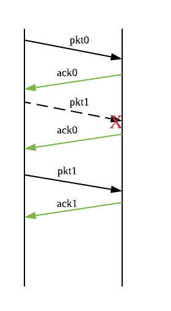
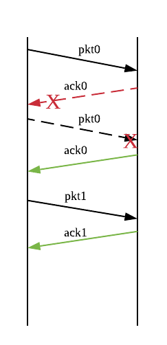
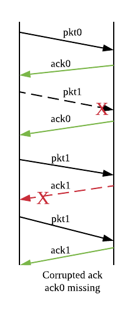
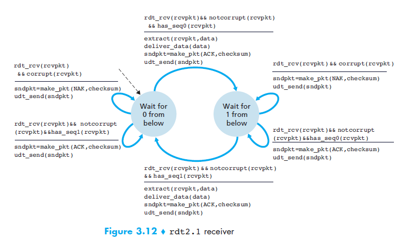
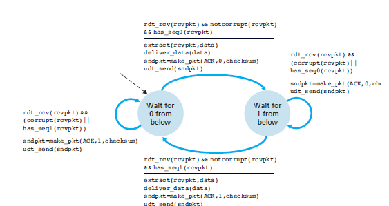
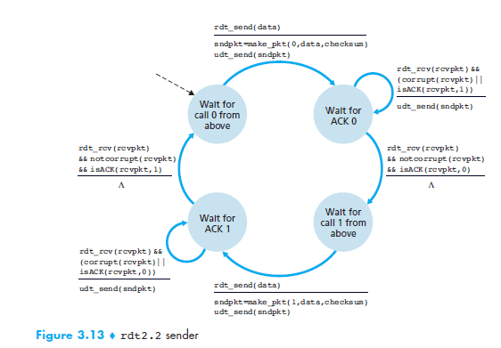
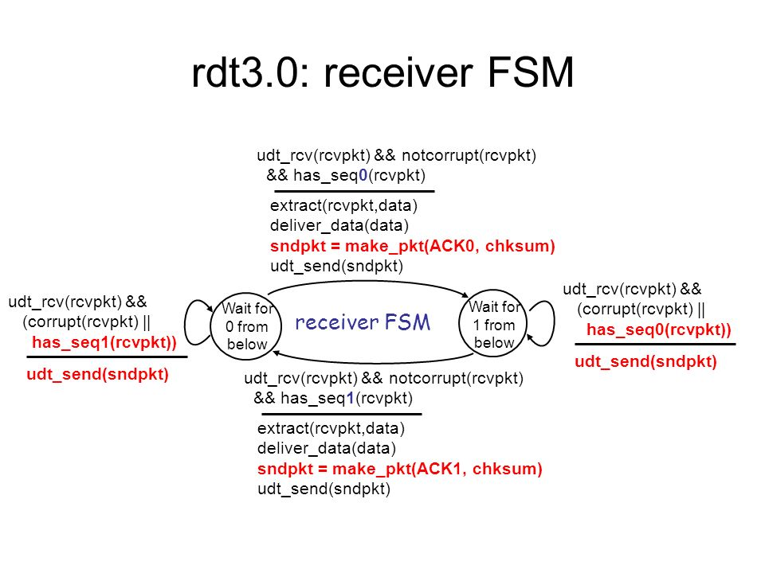
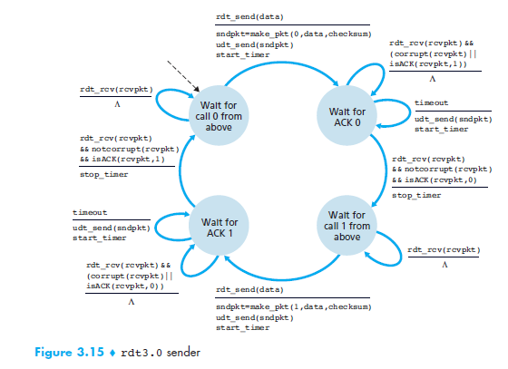

Table of Contents
- [Principles of Reliable Data Transport](#principles-of-reliable-data-transport)
  - [Model for Reliable Communication](#model-for-reliable-communication)
- [Basic RDT Protocols](#basic-rdt-protocols)
  - [RDT 2.0 & 2.1](#rdt-20--21)
  - [RDT 2.2](#rdt-22)
    - [Importance of Sequence Numbers (`seq_num`)](#importance-of-sequence-numbers-seqnum)
    - [Scenarios](#scenarios)
  - [RDT 3.0](#rdt-30)
    - [Features of RDT 3.0](#features-of-rdt-30)
    - [Calculating the Performance of RDT 3.0](#calculating-the-performance-of-rdt-30)
      - [Expected time between successful transmissions $(T_{succ})$](#expected-time-between-successful-transmissions-mathsemanticsmrowmo-stretchy%22false%22momsubmitmimrowmismimiumimicmimicmimrowmsubmo-stretchy%22false%22momrowannotation-encoding%22applicationx-tex%22tsuccannotationsemanticsmathtsucc%e2%80%8b)
      - [Throughput](#throughput)
      - [Utilization](#utilization)
    - [Requirements of Timeout](#requirements-of-timeout)
  - [Finite State Machine Diagrams](#finite-state-machine-diagrams)

# Principles of Reliable Data Transport

1. Physical channels are never completely reliable

    - Wireless links subjected to interference
    - Transmission noise --> lead to bit errors
    - Routers & Switches may drop packets due to buffer overflow

2. Reliable communication relies on **detection and retransmissions as necessary**.
    - Receiver: Acknowledges packets from the sender.
    - Sender: Transmits & retransmits based on information provided by the receiver. If the sender times out (ack/nack not received within a certain time-frame). An action will be triggered.
    - Packets: Contain [**sequence numbers**](#importance-of-sequence-numbers-seqnum)

## Model for Reliable Communication

-   Provides send/receive methods for applications to transfer packets
-   Fields in packet header is used to coordinate with peer

# Basic RDT Protocols

-   RDT 1.0: Assume reliable channel
-   RDT 2.0: Considers that channel may be corrupted.
-   RDT 2.1: RDT 2.0 + 1-bit `seq_num` for identifying packet loss.
-   RDT 2.2: RDT 2.1 + Stop and wait.
-   RDT 3.0: RDT 2.2 + timeouts

## RDT 2.0 & 2.1

**Assumptions**

1. Channel may corrupt but never lose packets.
    - Receiver always get something whenever a packet is sent
    - Sender always receives an ack after sending a packet (Feedback)
2. Receiver can always detect if packet has been corrupted.
   - Checksum to detect bit errors
     -  May be flawed as the checksum could still tally after modification to data

**Communication Flow**

-   Sender: Transmits one packet at a time and waits for ack/nack
-   Receiver: Sends ack when it receives packet correctly, and sends nack when it receives erroneous packet.

**Challenges**

-   Corruption: The reality is that packets, acks, nacks can all get corrupted.
    -   This means that the sender may not be able to tell which packet was received correctly or not.
    -   If sender retransmits the packet, the receiver could deliver the same packet to the application twice. If it transmits a new one, the receiver can fail to deliver a packet to the application.
-   Lost Packets
    -   Receiver does not know that a packet was sent to it, so it won't send an ack response
    -   Sender left waiting for ack, but ack never comes :(

Hence the 1-bit `seq_num` is introduced in RDT2.2, such that nack is not necessary anymore.

## RDT 2.2

Stop and wait (Alternating-bit protocol)
- Sender sends one packet and waits for receiver response

### Importance of Sequence Numbers (`seq_num`)

-   `seq_num` in ack identifies received packet(s)
-   Size of `seq_num`: Determines num of packets that can be sent before acknowledgements must be received

| sender                                               | receiver                                                                 |
| ---------------------------------------------------- | ------------------------------------------------------------------------ |
| Adds `seq_num` to packet                             | must check if received packet's `seq_num` != previously stored `seq_num` |
| must check if received ACK matches correct `seq_num` | receiver cannot know if its last ACK received OK at sender               |

### Scenarios

Case: Corrupted packet

- Receiver not receiving pkt1 as intended

Case: Corrupted ack

- Sender not receiving ack0, so it retransmit pkt0

<!--  -->

Case: Corrupted packet + Corrupted ack

- 1st packet and its ack not corrupted
- 2nd packet is corrupted so it is sent a 2nd time. 
- During the 2nd time, the packet is not corrupted but the ack is corrupted

## RDT 3.0

Previously RDT 2.2 did not address the issue of lost packets.
There are a few ways of recovering from lost packets:

1. Keep sending packet repeatedly until sender gets an ack
    - Sender and receiver both will do extra work
2. Sender waits for ack for a specified time, then re-sends the packet if ack fails to arrive in time (timeout)
    - Works well if maximum ack delay is known and **does not change**. Otherwise will lead to premature timeout.

### Features of RDT 3.0

*RDT3.0 is the correct way of implemeting RDT but inefficient*

-   Involves timeout before retransmission
-   Sends only 1 packet at a time
    -   works well if delay between sender & receiver is small
    -   inefficient if $RTT >> t_{pkt}$ where $t_{pkt}=\frac{L}{C}$

_example of ineffiency_
Consider a 1 Gb/s link with 10 ms delay in each direction, where RDT 3.0 sends only 1 packet every 20ms. The link is actually capable of sending 20 million bits in 20ms, so for typical packet sizes, only tiny fraction of link's capacity is used.

### Calculating the Performance of RDT 3.0

Important variables

-   $t_{pkt}=\frac{L}{C}$
-   $t_{out}$: RTT
-   ${C}$: link speed
-   ${L}$: average packet size
-   ${q}$: packet loss/corruption probability

If given $p$, the time to travel from sender to receiver and $p'$, the time to travel from receiver to sender, 

$$ q = p+(1-p)p' $$

#### Expected time between successful transmissions $(T_{succ})$

$$\begin{aligned}
T_{succ} =& \sum^\infin_{k=0}(k+1)(RTT+t_{pkt})(q^k)(1-q)(RTT+t_{pkt})\frac{1}{(1-q)^2}&& \\
=& \frac{RTT+t_{pkt}}{1-q}
\end{aligned}$$

#### Throughput

$$\frac{L}{T_{succ}} = C(1-q)(1+\frac{RTT}{t_{pkt}})$$

Thoroughput improves if
-  corruption probabiliy/loss get smaller
-  RTT gets smaller compared to $t_{pkt}$

#### Utilization

Fraction of time sender is busy sending

$$ U = \frac{D}{RTT+D}$$

Space-time diagram

### Requirements of Timeout

$$Timeout >= RTT$$
where $RTT = d_{nodal(data)} + d_{nodal(ack)}$

> Recall: $d_{nodal} = d_{proc} + d_{queue} + d_{trans} + d_{prop}$

**Challenges**

-   Premature timeout: sender receives ack late, after it has retransmitted the packet that it did not receive ack for.
-   Estimating RTT: Components are unknown and variable

## Finite State Machine Diagrams

| Protocol | Receiver                          | Sender                          |
| -------- | --------------------------------- | ------------------------------- |
| RDT 2.1  |  |  |
| RDT 2.2  |  |  |
| RDT 3.0  |  |  |