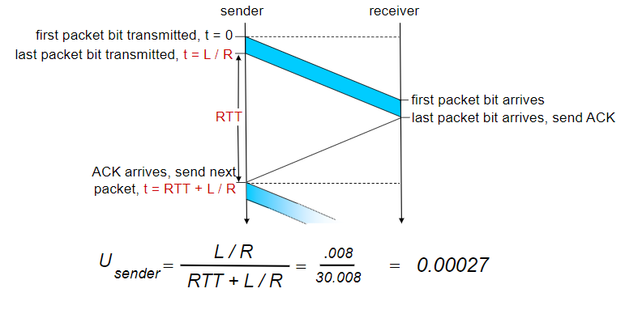
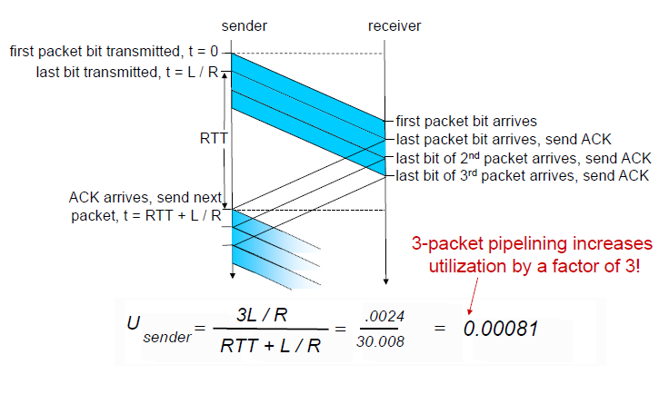
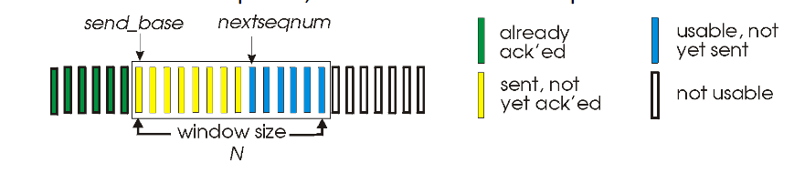

# Pipelined protocols

Pipelining allows for increased utilizaiton of the link.

| without pipeline                     | with pipeline                     |
| ------------------------------------ | --------------------------------- |
|  |  |

**Consequences of pipelining**

- The range of `seq_num` must be increased, since each in-transit packet must have a unique number and there may be multiple, in-transit, unack packets. (not counting retransmissions)
- Minimally, the sender will have to buffer packets that have been trasnmitted but not ack yet.

There are 2 basic approaches towards pipelined error recovery:
  1. Go-Back-N (GNB): [Interactive Animation](https://media.pearsoncmg.com/aw/ecs_kurose_compnetwork_7/cw/content/interactiveanimations/go-back-n-protocol/index.html)
  2. Selective Repeat (SR): [Interactive Animation](https://media.pearsoncmg.com/aw/ecs_kurose_compnetwork_7/cw/content/interactiveanimations/selective-repeat-protocol/index.html)

**Types of Pipeline Protocols**
  - [Go-Back-N (GNB)](#go-back-n-gnb)
  - [Selective Repeat (SR)](#selective-repeat-sr)
    - [Comparison with GBN](#comparison-with-gbn)
    - [Limitations of small range of `seq_num`](#limitations-of-small-range-of-seqnum)

## Go-Back-N (GNB)

**Sender**

The sender is allowed to transmit multiple packets without waiting for an ack, where:

- `N`: the no. unack packets in the pipeline / the window size.
- `base`: the `seq_num` of the oldest unack packet.
- `nextseqnum`: smallest unused `seq_num`, the index of the next packet to be sent.
- `seq_num_space`: range of [$0$, $2^k-1$] 
- `seq_num` with $k$ number of bits for the packet sequence number field in the packet header.



This results in the following array of packets at the sender's side.
```python
data = seq_num_space
ack_pkts = data[0:base]
window = data[base:base+N]
sent_unack_pkts = data[base:nextseqnum]
avail_pkts_to_send = data[nextseqnum:base+N]
outside_window = data[base+N::]
```

As such, it is refer to the **sliding-window protocol**.

**Receiver**

The receiver always send ack for pkt with highest in-order `seq_num`.
E.g. If the receiver receives packets 1,2,4,5 (pkt 3 is lost)
- assuming window size is 5. (packets 1-5)
- it will keep resending the ack for pkt 2 and discard packets above 3 (4-5).
- base is updated to 3, so after the timeout, the sender will resend packets 3-7. 
- If these packets are successfully received, then the sender can update base to 8 and send 8-12th packets.


## Selective Repeat (SR)

### Comparison with GBN
| Similarities                                                                  | Differences                                                                                                                        |
| ----------------------------------------------------------------------------- | ---------------------------------------------------------------------------------------------------------------------------------- |
| Fixed window size                                                             | -                                                                                                                                  |
| Initialize timeout for packets at the sender's side                           | Timeout is initialized for each and every individual packet in SR, instead of just one timeout for one packet in the window in GNB |
| The sender is allowed to transmit multiple packets without waiting for an ack | For out-of-order packets (due to lost packets), instead of discarding them, they are buffered instead in SR.                       |

### Limitations of small range of `seq_num`

- The receiver may intepret duplicate data as new data.
- The `seq_num_size` should be $2n$ to avoid this problem.