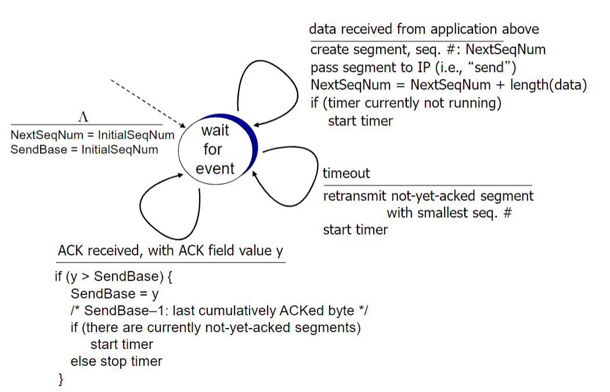

- [TCP](#tcp)
  - [TCP Segment Structure](#tcp-segment-structure)
  - [RTT, Timeout](#rtt-timeout)
    - [Estimate RTT](#estimate-rtt)
    - [Estimate SampleRTT](#estimate-samplertt)
      - [Timeout Interval](#timeout-interval)
  - [TCP RDT](#tcp-rdt)
    - [Fast retransmit](#fast-retransmit)
- [other RDT](#other-rdt)
  - [GBN](#gbn)
  - [SR](#sr)

# TCP

## TCP Segment Structure

- Cumulative ACK: TCP sends an ACK with `seq_num` of next byte expected from the other side, instead of replying which packet it has received
  - similar to Go-back-N
- Out-of-order packets: TCP will buffer, and not discard them.
  
## RTT, Timeout

### Estimate RTT
- $SampleRTT$: an average of recent measurements of time from segment transmission untli ACK receipt
  - Ignore retransmissions

Exponential Moving Average Equation
$$ EstimatedRTT = (1-\alpha)*EstimatedRTT + \alpha*SampleRTT$$

- Influence of past samples decreases exponentially fast
- typical $\alpha=0.125$

### Estimate SampleRTT

$$ DevRTT = (1-\beta)DevRTT + \beta|SmapleRTT-EstimatedRTT| $$
- typical $\beta$ = 0.25

#### Timeout Interval

$$ TimeoutInterval = EstimatedRTT + 4*DevRTT $$
- $4*DevRTT$ is a safety margin
- too short will result in premature timeout and unnecessary retransmissions
- too long will result in slow reactions to segment loss

## TCP RDT

### Fast retransmit

- If sender receives 3 duplicate (extra) ACKs for same data, it will resend unACKed segment with smallest `seq_num`.

# other RDT 

## GBN

- Requirement for k-bit `seq_num` in packet header : $2^k > N$
- Receiver window size: 1 (`expected_seq_num`).
- Relationship among `expected_seq_num`, `send_base`, `next_seq_num`: $send_base <= next_seq_num <= expected_seq_num $

## SR

rcv_base = next_seq_num if all packets uptonext_seq_num are received 

- Requirement for k-bit `seq_num` in packet header : $2^k > 2N$
- Receiver window size: 1 (`expected_seq_num`).
- Relationship among `expected_seq_num`, `send_base`, `next_seq_num`: $send_base < next_seq_num < expected_seq_num $
