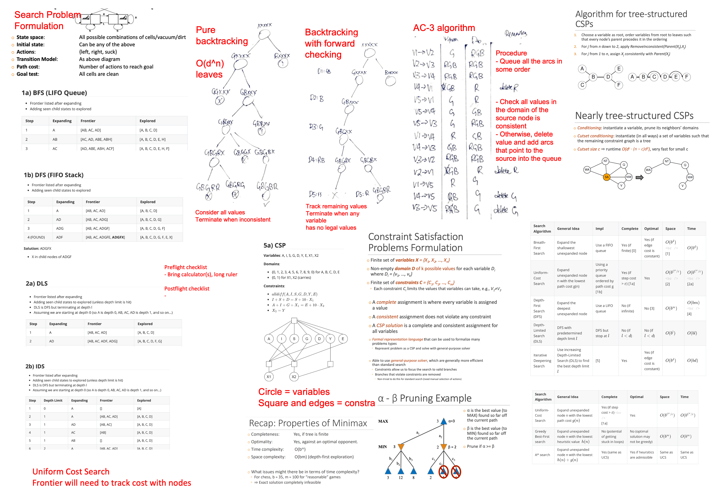
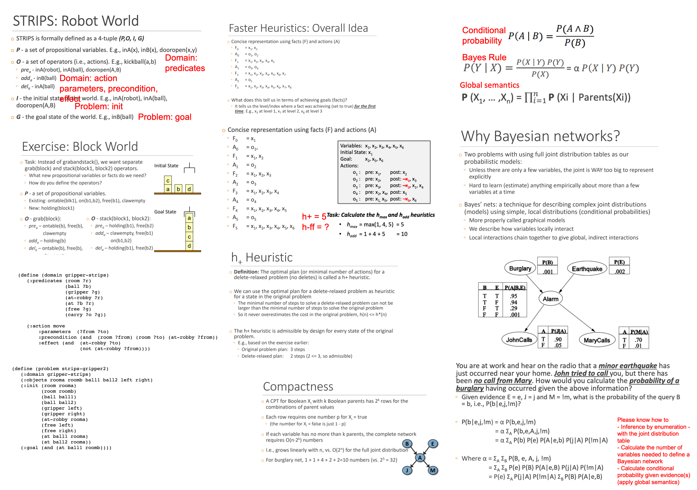
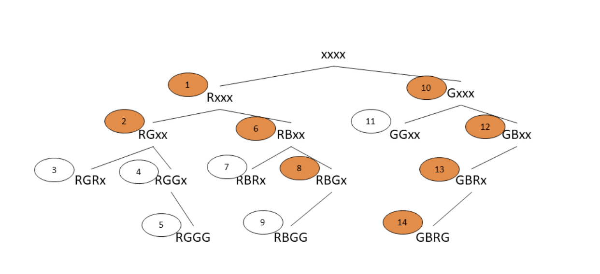
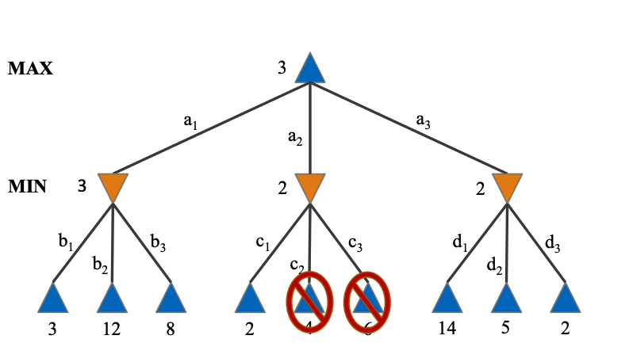

# Artificial Intelligence

* auto-gen TOC:
{:toc}


<script src="https://polyfill.io/v3/polyfill.min.js?features=es6"></script>
<script type="text/javascript" id="MathJax-script" async src="https://cdn.jsdelivr.net/npm/mathjax@3/es5/tex-chtml.js"></script>
<script>window.MathJax = {tex: {inlineMath: [['$', '$'], ['\\(', '\\)']]}};</script>


- Homework - 25%
- Project - 30%
- Quizzes - 20% (Week 5 and 10)
- Finals - 20%


<div style="page-break-after: always;"></div>
## Cheatsheet





<div style="page-break-after: always;"></div>


<div style="page-break-after: always;"></div>
## Introduction to AI

Turing Test

- whether the interrogator fails to guess which one is the machine, then the machine is said to have passed the Turing test
- test of behaviour rather than its internals - we do not care whether is it using logical methods or neural networks

Definitions of AI

- Think like humans - analysis of processes in the brain
- Act like humans - imitate human behaviour
- Think rationally - with logic?
- Act rationally - make the best decision given that is available, but need to define an objective

Social impact of AI

- Automation (and its impact on the labour market)
- Predictive analysis (discrimination)


#### The Agent Model

Agent - Anything that can be viewed as perceiving its environment through sensors and acting upon that environment through actuators

- Performance measure - the desirability of the environment states
- Environment - Which the agent exists in
- Actions - Made by the agent to affect the environment
- Sensors/Percepts - Observations made by sensors

An agent function maps a sequence of percept vectors to an action.

A rational agent chooses whichever action that maximises the expected value of performance measure given the percept sequence to date and prior environment knowledge.

- Rationality does not mean omniscience (all-knowing) or clairvoyant (future-knowing)

Different AI problems with the PEAS framework

- Medical diagnosis, Automated packing robot, Autonomous vehicle

Environment types

- Fully Observable vs Partially Observable - whether is it aware of the complete environment
- Deterministic vs Stochastic - whether the next state of the environment is completely determined by the current state and the action executed (strategic if deterministic except for the actions of other agents)
- Episodic vs Sequential - whether the choice of action in each episode depends only on the episode itself (not dependent on previous perceptions?)
- Static vs Dynamic - Static if the environment is unchanged while an agent is deliberating (semidynamic if the agent performance score changes)
- Discrete vs Continuous - whether is there a limited number of distinct and clearly defined perceptions and actions
- Single Agent vs Multi Agent - whether the agent is operating by itself in the environment
- (The types on the left are easier to deal with)


#### Problem Solving Agent Formulation

- State space
- Initial state
- Actions
- Transition model (in 8 puzzle - update the tiles in current and target cell positions)
- Path cost
- Goal test (explict at location, implicit checkmate)

A solution is a sequence of actions from the initial state to the goal state. An optimal solution is a solution with the lowest path cost.


 Evaluation      | Tree Search                                                  | Graph Search                                  
 --------------- | ------------------------------------------------------------ | --------------------------------------------- 
 Data structures | Recursion stack                                              | Frontier<br />Explored set                    
 Memory          | Height of search tree                                        | All visited nodes                             
 Time            | Expensive if graph is not a tree?<br />Intractable if graph is non acyclic? | Number of nodes and edges                     
 Comparison      | Redundant paths can cause the problem become intractable     | Potentially a large number of states of track 


#### Evaluation of Search Strategies

- Completeness - does it always find a solution if it exists
- Optimality - does it always find a least-cost solution if exists
  - All optimal algorithms are complete
  - A complete algorithm may not be optimal
- Time complexity
- Space complexity

Variables to evaluate space and time complexity

- $b$ - maximum branching factor for the search tree
- $d$ - depth of the least-cost solution
- $m$ - maximum depth of the state space (may be infinite)
- (usually in coding interviews we discuss based on number of nodes and edges, but anyways)


## Uninformed Search

Uninformed search - no additional information about states beyond that in the problem definition. (i.e. searching blindly, no idea on the desirability of each state)


 Search Algorithm         | General Idea                                            | Impl                                          | Complete                           | Optimal       | Space                | Time                 
 ------------------------ | ------------------------------------------------------- | --------------------------------------------- | ---------------------------------- | ------------- | -------------------- | -------------------- 
 Breath-First Search      | Expand the shallowest unexpanded node                   | Use a FIFO queue                              | Yes (if finite) [0]              | Yes (if edge cost is constant) | $O(b^d)$ <br />[1] | $O(b^d)$ 
 Uniform-Cost Search  | Expand unexpanded node n with the lowest path cost g(n) [7] | Using a priority queue ordered by path cost g [1b] | Yes (if step cost > $\varepsilon$) [1a] | Yes          | $O(b^{C^*/\varepsilon})$ <br />[2] | $O(b^{C^*/\varepsilon})$<br />[2a] 
 Depth-First Search (DFS) | Expand the deepest unexpanded node | Use a LIFO queue | No (if infinite) | No [3] | $O(b^m)$ | $O(bm)$<br />[4] 
 Depth-Limited Search (DLS) | DFS with predetermined depth limit $l$                  | DFS but stop at $l$                           | No (if $l<d$)                      | No (if $l<d$) | $O(b ^l)$            | $O(b l)$             
 Iterative Deepening Search | Use increasing Depth-Limited Search (DLS) to find the best depth limit $l$ | [5] | Yes | Yes (if edge cost is constant) | $O(b^d)$ | $O(bd)$ 

These are tree search algorithms. (How does these apply to graph search problems?)

Leetcode problems do not think of problems this way because graphs on Leetcode is constrained based on nodes and edges, rather than branching factor. Probably why this is confusing to me.

[0] Yes (if finite) - or rather "No (if infinite and does not have a solution)"?

[1] Do we need to store the path information?

[1a] Automatically penalises repeated paths. Does not prove no solution in infinite graph (can any algorithm do that anyway?)

[1b] **In graph search, the state is added into the explored set only after expanding the node**

[2] Consider a graph a-b-c-d, where b is the starting node and d is the goal state, and the cost of a-b and b-c is one, and the cost of c-d is large. We can see that the time uniform cost search is exponential wrt the cost of c-d.

[2a] Each insertion and removal cost $O(\log n)$ in the worst case. Is this considered in the complexity?

[3] The search might go down an infinite path, but the optimal solution may exist at a finite depth. Is this "No (if infinite)"?

[4] This is the maximum size of the LIFO queue will reach, keeping track of $b$ child nodes at each of the $m$ depths.

[5] Essentially BFS with better space complexity, but worse constant factor for time complexity.

[6] How do you know that a goal state is optimal? Does it assume an edge cost of one?

[7] How does UCS compare to Dijkstra https://www.baeldung.com/cs/uniform-cost-search-vs-dijkstras


## Informed Search

Informed search - uses problem-specific knowledge beyond the definition of the problem itself (some idea of the desirability of each state)

Issue with uniform cost search - possible redundant searches and we may waste search in the wrong direction


| Search Algorithm         | General Idea                                                 | Complete                                 | Optimal                                 | Space                    | Time                               |
| ------------------------ | ------------------------------------------------------------ | ---------------------------------------- | --------------------------------------- | ------------------------ | ---------------------------------- |
| Uniform-Cost Search      | Expand unexpanded node n with the lowest path cost $g(n)$    | Yes (if step cost > $\varepsilon$) <br />[1a] | Yes                                     | $O(b^{C^*/\varepsilon})$ | $O(b^{C^*/\varepsilon})$ |
| Greedy Best-First search | Expand unexpanded node n with the lowest heuristic value  $h(n)$ | No (potential of getting stuck in loops) | No (optimal solution may not be greedy) | $O(b^m)$                 | $O(b^m)$                           |
| A* search                | Expand unexpanded node n with the lowest  $h(n) + g(n)$      | Yes (same as UCS)       | Yes if heursitics are admissible | Same as UCS     | Same as UCS                |

All algorithms above use a priority queue, and are tree search.

Heuristics $h(n)$ is an estimate of how close a state $n$ is to the goal state.

A heuristic is admissible if $h(n) \leq h^*(n)$ 

- $h^*(n)$ is the true cost of node $n$ to goal state
- An admissible heuristic never overestimate
- Intuition - straight line distance can never be greater than actual road distance

A heuristic is consistent if $h(n) \leq c(n, a, n') + h(n')$

- $h(n)$ = estimated distance from node $n$ to goal state $G$
- $h(n')$ = estimated distance from node $n'$ to goal state $G$
- $c(n,a,n')$ = cost of getting from node $n$ to node $n'$
- Intuition - triangle inequality
- All consistent heuristics are admissible, but not all admissible heuristics are consistent

A heuristic $h_2$ dominates another heuristic $h_1$ if $h_2(n) \geq h_1(n)$

- Provided that both heuristics are admissible
- A dominant heuristic has the potential to explore less branches

How to design heuristics

- We want the heuristic to be as close to the true cost as possible
- Admissible heuristics can be derived from the exact solution cost of a relaxed problem (e.g. assuming direct paths)
  - Example of heuristics for 8-puzzle
    - Number of misplaced tiles
    - Total Manhattan distance
    - Sub problems (e.g. imagine that there is only 1,2,3,4 in the grid we have to restore their position without removing them from the board)

Applications of A* search

- Path finding problem
- Video games
- Resource planning problems
- Robot motion planning


## Constraint Satisfaction Problems

Compared to standard search problems, CSPs are more interested in the goal rather than the sequence of actions (path)

Definition

- State
  - Defined by variables $X_i$ that can take on values from domain $D_i$
- Goal Test
  - A set of constraint $C_i$ specifying allowable combinations of values for subsets of variables
  - The goal state is an unknown that is to be determined

Formulation

- Variables
- Domains
- Constraints
- Constraint graph (derived from constraints)
  - Each variable is represented as a circle
  - Each constraint is represented as a square connecting to the relevant variables

CSP Solution

- A complete assignment is where every variable is assigned a value
- A consistent assignment does not violate any constraint
- A CSP solution is a complete and consistent assignment for all variables

Advantages of CSPs

- Formal representation of language that can be used to formalize many problem types
- Ability to use a general-purpose solver, which are generally more efficient that standard search
  - Constraints allow us to focus the search to valid branches
  - Branches that violate constraints are removed

Varities of CSP problems

- Variables
  - Discrete variables
    - Finite domain
    - Infinite domain (all integers)
  - Continuous variables (real number)
- Constraints
  - Unary constraints - involve only a single variable
  - Binary constraints - involve a pair of variables
  - Higher-order constraints - involve three or more variables
  - Preference (soft contraints) - makes the problem a constrained optimisation problem

CSPs as standard search problem

- Formulation
  - Initial state - an empty assignment
  - Successor function - assign a value to an unassigned variable
  - Path cost - a constant cost for each step
  - Goal test - the current assignment is complete and consistent
- The solution will appear at depth $n$ for $n$ variables
  - There are potentially $n! d^n$ leaves in the search tree
    - $d$ is the size of the domain for the variable
    - Depth 1 has a branching factor of $nd$
    - Depth 2 has a branching factor of $(n-1)d$
    - ...
    - Depth $n$ has a branching factor of $d$

#### Backtracking

- Variable assignments are commutative
  - It does not matter which order you assign the variables.
  - We only need to consider assignment to a single variable at each level/depth (we do not need to consider which variable to assign to)
  - Branching factor is now the domain size $d$
  - Reduces $n!d^n$ leaves to $d^n$ leaves
- Backtracking search is essentially like DFS for CSPs
- Questions
  - Which variable should be assigned next?
    - Minimum remaining values (choose the most constrained variable)
    - Degree heuristic (choose the variable with the most constraints on remaining variables)
  - In what order should its values be tried?
    - Least constraining value (choose the one that rules out the fewest values in the remaining variables)
  - Can we detect inevitable failure early?
    - Forward checking (keep track of remaining legal values for unassigned variables)
      - Terminate search when any variable has no legal values
      - Does not provide early detection for all failures
    - AC-3 algorithm
  - Can we take advantage of problem structure?
    - Tree-structured CSPs

Example problem

```
{RGB} - {GB}
   |     | 
 {RG} - {G}
```




(Backtracking with forward checking, diagram made by Shiying)


#### AC-3 algorithm

Arc consistency of $X \to Y$

- $X \to Y$ is consistent if for every value of $X$ there is some allowed $Y$

Algorithm

- Begin with an arbitrary list of edges
- Maintain a queue of the arcs
- When domain of the node is pruned, add edges pointing to the node into the queue (at the end)
  - Just add the edge in the list on the left

```
V1 ---> V2: 	D1: RBG	D2: BG
V4 ---> V2: 	D4: G	D2: BG
V1 ---> V3: 	D1: RBG	D3: RG
V4 ---> V3: 	D4: G	D3: RG
V2 ---> V4: 	D2: B	D4: G  
(Delete G from V2, added V1->V2,	V4->V2)
V3 ---> V4: 	D3: R	D4: G
(Delete G from V3, added V1->V3,	V4->V3)
```


Complexity - $O(n^2 d^3)$

- $O(n^2)$ edges to check
- $O(d^2)$ for each edge, compare two domains of size $d$
- $O(d)$ variable changes
  - Each edge is processed at most $d$ times, which is domain size of the node it is pointing to.

Performance
- Arc consistency does not guarantee a solution
- Pruned domains allows for better search efficiency
- Time complexity may worsen in the worst case
- **How do we implement the general nonbinary constraint in practice?**


#### Tree-structured CSPs

Complexity - $O(nd^2)$

- $O(n)$ edges
- $O(d^2)$ for each edge, compare two domains of size $d$

Algorithm

- Choose a variable as a root, and order nodes such that every node's parent precedes it in the ordering.
- Starting from the last element to the second element, consider the domains for the element and its parent and remove inconsistent values.
  - Each remaining value in each node should have a solution for its children
- Assign consistent values from the root. There is a guaranteed valid assignment.


#### Nearly Tree-structured CSPs

Conditioning - instantiate a variable and prune its neighbours domains

Cutset conditioning - instantiate a set of variables such that the remaining constraint graph is a tree

Complexity - $O(d^c \cdot(n-c)d^2)$

- $O(d^c)$ iterations of tree-structured CSPs
- Very fast if $c$ is small

(You can also condition a node to compute two separate graphs)


## Adversarial search and games

Types of games

- Deterministic versus Stochastic
- Perfect Information versus Inperfect Information (of state)

Representing a Game as a Search Problem

- Initial State
- Action
- Terminal Test (Win / Lose / Draw)
- Utility Function (game is assumed to be zero sum)


#### Minimax Algorithm

- For deterministic and perfect information games
- Two players makes moves in succession

Approach

- Objective is to maximise the score for the first player, while the second player try to minimise the score
- Draw the tree, max player as triangles and min player as inverted triangles

Performance

- Complete, if the tree is finite
- Optimal, against an optimal opponent
- Time complexity: $O(b^m)$
- Space complexity: $O(bm)$ (same as depth-first search)

Simple fixes for the resource limit

- Cutoff at search at a certain depth
- Evaluation function to estimate the desirability of position at a leaf
  - Chess - weighted difference in the number of chess pieces
  - The relative size of the scores does not matter, as long as the order is preserved

Alpha-beta pruning
- Approach
  - $\alpha$ is the best value for max player found so far
  - $\beta$ is the best value for the current min player in the current path
  - Prune if $\alpha \geq \beta$, because max player will not choose the current path as the outcome of the current path can never be better than the current max move.
  - See the tree



- Time complexity is improved to $O(b^{m/2})$ if ordering is perfect
  - How this is calculated - we only need to branch at the max player, and the number of branches made is halved
  - No change in time complexity if ordering is not perfect because the worst case is possible


For non-deterministic games
- ExpectiMiniMax - consider the expectation at the chance nodes


## Machine Learning

Machine is the practice of using algorithms to learn from data. Previous approaches used rule based search.

There is still no general AI, all algorithms could only narrow tasks that they are designed on.

When is ML used

- Humans expertise does not exist
- Humans cannot explain their expertise (e.g. speech recognition)
- Models must be customised (personalised medicine)
- Models are based on huge amounts of data (genomics)
- Learning is not always useful (very boring tasks like payroll)

Components

- Representation - what is our data
- Optimisation - fitting
- Evaluation - measure performance of model

Tasks and techniques

- Classification
- Regression
- Clustering
- Association rules
- Reinforcement learning

Types of learning

- Supervised learning
- Unsupervised learning
  - Self-supervised learning - **Definition?**
- Semi-supervised learning
- Reinforcement learning

Designing a learning system

- Task
- Performance measure
- Training experience
- Target function
- Model
- Learning algorithm

Evaluation

- Accuracy
- Confusion matrix
- Precision and recall
- Receiver Operating Curve, Area Under Curve
- Regression losses (L1, L2)
- Difference between two probability distribution
  - Entropy - average level of information inherent in the variable possible outcomes $H(Q) = -\sum p(x) \log p(x)$
  - KL-divergence / relative entropy
    - difference between two probability distributions $P$ and $Q$
    - how much, on average, each sample gives the evidence of $p(x)$ over $q(x)$
    - $D_{KL}(P||Q) = \sum p(x) \log p(x) - \sum p(x) \log q(x)$
      = Information content of $P$ $-$ Information content of $Q$ weighted by $P$
    - average number of **total** bits needed to encode data coming from a source with distribution $P$ when we use model $Q$
  - Cross entropy
    - distance between two probability distributions $P$ and $Q$
    - $H(P,Q) = H(P) + D_{KL}(P \vert \vert Q) = - \sum p(x) \log q(x)$
    - average number of **extra** bits needed to encode data coming from a source with distribution $P$ when we use model $Q$

Sources of error
- Data mismatch - test set distribution is different from training set distribution
- Bias
  - Difference of the average value of prediction (over different realizations of training data) to the true underlying function $f(x)$ for a given unseen (test) point $x$ 
    - Different realisations of training data will train a different $\hat{f}$
    - $\text{bias}[\hat{f}(x)] = E[\hat{f}(x) - f(x)]$
  - Observation - error rate on the training set
  - Idea - underfitting
  - Mitigating bias
    - Modify input features
    - Increase size of model / Reduce regularisation
    - **More data does not reduce bias?** Yup does not help
  - Learning curve
    - Training set loss is higher than the desired loss. More data will allow the dev set loss converge to the training set loss, but the loss is still higher than the desired loss
- Variance
  - The mean squared deviation of $\hat{f}(x)$ from its expected value $E[\hat{f}(x)]$ over different realisations of training data
    - $\text{var}[\hat{f}(x)] = E[(\hat{f}(x) - E[\hat{f}(x)])^2]$
  - Observation - how much worse does the algorithm do on the dev or test set
  - Idea - overfitting
  - Mitigating variance
    - More data (e.g. artificial data)
    - Modify input features / Feature selection (with error analysis)
    - Decrease model size / Add regularisation
    - Add early stopping
  - Learning curve
    - Dev set loss higher than training set loss - but will converge when there is more data

Total error = bias + variance + noise

Bridge set

- Source - https://www.kdnuggets.com/2019/01/when-your-training-testing-data-different-distributions.html
- You have limited samples of your target distribution. You use augmented data which might have the same distribution as your target data.
- Purpose of bridge set - to understand if the error is coming from the data mismatch or variance error
- The bridge set and the test set consist of equal proportion of the augmented data and the target data.
- The validation (dev) set and test set consist of only target data.
- The model is trained on the training set
  - If the bridge set error is high compared to the training set - the model is overfitting on the training set
  - If the bridge set error is similar to the training set, but the dev set error is high compared to the training set - there is a data mismatch problem

Regularisation

- L1 Lasso
  - Feature selection by assigning insignificant input features with zero weight and useful features with a non zero weight.
- L2 Ridge
  - Forces the weights to be small but does not make them zero (non sparse solution) 
  - Not robust to outliers as square terms blows up the error differences of the outliers and the regularization term tries to fix it by penalizing the weights
  - Performs better when all the input features influence the output and all with weights are of roughly equal size


## Neural Networks

Concepts from Deep Learning

- Backpropagation
  - Breakdown in terms of node output, the breakdown node input and node output
  - **Solve the lecture example**
  - How do I solve the problem in the DL midterms?
    - Know which are weight values
    - Use common sense
- Activation function
  - To introduce non-linearities in the model
  - Gradient saturation
- Gradient descent and optimisers
  - Stochastic gradient descent
    - **What is a mini-batch?**
    - Advantages
      - More frequent updates resulting in faster convergence
      - Requires less memory
      - May help to escape local minima
    - Disadvantages
      - High variance in model parameters
      - May shoot up again even after achieving global minimum.
      - To get the same convergence as gradient descent needs to slowly reduce the value of learning rate
  - Adagrad
    - Advantages
      - Learning rate changes for each training parameter
      - Able to train on sparse data (?)
    - Disadvantages
      - Computationally expensive due to the need to calculate second derivative
      - The learning rate is always decreasing
  - Adadelta
    - Instead of accumulating all previously squared gradients, Adadelta limits the window of accumulated past gradients to some fixed size $w$. Use exponentially moving average rather than the sum of all the gradients
  - Adam
    - Works with momentums of the first and second order
    - https://tonghuikang.github.io/notes/sutd-deep-learning/#adam
    - Advantages
      - Converges rapidly
      - Rectifies decaying gradients, high variance errors
    - Disadvantages
      - Computationally costly
- Dropout
- Early stopping
- Data augmentation
- Regularisation
- Batch normalisation
- Word embeddings
  - TF-IDF
  - Co-occurance matrix
  - Skipgram, CBoW
- Recurrent neural networks
  - Vanishing gradient problem
- Optimisers


## Convolutional Neural Networks

- The formula = $\dfrac{N-F+2P}{\text{stride}} + 1$
- (I am still not sure if this is correct)
- There are no trainable parameters in pooling


## Deep Generative Models

- Regularised autoencoders
  - Sparse autoencoders - trained with sparsity penalty
  - Denoising autoencoders - trained with noise input
- Variational autoencoders
  - KL term acts as a regularisation of some sort to our reconstruction loss
  - VAE and debiasing by adaptative resampling underrepresented data (which have high variance in the latent representation)
- Generative Adversial Network
  - Vanilla GAN and its various training modes
  - Conditional GAN - generate specific alphabet, require the alphabet label
  - Pix2pix - generating a photo with a different style trained with paired data (day and night)
  - CycleGAN - generating a photo with a different style even if the trained data are not paired (horses and zebras)


## Classical Planning

Planning is the process of computing several steps of a problem-solving process before executing any of them.

In search, states are represented as a single entity (which may be quite a complex object)

In planning, states have structured representation which are used by the planning algorithm

Types of planners

- Domain-specific - playing a specific game
- Domain-independent - Gurobi, planners do not need domain specific knowledge and may not work well
- Configurable - general routing algorithms that is adaptable

Classical planning - path-searching in a graph

STRIPS - Stanford Research Institute Problem Solver

STRIPS Instance definition (POIG)

- P - a set of proportional variables
- O - a set of operators, each is a 3-tuple (pre, add, del)
  - pre - facts that must be true before the action can be performed (precondition)
    - How about facts that must be false?
  - add - facts that will change to true when the action is performed (postcondition)
  - del - facts that will change to false when the action is performed (postcondition)
- I - initial state of the world
- G - goal state of the world
  - Defined with a goal test condition

Closed World Assumption - facts are not listed in a state are assumed to be false. The agent has full observability. Only positive facts need to be state. - is this applied on the initial state?

Examples - robot world, block world

Components of a PDDL task

- Objects
- Predicates
- Initial state
- Goal specification
- Actions / Operators

Task specifications

- Problem file - objects, initial state, and goal specification
- Domain files - predicates and actions

Delete-relaxed problem

- Problem relaxation - Every plan that solves the original problem also solves the delete-relaxed problem
- A simpler problem to solve because true facts will always accumulate
- The delete-relaxed problem is an admissible heuristic $h(x) \leq h^*(x)$ - it never overestimate the cost in the original problem

h+ heuristic

- The optimal plan to a delete-relaxed problem
- Issues - requires computation of the optimal plan for a delete-relaxed problem (is this that difficult?)

h-max

- h-max is the cost of the single most costly goal fact (out of all goal facts)
- Optimisitic heurisitic - implicit assumption that an action can set multiple facts to true
- h-max is admissible, but under-estimate the true cost by a lot

h-add

- h-add is the summed cost of all goal facts
- Pessimisstic heurisitic - Implicit assumption is that an action can only set one fact to true
- h-add is not admissible

h-ff

- Algorithm
  - Loop through all goal facts
  - For each goal fact, check backwards for the action that made it possible
  - Continue all the way until initial state
- h-ff is inadmissible, but in practice useful


## Bayes and Uncertainty

Please know how to

- Inference by enumeration - calculate conditional probability with the joint distribution table
- Calculate the number of variables needed to define a Bayesian Network distribution table
- Calculate conditional probability given evidence(s)


Bayesian probability

- probabiltiy of event given some condition
- $\alpha$ is the inverse of the probability of the condition

General idea - "Compute distribution on query variable by fixing evidence variances and summing over hidden variables"

Inference by enumeration - count from the table

Use of conditional independence reduces the size of the representation of the joint distribution (joint distribution table) from $O(d^n)$ to linear in n. ($d$ is the largest domain size)

Conditional independence

- Variables X and Y is conditionally independent given Z
- $P(X,Y,Z) = P(X \vert Z) P(Y \vert Z) P(Z)$

How to count number of independent numbers needed - you do not double count $x$ and $1-x$

Probability of cause given effect and probaility of effect given cause

Bayesian network representation

- One variable per node
- One arc representing directly influence
- One conditional distribution for each node

Global semantics defines the full joint distribution as the product of local conditional distributions

- $P(X_1, ..., X_N) = \prod_i P(X_i \vert \text{Parents}(X_i))$

