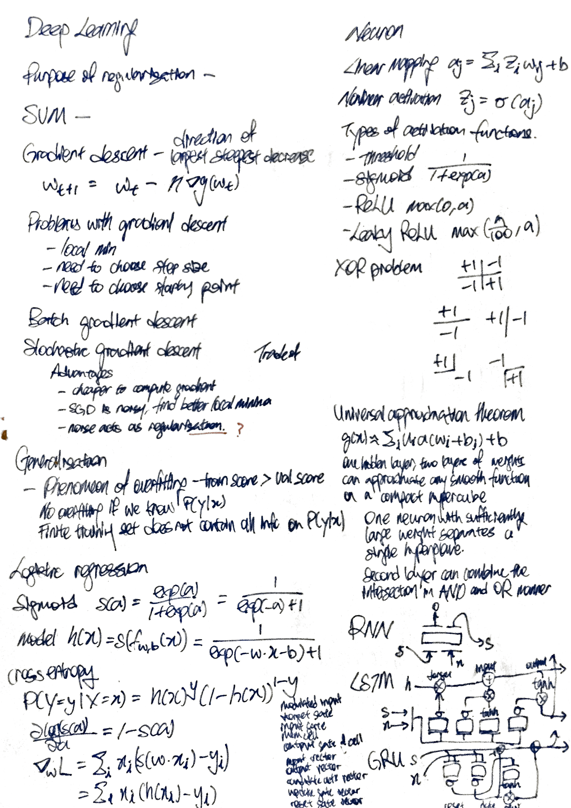
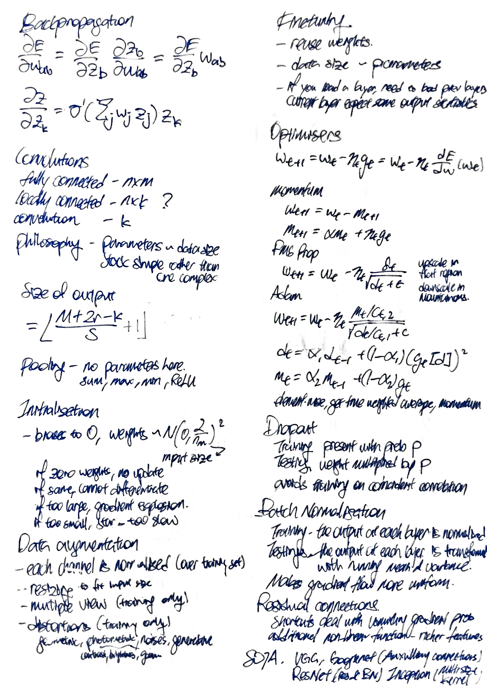
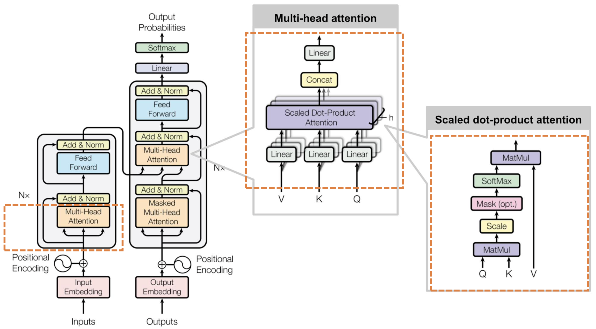
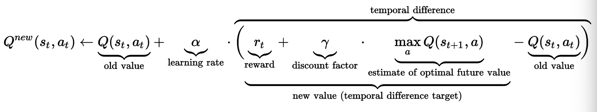

# Deep Learning

I am auditing this course, so projects and examinations are optional for me.

* auto-gen TOC:
{:toc}

<script src="https://polyfill.io/v3/polyfill.min.js?features=es6"></script>
<script type="text/javascript" id="MathJax-script" async src="https://cdn.jsdelivr.net/npm/mathjax@3/es5/tex-chtml.js"></script>
<script>window.MathJax = {tex: {inlineMath: [['$', '$'], ['\\(', '\\)']]}};</script>

<div style="page-break-after: always;"></div>

## Midterm Cheatsheet



<div style="page-break-after: always;"></div>



<div style="page-break-after: always;"></div>

## Finals Cheatsheet


<div style="page-break-after: always;"></div>

## Introduction

Why MINST and CIFAR-10 are not used for deep learning

- "There is almost not failure possibility on MINST and CIFAR-10"
- There are some methods that do not do well on the simple datasets but widely used in practice (e.g. batch normalisation)


Key components of discriminative (?) machine learning

- IO - model for input space, model for output space
- M - define a prediction model (and its hyper-parameters)
- L - define a loss functionm
- A - define an algorithm for updating the model parameters


Low-level (?) engineering steps

- Define a data loader
  - Mini-batch of data
- Define data augmentations steps
- Hyper-parameter search
- Optimise your model parameters (i.e. training)


Pytorch guide

- https://pytorch.org/tutorials/beginner/blitz/tensor_tutorial.html
- https://pytorch.org/docs/stable/notes/broadcasting.html
  - Two tensors are “broadcastable” if the following rules hold:
    - Each tensor has at least one dimension.
    - When iterating over the dimension sizes, starting at the trailing dimension, the dimension sizes must either be equal, one of them is 1, or one of them does not exist.
- `torch.mm` and `torch.bmm`


The fallacies of Deep Learning

- Poor performance for small sample sizes
- Transfer learning can help here

Human in the loop

- Any deployment of machine learning solutions needs to have a mechanism to deal with its errors

What is being optimised

- Data augmentation
  - brightness, contrast, color distortion
  - Feature engineering is no longer done as features will be learned from data
- Hyperparameters
  - Batch size
  - Minibatch structure
  - Initial learning rate
  - Learning rate decay
  - Optimizer

The goal of machine learning is to find a model that generalises to unseen data points.


<div style="page-break-after: always;"></div>


#### Generalisation

The goal in machine learning is to find parameters $w,b$ which generalise well to new, unseen data points - i.e. give predictions with low errors

- We need a way to model "new, unseen points"
- We define generalisation in terms of an experiment in which we draw 100 or 1000 times a test dataset - or in terms of an expected loss.

The training objective and the prediction objective might be different (e.g. training objective usually include regularisation terms).

(I do not understand the small example middle - but I am not taking the exam heh)

The expected loss is considered "low" when our average loss is very close to the assumed model $f^*$ that generated the dataset.

- (when we eliminate both bias and variance leaving only noise, in the bias-variance tradeoff)


Takeaways

- If we know the generating distribution $P(y|x)$ and optimize directly for it, there is no overfitting. Overfitting occurs because we optimize for a finite training set $D_n$, which does not contain all information about the generating distribution $P(y|x)$
  - Phenomenon is overfitting - training score > validation score
  - Why do we need test data when we have validation data?
- Suppose we are using the same number of data. The more complex classifier have a higher change of locally (?) predicting a wrong label compared to simple classifiers. 
  - More complex classifiers generally need more data to estimate whether they predict correctly (I disagree, this depends on the size of the test sample).
  - More complex classifiers need more data to train.

<div style="page-break-after: always;"></div>


## Linear Regression

Prediction mapping of vector $x$ to a value

- Linear function without bias
  - $f_w(x) = x \cdot w$

- Linear function with bias $b \in \mathbb{R}^1$
  - $g_{w,b}(x) = x \cdot w + b$

Linear mapping $g(x) = w \cdot x + b$
- Has a zero set which is the points ${u + b\dfrac{w}{||w||^2}}$
- "What does linear mapping represent?" (Why is this introduced?)

Loss function to use linear regression for classification

- Square loss $(f(x) - y)^2$
  - Easy to compute derivative
- $0-1$ loss - 0 if correct, 1 if incorrect
- Hinge loss - $\max(0, 1-f(x) \cdot y)$
- Takeaways
  - Generalization
  - Linear model is suitable for classification

Regularisation

- Ridge regression $\lambda ||w||^2$
- **<u>What is the purpose of regularisation?</u>**

Support Vector Machine

- Average hinge loss
- Linear/affine model
- Quadratic penalty on the weights
- SVM maximises the margin $\dfrac{1}{||w||}$
- (please understand how linear regression is used to SVM)

<div style="page-break-after: always;"></div>


## Logistic regression

The sigmoid function $s(a)$

$s(a) = \dfrac{\exp(a)}{1+\exp(a)} = \dfrac{1}{\exp(-a) + 1}$

Logistic regression model

$h(x) = s(f_{w,b}(x)) = \dfrac{1}{\exp(-w \cdot x-b) + 1}$

The cross-entropy loss function
- $L(p(x),y) = -y(\log(p(x)) - (1-y)\log(1-p(x))$

- $p(x)$ is our prediction of the probabilty

- Derivation of the cross-entropy loss

  - We want to find a set of parameters $w,b$ that maximises the likelihood of observing the training data $L(w,b) = P(Y_1 = y_1, Y_2 = y_2 ... | x_1, x_2 ...)$

  - As data points are conditionally independent

    $L(w,b) = P(Y_1 = y_1 | x_1) \cdot P(Y_2 = y_2 | x_2) \dots$

  - Maximising the product of probabilities is the same as minimisng the negative sum of log-probabilities

    - $w^*,b^* = \text{argmin}_w -\log(L(w,b))$

- Derivation of the loss function

  - Expressing probability of the prediction is correct $P(Y=y|X=x)$ in terms of the predicted probability of one of the classes $h(x) = P(Y=1|X=x) = s(w \cdot x)$
  - $P(Y=y|X=x) = h(x)^y \cdot (1-h(x))^{1-y}$
    - $h(x)^y$ if $y=1$ 
    - $(1-h(x))^y$ if $y=0$ 

Optimising with gradient

- $\dfrac{\partial \log (s(a))}{\partial a} = 1 - s(a)$
- The gradient with respect to $w$ is
  - $\nabla_w L = \nabla_w \left( - \sum_i y_i \log(s(w \cdot x_i)) + (1-y_i) \log(1-s(w \cdot x_i)) \right)$
  - $\nabla_w L = \sum_i x_i (s(w \cdot x_i) - y_i) = \sum_i x_i (h(x_i) - y_i)$

Observations


- The gradient of $w$ is the weighted sum of differences between the predicted probability and the true classification.
- If both classes can be perfectly separated, the weights can go to infinity. We use a regularisation term to avoid this.
- To add a bias term, we can augment all our data points by adding an extra dimension which is constant.
- Are the above expressions designed or derived?


<div style="page-break-after: always;"></div>

## Gradient descent

Gradient methods can be used if the function is differentiable.

- Goal
  - Find $w^* = \text{argmin } g(w)$
- Idea
  - The negative gradient at point $w$ is the direction of locally steepest decrease from $w$
- <u>General procedure of gradient descent</u>
  - Choose the steps size $\eta$ and initial weights $w_t$
  - We change the weight in the direction of the negative of the gradient
    - $w_{t+1} = w_t - \eta \nabla g(w_t)$
  - We stop when $||g(w_t) - g(w_{t-1})||$ is small.
  - **How is the gradient computed?**
- Problems with gradient descent
  - We might only reach a local minimum.
  - We need to choose a step size.
  - We need to choose the starting point.


How do we calculate the gradient of a function?

- $\nabla f(x)$ is the vector of partial derivatives in point $x$.
- The gradient stores information about all slopes of a function at $x$ for every direction $v$ away from the point.
- How? Given function and data points?


Differentiability

- A function is differentiable in input $x$ if all directional directives exist for all directional vector $v$.
- The directional derivatives satisfy a linear relationship.


Learning rate

- We often start with a learning rate, and decrease its value witha  learning rate schedule (polynomial or by a factor every $N$ iterations)
- Enforces convergence, but not necessary to a good point.
- A large learning rate at a steep starting point can also cause problems


#### Stochastic gradient descent

Batch gradient descent

- We want to minimise average of losses over all training samples $\mathcal{L}(f(x,\theta), y)$.
- The gradient is computed with the entire dataset. 

<u>Stochastic gradient descent</u>

- Average of losses over a mini-batch of samples
- Advantages
  - Full-batch is often too costly to compute a gradient using all of the samples.
  - SGD is a noisy, approximated version of the batch gradient. The local optima found with SGD can be better.
  - The noise from approximation can sometimes act as regularisation - prevents looking at the data too closely.
- What is the trade-off in the batch size?


<div style="page-break-after: always;"></div>

## Neural networks

Neuron

- Set of inputs
- One output
- Weights on inputs, and bias
- Non-linear activation function
- Forward equation
  - Linear mapping $a_j = \sum_i z_i w_{ij} + b$
  - Nonlinear activation $z_j = \sigma(a_j)$

Types of activation functions

- Threshold $1$ if positive, otherwise zero
- Sigmoid $\dfrac{1}{1+\exp(a)}$ 
  - Prone to saturation - when the output of the sigmoid is close to 0 to 1
  - The gradient of the sigmoid function is close to zero
  - Almost no parameter update and learn gets stuck
- ReLU $\max(0,a)$
  - Why is ReLU most commonly used?
- Leaky ReLU $\max\left(\dfrac{a}{100},a\right)$
- https://towardsdatascience.com/activation-functions-b63185778794

Neural network

- Directed graph structure made from connected neurons
  - could have cycles - known as recurrent neural network

How does neural network learn non-linear mappings

- The XOR problem
  - To classify $(x_1 > 0) \, \oplus \, (x_2 > 0)$
  - We can use $\tanh$ to push points towards $(\pm 1,\pm 1)$
    - Layer one
      - $z_1 = \tanh(10x_1)$
      - $z_2 = \tanh(10x_2)$
    - Layer two
      - $z_3 = \tanh(z_1 + z_2 - 1)$ fires only for $(+1,+1)$
      - $z_4 = \tanh(- z_1 - z_2 - 1)$ fires only for $(-1,-1)$
  - There are multiple solutions

Universal approximation theorem

- $g(x) \approx \sum_i u_i a(w_i + b_i) + b$
- Neural networks with one hidden layer, two layers of weights can approximate any smooth function on a compact hypercube.
- Does not mean that we are able to learn well from training data.
- Logic
  - One neutron with sufficiently large weight separates a single hyperplane.
  - Second layer can combine the intersection in AND or OR manner
- Takeaway

  - NN can learn non-linear boundaries
  - Complexity arises by combining many simple units
  - Can learn non-linear boundaries (e.g. XOR problem)

How to learn neural network parameters

- Compute gradient $\dfrac{\partial L (\text{minibatch}, f_w)}{\partial w}$
- Optimise parameters by gradient descent $w_{t+1} = w_t - \epsilon_t  \dfrac{\partial L}{\partial w}$

Multiclass vs multilabel classification

- Multiclass - labels are mutually exclusive
  - We use a one-hot vector as the target
  - The sum of our probabilistic outputs should be equal to one
    - We use softmax mapping in the last layer
    - $p_c = \dfrac{\exp(z_c)}{\sum_i \exp(z_i)}$
    - The probabilities will add up to one
    - If $C=2$, we have the logistic sigmoid.
- Multilabel - labels may not be mutually exclusive
  - The target vector may have any number of ones
  - We have a logistic loss for every label

<div style="page-break-after: always;"></div>

#### Backpropagation

The objective of backprogagation is to calculate the gradients of each weight from node $b$ to node $a$ $\dfrac{\partial E}{\partial w_{ab}}$, where $E$ is the loss of the minibatch.

The derivative of the weight is the derivative of the output node

$\dfrac{\partial E}{\partial w_{ab}} = \dfrac{\partial E}{\partial z_{b}} \dfrac{\partial z_b}{\partial w_{ab}} = \dfrac{\partial E}{\partial z_{b}} w_{ab}$

The we use chain rule to compute the derivative of each node

$\dfrac{\partial E}{\partial z_k} = \sum\limits_{l:\, l \text{ receives input from } k} \dfrac{\partial E}{\partial z_l} \dfrac{\partial z_l}{\partial z_k}$

The derivative between each node $\dfrac{\partial z_l}{\partial z_k}$

$\dfrac{\partial z_l}{\partial z_k} = \sigma' \left( \sum_j w_j z_j \right) z_k$

We can reuse the derivative in the later layers (this technique is known as dynamic progamming).

What happens for recurrent neural networks?


Challenges
- Vanishing and exploding gradients
  - Gradients may become very small. Small gradients imply very low weight updates and slow learning.
  - If we use sigmoid as activations, a saturated sigmoid will result in a gradient close to zero.
- One key challenge in deep learning is to maintain gradient flow so as to be able to update weights quickly, and at approximately the same speeds across the network.

<div style="page-break-after: always;"></div>

#### Convolutions

Why do we use convolutions?

- Fewer parameters.
  - Fully connected layer - $n \times m$ parameters
  - Locally connected layer - $n \times k$ parameters
  - Convolution - $k$ parameters
  - Philosophy
    - Machine learning in general - Keep number of parameters limited to training set size to avoid overfitting.
    - Deep learning - stack simple functions deeply in many layers than learning in one layer something very complex.

- One layer as a battery of localised pattern detectors
  - We want the detection to be localised.
  - Neighbour pixels tend to be more related.
  - Each filter kernel $w$ works like a detector for some structure by computing an inner product.
- Stacking convolutions
  - Convolutional layers can be stacked.
  - Neurons at high layers can look at very large regions of the input image
- (Shift-invariance?)
  - The idea that it does not matter where the object is placed.


Dimensions of a 2D convolution

- Parameters affecting the size of the output layer
  - Size of one dimension of the input layer $M$
  - Padding (of the input) $r$
  - Kernel size (dimension of weights of the kernel) $k$
  - Stride (the number of input elements/pixels which $w$ is moved at every step) $s$ 
    - essentially downsampling the layer
- Size of one dimension of the output layer is $\left\lfloor \dfrac{M+2r-k}{s} +1 \right\rfloor$


Pooling

- Similar to convolution, but has no parameters to be learned.
- Variants - sum pooling, max pooling, min pooling, ReLU pooling
- (Idea - detect the presence of a pattern over a larger area, act as nonlinearity)

<div style="page-break-after: always;"></div>

## Training techniques

#### Initialisation

Guidelines on initialising the parameters of a neural network
- Initialise weights to random numbers
  - set biases to zero
  - draw weights from a $N \left( 0, \dfrac{2}{n_{in}}^2 \right)$
- Why different?
  - If the weights are initialised with the same value, we would have identitical gradient updates for the weights. Neurons will never start to produce different outputs.

- Why small weights?
  - (So we don't have explosions at the start)
  - (If too small the training of the weights starts too slowly)

<div style="page-break-after: always;"></div>

#### Data augmentation

- give suggestions how to use images of varying sizes in aneural network with a fixed input size
- use a neural network with an input size that is differentfrom the one used at training time
- explain some example data augmentations
- explain how to choose data augmentation parameters


Data augmentation at testing time allows the neural net to see multiple views of the same sample.

Data augmentation at training time allows the neural net to be trained with more samples.

Types of augmentation

- Each channel is normalised over a the mean and standard deviation estimated over the training set - "to match how the network was trained"
- Resizing the input as the neural takes in a fixed size.
- Take multiple views of the data (at testing time only)
- Distortions (at training time only)
  - Geometric (rotation, mirroring, shear)
  - Photometric (contrast, brightness, gamma)
  - Noises (Gaussian)
  - Generative methods like seq2seq or cycleGANs
  - (Can help to reduce overfitting?)

<div style="page-break-after: always;"></div>

#### Finetuning

- We can reuse weights obtained from a similar task. The weights are the same except for the last layer. In training, we freeze all layers except the last 1-2 layers.
- If we have a small number of samples, it is better that we learn a simple model. Finetuning makes sense because the number of parameters we train is small.
- When you load a layer, you have to load the weights for any layer below it, because the current layer expect certain output statistics from the layer below.

<div style="page-break-after: always;"></div>

## Optimizers

Stochastic gradient descent (refer to a section previously)

- $w_{t+1} = w_t - \eta_t g_t = w_t - \eta_t \dfrac{dE}{dw}(w_t)$

Learning rate $\eta$

- Too small - converge too slowly
- Too large - divergence
- The loss profile could have a "cliff"
  - Too slow then too fast

Learning rate schedule $\eta_t$

- Linear decrease (learning rate multiplies by $\gamma < 1$ at every $K$ step)
- Polynomial decrease ($\eta_t = \eta_0/t^\alpha$)
- Warm restarts
  - Learning rate returns to maximum periodically
  - Purpose - To jump out of the local minima

Weight decay with regularisation

- Derived from quadratic regularisation
- Push the weights towards zero
- $w_{t+1} = w_t - \eta_t g_t - \lambda \eta_t w_t$

#### Momentum

- Acts as a memory for gradients in the past
- The applied gradient is stablised by an average from the past
- Reduces the influence of too big gradients when taking "an unlucky step into a steeply mountainous region" 
  - Smooths the gradient
- $m_t$ is an expoential average of previous gradients
  - $m_t = \alpha m_{t-1} + \alpha^2 m_{t-2} + ...$
- $w_{t+1} = w_t - m_{t+1}$
- $m_{t+1} = \alpha m_t + \eta_t g_t$

#### RMSProp

- Exponential moving average (EMA)
  - The weights of EMA($g_s$)$_t$ sum up to $1 - \alpha_{\text{EMA}}^{t+1}$
- $w_{t+1} = w_t - \eta_t \dfrac{g_t}{\sqrt{d_t + \epsilon}}$
- $d_t = \alpha_\text{EMA} d_{t-1} + (1-\alpha_\text{EMA}) \vert \vert g_t \vert \vert ^2$
- Summary of method
  - Maintain an EMA for squared norms of gradient
  - Divide gradient by square root of EMA, plus a stabilising $\epsilon$
- Interpretation of effect
  - Divide gradient $dE/dw$ by a history of gradient norms with a time-limited horizon
  - Upscale step-size in flat region
  - Downscale step-size when it become mountainous

#### Adam

- RMSProp with momentum term, with two improvements
  - Normalise every dimension of the update separately
    - $d_t$ is now a vector
  - Get a true weighted average by multiplying with the appropriate constant
    - $m_t$ is divided by $1-\alpha$
    - $d_t$ is divided by $1-\alpha_\text{EMA}^t$
- (Add formula here)

<div style="page-break-after: always;"></div>

## Model Improvements

#### Dropout

- At training time - each node is present with probability $p$
  - In each minibatch, are the nodes dropped the same
- At testing time - the weight of the node is multiplied by $p$
- What is the tradeoff for the choice of $p$?
- [Paper](https://www.cs.toronto.edu/~hinton/absps/JMLRdropout.pdf)
- Inspired by bagging (bootstrap aggregating)
  - Used in random forests and decision trees
- You train only on a subset of the dataset
  - Helps to prevent overfitting
  - In bagging, you drop input. In dropout, you drop nodes. Which is quite the same, because the output of the previous layer is an input for the next layer.
- Why does bagging or dropout work?
  - Assume that we have a correlation between two features in the training data due to conincidence (i.e. this correlation is not present in the test data). Overfitting happens as we train on the coincidental correlation. If we drop features, we can prevent the algorithm from using such non-generalising correlations.

#### Batch Normalisation

- Each mini-batch is trained together (at the same time). At every layer where batch-normalisation is applied, normalise its output of the layer before passing on to the next layer.
- At the end of every mini-batch, normalise its output before passing it to the next layer. (Usually a batch size of at least 8 is used)
- During testing
  - The running (?) mean and variance at training time (i.e. all the training history).

  - Please activate `model.eval()` for PyTorch during inference, and `model.train()` when inference is done.
- Benefits
  - Make gradient flow more uniform across neurons of a layer.
  - https://towardsdatascience.com/batch-normalization-8a2e585775c9

#### Residual connections

- **What are residual connections?**
- Backward pass - gradient flows as the identity through the shortcut, deals with the vanishing gradient problem (how?)
- Forward pass - additional non-linear function on top of the input feature from the previous layer (?), allows for richer features


#### The history of SOTA CV models

- Traditional Convolutional Neural Network structure
  
  - (pre-batchnorm and residual connections)
  - Convolution - ReLU - Pooling with last two fully connected layers
- VGG
  - From Oxford Visual Geometry Group
  - 2014 ImageNet LSVRC second place
  - Structure
    - Repeated blocks of nx(convolution-ReLU)-pooling
    - 3 fully connected layers containing many parameters
    - Dropout layers between fc layers
- Googlenet
  - 2014 ImageNet LSVRC first place
  - Contribution
    - Auxiliary losses (in training only) to help to address vanishing gradient problem due to deep neural nets (ResNet is a better way of doing this?)
    - Inception module - convolution parallel with different effective kernel sizes for multiple scale processing (object may have different scales)
- ResNet
  - Residual connections shortcuts across layers

  - Batch-normalisation after every convolution
- Densenet
  
  - ResNets to the extreme - within each "dense block", connect each layer to each other layer with shortcuts.
  - Better parameter vs error tradeoff versus ResNets.
- InceptionV3
  
  - Improved Inception module - Use 2 layers of 3x3 instead of one layer of 5x5 because it is faster (really?) and less likely to overfit. (?)
  - https://towardsdatascience.com/a-simple-guide-to-the-versions-of-the-inception-network-7fc52b863202

<div style="page-break-after: always;"></div>

## Recurrent Neural Networks

There are many variations, and notation may not be uniform.

#### Vanillin RNN cell

- (Visualise how it will look like if it is expanded. It is a deep neural network that has shared weights across various blocks)
- (Please understand the dimensions of the input)
- Elements
  - The input is concatenated with the hidden state from the previous cell.
  - There is a linear mapping from `combined` to the next hidden state and the output.
  - The output undergoes a softmax function (e.g. for multiclass classification)
  - We define the initiall hidden state somehow (all zeroes is ok)

```python
    def forward(self, input, hidden):
        combined = torch.cat((input, hidden), 1)
        hidden = self.i2h(combined)
        output = self.i2o(combined)
        output = self.softmax(output)
        return output, hidden
```

- Vanishing/exploding gradient
  - Due to product of many terms
  - $\dfrac{\partial s_t}{\partial s_{t-K}} = \dfrac{\partial s_{t}}{\partial s_{t-1}} \dfrac{\partial s_{t-1}}{\partial s_{t-2}} \dots \dfrac{\partial s_{t-K+!}}{\partial s_{t-K}}$

#### LSTM cell

- Elements
  - **Forget gate** - what to forget (0 to 1)
    - What is to be forgotten is multiplied to the hidden state
  - **Input gate** - what to remember (-1 to 1) and how much to remember (0 to 1)
    - What is to be remembered is added to the hidden state **memory cell**
  - **Output gate** - what to output (0 to 1)
    - The output is **output state**
  - (There are weights associated with each gate)
- How does LSTM resolve the vanishing/exploding gradient problem
  - https://weberna.github.io/blog/2017/11/15/LSTM-Vanishing-Gradients.html

#### GRU cell

- Comparison with LSTM
  - Fewer parameters
  - No memory cell, the state is recorded in the output state
- Elements
  - Candidate activation vector
  - Update gate vector
  - Reset gate vector
- There is only one hidden state.

#### Temporal Convoluntional Neural Network

- (Prof worked on it)
- Use layers of 1D CNN with non-linearities to model the sequence.
- Dilated convolution - the "stride" of the kernel in each layer is two
  - Advantages
    - RNN needs to process the input seqeuence step by step and cannot be parallelly calculated.
    - Can still model the hierarchical structure of the information.
  - (Are the weights shared like in CNN?)
  - (Require fixed length inputs?)
- Now transformers are used

#### Implementation

- Pytorch allows you to feed all the to avoid the use of for loop, by fitting the sequence as a whole.
- However, if you do not have the next input in advance, you may still need to use the for loop.

#### Sequence to one prediction

- The loss will be trained on the ouput.
- Vanishing/exploding gradient problem due to deep structure

#### Sequence to sequence prediction/generation

- Loss will be the sum of losses over all time steps
- Refer to section on transformer

#### Encoder to sequence generation

- The input could an output from an encoder (e.g. image encoder)
- Feed last prediction as an input to the next step
- Stop if `EOS` label is predicted.


## Attack and defense on neural networks

Neural networks are "limited" - they will always be at risk of attacks making them malfunction, no matter how many safeguards that are put in place.

Epsilon Noising Attack

- Add noise to the image to cause the model to misclassify
- Noise could be normally or uniformly sampled, from a range $[-\epsilon,\epsilon]$
- Example in lecture - effect MINST on accuracy

What is a good attack sample

- Efficacy - makes the model predict a wrong label of the sample
- Plausibility - looks normal to a human
  - Impose a constraint on a distance metric
    - $L_0$ norm - number of changed parameters
    - $L_1$ norm - absolute difference
    - $L_2$ norm - sqaured difference
    - $L_\infty$ norm - maximum difference (usually used)

#### Impact of noise on classifiers

- Deep learning algorithms process data differently from humans, with strong discontinuities in the change of prediction as a function the inputs.
- The image space is not uniformly filled with image samples, images usually form clusters in the image space.
- Regions will not necessarily be contiguous
- Training samples are usually far away from the boundaries.
- The boundaries between samples are randomly decided. The boundaries not necessarily be smooth.
- Noise can move the samples across a boundary resulting in a misclassification. The gradient can inform us of the direction we can move the sample.

#### Taxonomy on attacks

- Untargeted attack - just misclassify
- Targeted attack - misclassify as a specific label
- Black-box attack - can only try inputs and access the outputs
- White-box attack - the whole model can be accessed - including the weights and gradients
- One-shot attack - if the attack fails, it simply retries on a different sample
- Iterated attack - attempts to produce a one-shot sample

#### White-box attack strategies

- (The attack function produces a sample that will/may be misclassified)
- Untargeted Gradient Attack
  - Options
    - Move away from the correct classification
      - Gradient ascent $\tilde{x} \leftarrow x + \epsilon \nabla_x f_c(x, \theta, y)$
    - Move towards the least probable classification
      - Gradient descent $\tilde{x} \leftarrow x - \epsilon \nabla_x f_{c^*}(x, \theta, y)$
    - (Use of logits instead of sigmoid to preserve gradient)
  - Gradient attack works better than randomly noising because we no longer move randomly in the feature map.
- Fast Gradient Sign Method (FGSM)
  - Uses only the sign of the gradient to create an attack sample.
  - Reduces computational complexity (really?)
  - (Pixel values can only take integer values right?)
  - (The pixels changed to misclassify the lion is from the background)
- Iterative FGSM
  - Repeat until malfunction
  - Variations - implement momentum in gradient descent/ascent
- Iterative targeted FGSM
  - Repeat until malfunction, gradient descent on the targeted class

#### Defense strategies

- Arms-race defense
  - Train the model to correctly classify some of the attack samples (some sort of data augmentation technique)
  - Not prepared for new types of attack, and possibly the same attack with different parameters
- Defensive distillation
  - Vanish out gradient on purpose
  - Use of softmax with temperature $T$
    - High $T$ - all output probabilites are similar
    - Increase the value of the temperature while training
  - Meant against gradient attacks, may still work on FGSM (?)
- Black-boxing your model
  - To prevent white box attacks
  - Different levels of black boxing
    - No access to model gradients (white-box as access)
    - No access to model hyperparamters
    - No access to model
- The ensemble defense
  - Make life harder for attackers

#### Black-box attack strategies

- Carlini-Wagner attack (targeted, one-shot or iterated, white-box)
  - Uses the logits of the model (and not the gradients)
  - Generates sample by solving an unconstrainted optimisation problem
    - $\min_u (||u-x||_2 + \alpha \max(d(u),0))$
      - with $d(u) = f_t(u) - f_c(u)$, where $c$ is the correct class and $t$ is the wrong class
    - The objective is to generate the best image $u$, which minimizes our objective function
    - The first part penalises images $u$, which are far from the original image $x$ (encourages plausibility)
    - The second part is non-zero if the image $u$ does not have the target label (encourages efficacy)
    - $L_2$ norm to make the process differentiable.
- Surrogate attack (targeted/untargeted, one-shot/iterated, black-box)
  - Create a copy of the model trained with inputs and outputs
  - Use white-box attacks on the copy of the model
  - More effective if the attacker has access to model hyperparameters and dataset
- Boundary attack (targeted, iterated, black-box)
  - Access to inputs and outputs only
  - Heavily noise the image to misclassify first, then minimise $\vert \vert \tilde{x} - x \vert \vert$ while still misclassifying
  - Uses ideas from mathematical topology to better choose the next direction
- Transferability of attacks
  - May work for secret models
  - Attacks can be transferable - e.g. facial recognition systems


## The Embedding Problem

(With some bonus material mostly from this [video](https://www.youtube.com/watch?v=ASn7ExxLZws) because I need to pass interview)

The model can only take in a set tensor inputs (i.e. constant size). If our dataset involves these, we need to transform the dataset

An embedding transforms an object $x$ into another object $y$

- Properties of functions (refer to the slides)
  - Injective - all movies have a different vector (some vectors may not have a vector mapped to it)
  - Surjective - all vectors have a movie mapped ot it (multiple movies may have the same vector)
  - Bijective - injective and surjective, one-to-one mapping, can be inversed - embeddings should be bijective
  - (Please do not use $f(x) = x^2$ - this could be either a bijective or non-injective-non-surjective function depending on the domain)

How do we evaluate word vectors
- Intrinsic evaluation - evaluation on a specific/intermediate subtask
  - Examples
    - semantic proximity (rated by volunteers) - and compare correlation of similarity ratings from humans and from the embeddings, or compare the top 10 lists
    - word vector analogies and cosine distances (man is to woman as king is to queen)
    - operationality on the variations on words (color/colour, typos, plural forms, conjugation)
    - statistical measures (?) - for example the sparsity of vectors
    - (however there is no objective measure on what are the top 10 closest words)
  - Fast to compute
  - Helps to understand that system
  - Not clear if really helpful unless correlation to real task is established
  - Results (for GLoVE)
    - More dimensions is not necessarily better
    - More (good) data is better
    - More training helps until it plateau
    - Type of data matters, Wikipedia corpus will more like help you to learn capital analogies compared to news corpus
- Extrinsic evlauation - evaluation on the real task
  - Can take a long time compute accuracy (i.e. need to train another model)
  - Unclear if the problem is with the downstream model or the vector
  - Real impact if we improve the downstream task
- Issues
  - Biases are encoded (e.g. gender expectations)

Distributional Hypothesis of Linguistics

- Words appearing in similar contexts are related to each other semantically.


#### One-hot embeddings

- One-hot embeddings
  - Bijective and easy to invert, orthogonal
  - Issues
    - Identitical words can have multiple meanings, depending on context and therefore cannot be injective
    - Different words (and typos) may have very similar meanings
    - The proximity of meanings depends on context (TV show versus medical book)
    - The size of the dictionary can be very large


#### Count-based embeddings

- Co-occurance matrix
  - Contain the pair-wise frequency of words appearing side-by-side - we might put a ceiling on the frequency
    - The matrix of is size of $d \times d$ and inherits most of the problems from the one-hot matrix
- Latent semantic analysis
  - Singular value decomposition (SVD) can be used to reduce dimensionality - the method is known as LDA (Latent Dirichlet allocation)
    - however it is incomputable with millions of documents
    - hard to incorporate new words or documents
    - different learning regime than other deep learning models
    - does poorly on word analogy task


#### Word2Vec Methods

In contrast to count-based method, this is a prediction-based method

- Continuous Bag of Words (CBoW)
  - We want to predict the word in the middle
  - There are two trainable matrices - embedding matrix and the output matrix.
- Skip-gram
  - We want to predict adjacent words given the center word.
  - The trained model will predict the same word for each of the adjacent matrix, but we do not really care.
  - There are also two trainable matrices - embedding matrix and the output matrix.
  - Negative sampling to sample the less common words - frequency of sampling is proportional to $U(w)^{3/4}$
  - It is better because it produces embedding that are able to describe any word by somewhat predicting the surrounding words around it.
- Merits
  - Performs well for word analogy task
  - Word2Vec does not completely utilize the statistical information present in the corpus as they train on separate local windows instead of global co-occurrence counts.
  - Computation scales with size of corpora
- Notes
  - (The Pytorch demo is very wrong - Prof)
  - (Is negative sampling conducted for CBoW - possible?)
  - (We do not really care about the prediction problem, we just want the embeddings)
  - How do we interpret the output matrix - it is also an embedding we can sum them up - adding vectors may lead to bad consequences (but unlikely bad if the vector dimension is large?)


#### Global Vectors for Word Representation (GLoVE) 

- Minimise the objective function
  - $J(\theta) = \sum_{i,j}^W f(P_{ij})(u_i^T v_j - \log P_{ij})^2$
    - $f(P_{ij}) = \min(1,cP_{ij})$
  - Sum across co-occurance pairs, the tapered-frequency weighted difference between the dot product of first word and second word column with the logarithmic frequency
  - Co-occurance pairs is up to $k$ words apart
  - "Glove uses a global log-bilinear regression model to generate meaningful vector representations"
  - Each token has two matrices $u_i$ and $v_i$
  - Some black magic to optimise two trainable matices
- Merits
  - Tries to combine the best of both worlds of count-based methods and word2vec methods
  - Scales to large corpra because it scales with token size rather tha corpora, word2vec trains window by window, where GLoVE trains with the global statistic by global statistic
  - Word2Vec results in the clustering of words into a cone in the vector space while GloVe’s word vectors are located more discretely.
- Notes
  - Two embeddings are produced - row and column - just sum them up for downstream usage


#### Universal and Multitask Learning-based Embeddings 

Universal Embeddings are embeddings that are pre-trained on a large corpus and can be plugged in a variety of downstream task models to automatically improve their performance, by incorporating some general word/sentence representations learned on larger datasets. 

- May not exist because embeddings should be task specific.
- Universal embeddings may be inevitably biased

A good embeddings should at least be partially operate on out-of-vocabulary words.


#### fastText

- Written in C++, standalone Python library
- Each word is represented as a bag of character n-grams in addition to the word itself
  - `computer` is now `[<co,com,omp,mpu,put,ute,ter,er>]`
  - Covers for word variants, typos, conjugation, plural forms
  - Unseen words can be assicoated with similar looking words
  - However may confuse between similar sounding word
  - How are the ngrams which is of variable length combined together?
- Strong baseline before considering contextual embeddings
- Trained with a method similar to skip-gram


#### Google Universal Sentence and Word Encoder

- Multitask learning based encodings
- The current direction in research for word embedding is to combine both supervised and unsupervised learning techniques
- Pre-release on Tensorflow, no news on Pytorch


#### Sentence embeddings

- Baseline - average of word vectors, term frequency inverse document frequency of word vector
- Unsupervised
  - Skip-thoughts
    - Skip-thoughts extends skip-grams model from word embeddings to sentence embeddings. Instead of predicting context by surroundings word, Skip-thoughts predict target sentence by surroundings sentence. Typical example is using previous sentence and next sentence to predict current sentence.
  - Quick-thoughts
    - Quick-thoughts is quite similar to skip-thoughts. Rather than generating words to construct sentences (skip-thoughts approach), objective is classifying whether candidate sentences belongs to adjacent sentences. Same as skip-gram, both quick thoughts and skip-gram build leverage classifier to learn vectors.
- Supervised
  - Infersent
    - One is the sentence encoder that takes word vectors and encodes sentences into vectors
    - Multiple architectures for sentence encoding discussed
      - BiLSTM with max/mean pooling
      - LSTM and GRU
      - Self Attentive network
      - Hierarchical ConvNet
    - Two, an NLI classifier that takes the encoded vectors in and outputs a class among entailment, contradiction and neutral.
      - concatenate, element-wise product, absolute difference - to capture the various ways th sentence can vector can relate to each other
      - fed into the three class classifier
    - (Apparently they are just learning the statistics and not the meaning?)


#### Contextual embeddings

The idea that the embeddings should depend on the context.

##### RNN encoder and decoder

Turns an input sequence into another output sequence.

- RNN encoder and decoder
  - Encoder RNN output one context vector
    - Often bi-directional to encode context in both directions
  - Decoder RNN output the sentence ending with EOS token
    - First input of RNN is BOS token
    - First hidden state is the context vector
    - The output of the current cell is the input to the next cell
    - Stop when the output is EOS
  - Issues
    - The longer the text, the lower the accuracy, it is difficult for the context vector to remember information early in the sequence


##### Embeddings from Language Models (ELMo)

- Structure
  - Character embeddings (no out of vocabulary problem)
  - 1D CNN layer
  - Highway layer (combining GRU and fully connected layer) - transform and carry gate
  - Bidirectional LSTM
  - Attempt to predict what?
- Takeaways
  - Train the whole network for the task of prediction the next word in sentence (?), almost as in CBoW
  - To get an embedding of a word, input the whole sentence in context and take the vector that corresponds to the word
  - Contextual embeddings as the output of the first layer of LSTM
- Merits
  - No problems with out-of-vocabulary words (as it operates on characters)
  - Unsupervised training
  - Slow because of the sequential nature of LSTM - often preferable to use BERT


#### Attention

Examples given
- "The animal didn't cross the road because it was too tired" vs "The animal didn't cross the road because it was too wide" - what "it" refers to changes according to the last word
- A very long sentence where "populace" in the middle of the sentence refers to "Paris" which is the first word.

Attention coefficients

- Identify which elements of the input sequence $x=(x_1, ... x_N)$ is relevant to compute an element $y_k$ in the output sequence.
- $a_{i,j}$ = importance of $x_i$ to calculate $y_i$
- Visible results
  - Verb subject order is different for different languages
  - Coreference resolution (what does "it" refer to)


#### Transformer

(to ask prof to go through the specific details on Tuesday)

(Try to understand this graph)



- This is a sequence to sequence task (what is BERT trained on?)
- Input column
  - Input embedding contains $n$ vectors
  - Positional encoding (still an open question on how to do this)
  - Multi-head attention
    - V value, K key, Q query - three inputs that this layer takes
    - $A = \text{softmax}\left(\dfrac{QK^T}{d}\right)V$
    - Return matrix $A$ of pairwise importance between tokens
    - (Why multi-head?)
  - Feedforward layer (multiple linear layers?)
  - Output of a value and key (for each token?)
- Output column
  - Output embedding contains the embedding for all the tokens
    - (Is the decoding part done token by token? I thought everything is parallelisable)
  - Masked multi-head attention
    - Mask tokens that has not appeared previously (but I thought the input is the whole dictionary?)
  - Multi-head attention
    - The value and key (please check) is the output of the input column
  - Feedforward layer
  - Linear layer
  - Softmax
- Residual connections and batch normalisation (add & norm) around all layers to reduce vanishing gradient problem


Applications of attention/transformers

- Video captioning
- Handwritten recognition
- BERT embedding (there is a Python package)


Limits of attention

- Pure attention performance decays in rank and doubly exponentially with respect to depth https://arxiv.org/abs/2103.03404
- New type of transformer layer called Lambda layer https://arxiv.org/abs/2102.08602


#### History of the state of the art of NLP

- Unsupervised methods of producing embeddings worked better until 2018
- TBC


## Graph Convoluntional Network

#### Introduction to Graphs

Elements of a graph

- Nodes / Vertices / points
- Edges / Links / Lines
- (each node and edges can have labels)

Types of graph

- Directed (Twitter / Instagram)
- Undirected (Facebook friends)

Adjacency matrix

- $a_{ij} = 1$ if node $i$ and node $j$ is connected
- Symmetric if the graph is undirected

Degree matrix (for undirected graph only)

- A diagonal matrix (all zeros except the diagonal)
- $a_{ii}$ = degree of the node (undirected graph)
- In-degree $d_i^+$ of a directed graph - number of edges from the node
- Out-degree $d_i^-$ of a directed graph - number of edges to the node

Laplacian matrix

- $L = D-A$
- All column sums and row sums are zero 
- Symmetric and positive definite (all eigenvalues are positive)
- The number of connected componenets in the graph is the dimension of the nullspace of matrix $L$, and the algebraic multiplicity of its 0 eigenvalue.

Reachability - whether a node is reachable by another node with a sequence of nodes. Reachability is not necessarily mutual if the graph is directed.

Hop distance - if a node is reachable by another, what is the length of the smallest sequence.

Hermitian matrix is matrix that has elements $a_{ij} = \overline{a_{ji}}$
- Hermitian matrix is unitarily diagonisable with real eigenvalues.

Application

- Covid-19 - contract tracing, social distancing, finding patient zero, contagion inference
- Solving some graph theory problems


#### Graph convolutions

- Images are graphs too. Lessions from CNNs - Pixel values independently have little or no meaning, keeping the structure of image is essential
- Homophily property of graphs - connected nodes in a graph tend to have similar features and labels
- $H = \hat{N}X = \hat{D}^{-1}\hat{A}X = \hat{D}^{-1}(A+I)X$
  - $A$ is the adjacency matrix
  - $D$ is a degree matrix (a diagonal matrix).
  - Adding that hat includes inself
    - $\hat{D} = D+I$
    - $\hat{A} = A+I$


#### Graph convolutional layer

- Conventional
  - $H = f(A,X,W) = \sigma(\hat{N}XW)$
    - $\sigma$ is an activation function
    - $\hat{N}$ is a graph convolution
    - $X$ is the input features
    - $W$ is the trainable weight matrix
- Kipf graph convolutional layer
  - $H = \sigma(\hat{D}^{-1/2} \hat{A} \hat{D}^{-1/2} X W)$
    - Takes into account the degree of neighbours, as extra structual information - helps low-degree neighbours to provide more useful information than high-degree neighbours
- Graph embeddings
  - Layer 1 - [34,4] weights
    - This is apparently ok because it is an embedding layer, but this is only trained for one purpose
  - Layer 2 - [4,2] weights
  - Logisitic regression on graph embeddings
- Why do we use Laplacians for our spectral embedding layers
  - The good graph embedding
    - $P^TP = I$ (some property) and $P^TI = 0$ (othrogonality)
    - Minimise $P^T L P$
  - "Some spectral properties that we can leverage"
  - https://cse291-i.github.io/WI18/LectureSlides/L14_GraphLaplacian.pdf
- Feature engineering
  - Hop distance from some interesting nodes
  - Adding edge features
- Limits with previous approaches
  - Inefficient because most elements in the adjacency matrix is zeros and ones
  - Not dynamic - adding a new node in a graph requires to reshape the whole embedding architecture
  - Should automatically learn the features instead of feature engineering
  - Does not identify the important nodes
- How can we train on very large networks?
  - is the number of weights larger than the amount of data, and the number of weights scale with the amount of data?


#### Graph convolutional layer improved

- DeepWalk (2014)
  - Start from a node, walk randomly in the graph
  - SkipGram to train graph embeddings
- Node2Vec (2016)
  - Objective - learn a latent representation of the adjcaceny matrix of the graph
  - The next node is no longer decided using uniform random, to encourage exploration (tSNE)
    - $\gamma$ the number of random walks from each node
    - $t$ the length of the walk
    - $p$ the probability to return to previously visited node
    - $q$ the probability to visit an unvisited node
- GraphSAGE (2017)
  - Learn to propagate nodes information across the graph to compute new node features
  - $h_i^{k+1} = \sigma\left(W^k h_i^k \sum_{j \in f(i)} \sigma(Q^k, h_j^k) \right)$
  - Take the features from the neighbours, aggregate them (mean, LSTM), produces embeddings
- Graph Attention Networks (GraphSAT)
  - Identify words that are most relevant for a given word
  - Steps
    - Linear transformation
    - Compute attention coefficients
    - Normalise coefficients with softmax
    - Propagation rule (which may use attention mechanisms)
- CNN-inspired layers (mean/max pooling)
- Graph-based generative adversial networks


## Generative Models

#### Structure of an AutoEncoder
An AutoEncoder is a neural network that learns to copy its input to its output.
- An encoder that maps the input into a context vector
- Bottleneck - the layer that contains the compressed representation of the input data
- A decoder that maps the context vector to a reconstruction of the input
- Reconstruction loss - measures how well the decoder is performing and how close the output is to the original input, usually MSE


Why AutoEncoder will not be perfect
- Different weights and activation functions
- Low-dimensionality latent representation (encoder function is non-injective and therefore non-invertible)


#### Fully Connected AutoEncoder

MINIST autoencoder with fully connected layers
- An encoder modelled as a fully connected layer from a flattened 28x28 input to a hidden layer
- A decoder modelled as a fully connected layer from the hidden layer size back to 28x28
- We should not use fully connected layer as the first layer for the image.

Choice of the size of context vector
- Higher size - more accurate representation, more parameters to train (what is the real downside?)
- Lower size - less accurate representation, less parameters to train


#### Inverse Convolution operations

- Nearest Neighbours upsampling
  - Upsample and fill the rest of the layers with the nearest value
- Bed of Nails upsampling
  - Upsample and fill the rest of the layers with zeroes
- Bi-Linenar Interpolation upsampling
  - Downside - we might need to expect sharper edges at some parts of the image
- Reversed MaxPooling upsampling
  - Bed of nails, but we use information from the encoder to place the nails
  - (isn't this cheating the context size?)

Problems
- Too simplisitic and might not be able to reconstruct the missing information of an image properly
- Layers are not trainable and we have no control over them


#### Deconvolution layer
- Other names - Transposed Convolution / Fractionally Strided Convolution
- `ConvTranspose2D()` in PyTorch
- Upsample the input feature map to desired output feature map using some learnable paramters

Magic formula for convolution
output size = (input_size + 2 x padding - kernel_size + stride)/stride

Magic formula for deconvolution
output_size = (input_size-1) x stride - 2 x padding + kernel_size + output_padding + 1
output_size = (input_size-1) x stride - 2 x padding + output_padding + 1 + dilation x (kernel_size - 1)

Use output_padding so that the input is divisble by the stride

Animation - https://github.com/vdumoulin/conv_arithmetic/blob/master/README.md


#### Applications of AutoEncoder
- Signal Denoising - the autoencoder will simply focus on keeping the most important features of the image and will likely drop the noise present in the image, helps to protect against noising attacks
- Supersizing images - attempt to reconstructor the missing pixels in the image to increase its resolution
- Anomaly Detection - (don't understand)


#### Variational AutoEncoder (VAE)

- Vanilla autoencoders take an input and output a fixed single value
- VAE provides a probabilistic manner for describing an observation in latent space.
- Probabilistic latent representation in bottleneck layer
  - The decoder will sample from the mean and variance of from the context vector
- Reconstruction loss
  - $\text{MSE}(x, \hat{x}) + \alpha \sum_j \text{KL}(q_j (z|x) || N(0,1))$
  - Penalising reconsturction loss encourages the distribution to describe the input
    - Without regularisation, our network can cheat by learning narrow distribution
    - Penalising KL-divergence acts as a regularising force
  - Ideal latent space distribution
    - The points to cluster together (which vanilla autoencoder does)
    - The whole latent space is explored (which vanilla autoencoder does not do)
  - KL-divergence 
    - $D_{KL}(p || q) = \sum_x p(x) \log\left(\dfrac{p(x)}{q(x)}\right)$
    - Not symmetrical
    - (No idea what the mathematic)
  - JS-divergence 
    - which is an average of KL-divergence in both ways

- Implementation of VAE
  - (out of the scope of this class)
  - Forces the VAE to work harder to figure out a good embedding
  - Embeddings produced do preserve similarity as word embeddings
  - KL term acts as a regularisation of some sort to our reconstruction loss
  - VAE can train a good embedding that can be used for downward tasks


## Generative Adversarial Network

https://arxiv.org/abs/1406.2661

An architecture which attempts to learn to produce the samples distribution in a given dataset.

Train a model $G$ which noise sample inputs $z \in \mathbb{R}^k$ drawn from normalised Gaussian distributions.

Components

- Noise sample generator $Z$
  - Draw some random vector $z$ by using random noise
- Generator $G$
  - Take noise vector $z$ as input and produce a fake image $\hat{x}$ as output
- Discriminator $D$
  - Receive an image $x$ from the dataset half of the time and image $\hat{x}$ from the generator half of the time
- Loss $L_D$ on discriminator $D$
  - The first component checks if the discriminator is correctly classifying the real samples
  - The second component checks if the discriminator correcly classifies the fake samples
  - Binary cross-entropy loss
  - $- \sum_x \log(D(x_1)) - \sum_x \log(1-D(G(z_i)))$
- Loss $L_G$ on generator $G$
  - The purpose of $G$ is to create images that are good enough to fool the discriminator $D$
  - $- \sum_x \log(1-D(G(z_i)))$

Training procedures

- Interleaved training
  - Optimize discriminator strategy, with generator strategy fixed
  - Optimize generator strategy, with discriminator strategy fixed
  - Repeat until convergence on both players strategies
- Does not necessarily converge to 50%
  - The value converged to depends how good the discriminator and generator are designed
  - We just need to be able to produce plausible samples


Objective

- Find a good distribution $q$ that matches $p$, by minimising KL-divergence
- No idea what is going on here
- [Proof](https://www.youtube.com/watch?v=uaaqyVS9-rM&t=1182s)


#### Issues with vanilla GANs

- Convergence of interleaved training is not guaranteed
- Convergence is not the best possible outcome in terms of generator performance
    - The training converges to a Nash equilibrium - when no player is interested to change its own strategy anymore
    - The Nash equilibirum is not the optimal outcome state (state where both players have achieved stable strategies vs state where players have the best strategies for themselves) - e.g. prisoner dilemma
- Mode collapse 
  - Refers to situations where the generator producing the same image with small variations
  - Considered a loss of generality for the generator
- Oversensitivity to (unlucky) hyperparameters settings
  - Does not train for specific set of hyperparameters
- Imbalance in discriminator/generator performance
  - If one of the two models is bad, it might require more training to catch up


#### Wasserstein GAN

- Instead of the critic (the name of discriminator for WGAN) providing the a binary classification to the generator, the critic provides a soft feedback (logits?)
- All gradients in the generator and the critic is encouraged to be smaller than 1 with a regularising term.
- $L_f = \dfrac{1}{N} \left( \sum f(G(z_i)) - \sum f(x_i) \right) + \lambda R(f)$

Mathematical story

- Wasserstein distance - when p and q are discrete distributions, it is defined as the minimal transport needed to convert p to q (and this idea can be generalised to continuous distributions)
- K-Lipschitz function $\text{Lip}_K$ - a function with its derivative bounded by $K$
- Kantorovich-Rubinstein duality theorem
  - The Wasserstein distance is equal to finding the maximum function $\text{Lip}_1$ function in some expression (don't understand)
  - Neural networks can model a $\text{Lip}_1$ function
- Purpose - generate samples, which look similar, in terms of distribution, to the ones in the dataset


#### Progressive GANs

Limitations of vanilla/WGANs

- Limited to small image sizes
- Fine details such as the hair is not well trained

Issue - generating high-resolution images is challenging because the generator must learn how to product both large structures and fine details at the same time

Core idea 

- Incrementally increase the size of the both the critic and generator during training
- Skip connections to connect the new block to the output of the generator and add it to the existing output layer (nearest neighbour upsampling in the generator, average pooling in the critic/generator)


#### StyleGANs

- No longer take noise vector - a style vector with some norm
- The style vector is passed in different
- Local noise addition - Gaussian noise is added to each of the convolution prior to AdaIN operations
- AdaIN operations - TBC


#### Conditional GANs

- Generate a handwritten 7, rather than any handwritten digit
- Takes in training labels as well


#### CycleGAN

- Do not use noise as input for generator, use another image that you wish to transform
- Train two generators
  - One generator $G_1$ that transforms men into women
  - One generator $G_2$ that transforms women into men
- Train both generators to accomplish $G_1(G_2(x)) = x$
- GauGAN for landscape generation


## Interpretability

Why do we need interpretability

- Humans do not like things that are not easily explainable - regulations now require how data is used and decisions are collected
- Improving nerual network decision and training methods - current "it just works"
- Confirming what a neural network has learned and what it seems to implement to reach a decision - e.g. learning to read the clock to predict overcrowding, understanding why some algorithms can outperform humans such as Go
- Identify the reasons for mistakes and cognitive biases in the decicions of a neural network in an attempt to fix them.
[[1](https://petapixel.com/2020/09/21/twitter-photo-algorithm-draws-heat-for-possible-racial-bias/)] [[2](https://www.nature.com/articles/d41586-019-03228-6)]


Two families of interpretability methods

- Understanding the model
- Explaining single decision


Methods for interpretation

- t-SNE
  - PCA - linear dimension reduction technique - repeatedly finding the direction with maximum variance
  - t-Distributed Stochastic Neighbour Embedding
  - Procedures
    - Gaussian distribution between samples in high-dimension space
    - Cauchy distribution between representations in low-dimension space (so that moderately far distances are still favoured)
    - Decide the low-dimension locations such that the KL divergence is minimised
  - Usefulness and limitations
    - An indicator whether the data is separate in the first place
    - Does not indicate distances https://distill.pub/2016/misread-tsne/
    - Need to decide perplexity
  - (Do you apply the last layer of the neural network or the input)
- Activation maximisation
  - "What is the most doggish picture possible?"
    - The picture that produces the largest logit value
    - The picture that produces the largest output of a neutron - to see which node has a strong impact on doggishness
- Occlusion-based methods
  - See if a censored image (the object or the background) still produce the same decision
  - Redacting may still preserve the shape, blurring if preferred if we are censoring an image
- Gradient sensitivity
  - "Which pixels in the image are making the image doggish"
  - Which pixels are the most susceptible to chainging the decision (does not mean that they are the most contributing)
- LIME algorithm
  - Local Interpretable Model-Agnostic Explanations
  - Tweak the value and observe the impact on the input, the mask is selected from the top K pixels?
- Guided backpropagation
  - We do the backpropagation, but for outputs that push the class in the opposite direction, we set the values to zero
  - Identify exclusively the positive contributions from the image
- Class Activation Mapping (CAM)
  - For models with 2D convolutions
  - The importance of different layers of the convolutions is upsampled to the size of the original image. The importance is a weighted sum?
  - Grad-CAM
  - Guided Grad-CAM
  - Grad-CAM++
  - Use of CAMs in image captioning
- Layer-wise Relevance Propagation (LRP)
  - Relies on "the mathematical Deep Taylor Decomposition of the neural network"
  - Backprogagate the relevance score from the final layers to the first inputs with the highest fidelity as possible
  - https://git.tu-berlin.de/gmontavon/lrp-tutorial


## Reinforcement Learning

[Reference](https://tonghuikang.github.io/notes/sutd-statistical-machine-learning/#markov-decision-processes)

Elements of a RL framework

- State $s_t$
- Action $a_t$
- Reward $R_t(a_t,s_t)$
- Policy $\pi_t:s_t \to a_t$
- Return $\sum_t R_t$


Exploration - Acquire knowledge

Exploitation - Make use of knowledge to make the best decision

A good RL-based AI smartly combines exploration and exploitation


#### Multi-armed bandit problem

- $\pi^* = \arg \max_\pi \left( E[\sum_{t=1}^{10000} r_t (a_t = \pi(t), s_t)] \right)$


Reference strategies

- Random strategy - randomly decide which machine to play all the way
- Perfect knowledge strategy - for upper bound analysis


$\epsilon$-first strategy

- Exploration - Random strategy for the first $\epsilon$ of the attempts 
- Exploitation - Choose the action that provides the best expected reward


$\epsilon$-first strategy with softmax exploration

- Exploration - Softmax strategy for the first $\epsilon$ of the attempts. The probability of each action is proportional to the expoential of the current estimate of the reward of the action
- Exploitation - Choose the action that provides the best expected reward


$\epsilon$-greedy strategy

- Behaves greedily $1-\epsilon$ of the time.
- Does not select intelligently between the non-greedy actions.


Upper bound confidence interval strategy

- $a_t = \arg \max_i \left( e_i(t) + c \sqrt{\dfrac{\log(t)}{N_t(i)}} \right)$


#### Maze Problems

Now that the agent may exist in many different possible states


Value function $V$

- The prediction for the future reward, if in state $s_t$ at time $t$, for policy $\pi$

State-action function $Q$

- The benefit of taking action $a_t$ in $s_t$ at time $t$, according to our policy $\pi$
- Sum of reward from the action and the value function of the next stage after taking action

$Q$-learning

- To update the Q table
- Equivalent to gradient descent




#### Naive-Q learning

There may be almost infinite possible states, and it may not longer be possible to have a Q table. We use a deep neural network (DNN) to replace the Q table

- Memory replay - (This is like training on a sequence, but you influence the sequence too?)


#### Deep-Q learning

Use of experience buffer 

- Prevent action values from oscillating or diverging catastropically.
- Allows us to learn more from individual tuples multiple times, recall rare occurance, and in general make better use of our experience 

Use two neural networks, one for training and one for producing targets.

- The target network parameters are not trained, but they are periodically synchronised with the parameters of the main Q-network
- The idea is that using the target network Q values to train the main Q-network will improve the stability of the training
- Use of Huber loss function to be slightly more robust to outliers


#### More advanced problems

Actor-critic - for problems where reward is not easily computed

- Actor - purpose is to produce actions in response to given states
- Critic - purpose is to evaluate the quality of the selected actions and suggestion directions for improvement

Markov states - for problems when transitions is not deterministic

Partially observable environment - when agent is not able to see full board state

State-Action-Reward-State-Action (SARSA) - the agent has to learn how to play, but also has to learn how another player might respond to its actions

Non-stationarity in problems - the distribution of candies can change over time


<div style="page-break-after: always;"></div>

## Invited Talks

#### Jason Kuen

- Adobe Research, twice intern and now Research Engineer II after NTU PhD
- New stuff
  - Vision Transformers
  - JAX
- Adobe Research
  - Given photo, crop object
  - Given description, find photo
  - Given photo, find related photo
  - Given photo, check whether is it authentic

#### Mathieu Ravaut

- NTU PhD, after working in layer6.ai
- https://www.linkedin.com/in/mravox/
- General restrictions of working in healthcare datasets
- Working with real-life data - missing values and class imbalance
- Extracting value of the of data
- Conducting experiments from temporal data (e.g. patient information update in nonregular intervals, do you predict whether a patient will suffer complication)
- Comparison between deep learning and gradient boosting methods (and TabNet that combines both)
- Comments on interpretability (and on gradient boosting models - Shapley values?)


## Small project feedback

- Dataset and Dataloader - Made one-to-rule-them-all Dataloader (yay)
- Data exploration should be your first step - data inbalance, data examples (should we use pie charts rather than a bar chart?)
  - Explain that accracy should not be the metric that we should use due to data imbalance
- Data augmentation - augmentations need to be valid
  - Contrast enhancement, pixel shifts
  - The human body is not supposed to be symmetrical, you should not flip. It is good to justify why we do not conduct some augmentations
  - Edge detection methods (e.g. canny) although this is not a computer vision class
  - (We did slight rotations, I think it should be ok?)
- Model choice (triclass versus cascaded binary classifiers)
  - We should explain the merits between two classifiers (see slide)
- Model architecture
  - We should start simple (2 to 5 CNN layers) and a few (FC) layers
  - Should not use ResNets
  - Would rather than a slightly underfitting model than a highly overfitting one
  - (Consider the number of parameters in the model)
- Training hyperparamters
  - Relevant hyperparamters
    - Optimisers (SGD and others)
    - Model architecture - CNN layer sizes are supposed to decrease by certain size after each layer (https://stats.stackexchange.com/a/136542/147952)
    - Batch size (powers of two)
    - Dropout rate (0.2 to 0.8)
    - Regularisation (L1/L2 and type)
  - Need to change all them
- Progress display
  - Good to record how much time it takes
- Make regular saves of your model weights
  - Important because instructor wants to reproduce results
  - You should have a load function that should be easy for the instructor to run
  - Save/load functions could be a class method for the model
- Metrics
  - Recall, precision, F1, confusion matrix
  - You can add weights to your loss function encourage the system to classify some labels correctly (How do we decide the weights might as well set threshold and look at ROC/F1?)
  - Need to justify
- Context
  - X-ray is not used to diagnose COVID, it is meant to diagnose lung damage, if humans cannot diagnose, unlikely machine learning can diagnose
  - Swab tests are more reliable
  - COVID weakens the immune system which open the door to other infection
  - Peumonina occurs in only a few cases of COVID
  - All infected patients actually have COVID (the classifications) 
- Random comments
  - Catching people for training on the test set
  - How to measure performance correctly (there is a huge variance in the training accuracy)

