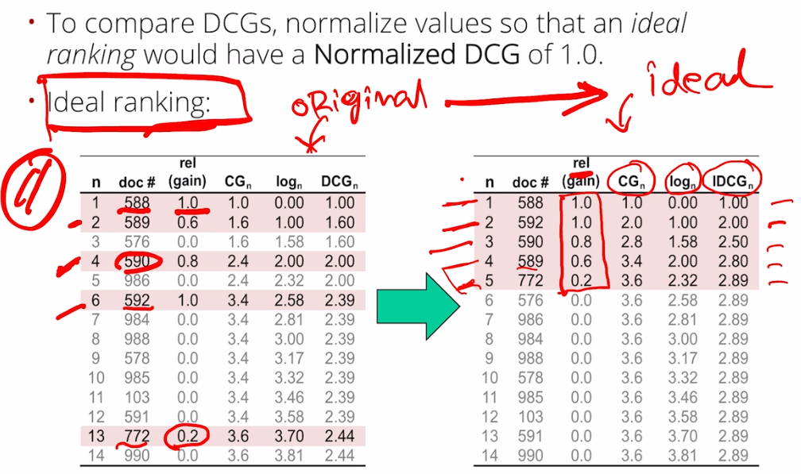
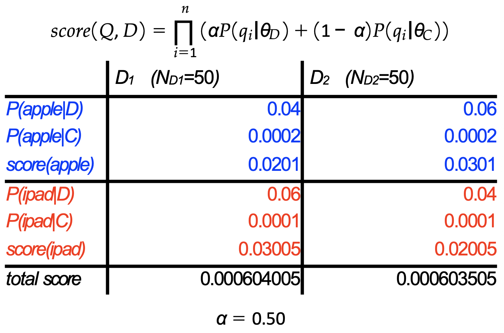

# Information Retrieval

* auto-gen TOC:
{:toc}

<script src="https://polyfill.io/v3/polyfill.min.js?features=es6"></script>
<script type="text/javascript" id="MathJax-script" async src="https://cdn.jsdelivr.net/npm/mathjax@3/es5/tex-chtml.js"></script>
<script>window.MathJax = {tex: {inlineMath: [['$', '$'], ['\\(', '\\)']]}};</script>


Instructor

- https://sporia.info/
- https://declare-lab.net/

Grade breakdown

- 20% Checkoff
- 20% Finals
- 60% Project

What is information retrieval

- Learn how to use machine learning and AI tools to mine your desired information from the web
- Not just web scraping
- Group projects in 3 people

All logarithms in this course is $\log_2$


## Information Retrieval task

Implementation of IR models

- Preprocessing - tokenisation, stop word removal, stemming
- Indexing - build an inverted index
- Retrieval - compute cosine similarity of a limited set of documents that contains at least one of the query words
- Ranking - sort the retrieved documents based on the value of cosine similarity


## Boolean IR (ok)

Objective of Boolean IR

- Information need: "Which plays by Shakespeare mention Brutus and Caesar, but not Calpurnia?"
- Boolean query: Brutus AND Caesar AND NOT Calpurnia
- Does not rank the query

Apporaches to Boolean IR

- Term-document incidence matrix
  - 1 if term exists in document, otherwise 0
  - The matrix is too large to store
  - The matrix is very sparse as well
  - Each document is a column, each index in a row
- Inverted index
  - Map each term to a posting list (linked list) of documents containing it
  - Assemble sequence of (token, docID) pairs
  - Sort by terms, then by docIDs
  - Retrieve the relevant posting list
  - Merge sort the posting list according to the query (AND/OR/NOT)
  - Consider the query processing order
    - Process the smallest query first

#### Appraisal of Boolean IR

Problems with Boolean IR

- Does not rank the results
- Require expertise and precise understanding of their needs the collection
- Boolean queries often result in too few or too many results
- Hard to tune precision and recall

<div style="page-break-after: always;"></div>

## Vector Space Model (ok)

Documents as vectors

- Each document are a point in $V$ dimensional space, though most entries are zero.
- Each vector is the TF-IDF of each term occuring in the document)


#### TF-IDF measure

Jaccard coefficient

- Overlap of two sets A and B
- **The size of intersection divided by the size of union**
- Size of intersection + Size of union = Size of A + Size of B
- Does not consider term frequency and document frequency

Term frequency

- Number of times the term $t$ appears in document $d$
- More frequent terms in a document are more important
- May be normalised over the frequency of the most frequent term (interpretation - each document should have at least a one)

Document frequency

- Rare terms are more information than frequent terms
- Number of times the term $t$ appears in all the documents (?)
- Logarithm to dampen the effect

TF-IDF

- term-frequency inverse document frequency
- $$w_{t,d} = \text{tf}_{t,d} \times \log_{10}(N / \text{df}_t)$$

Different situations (?)
- Technical vocabulary
- Varied vocabulary
- Short documents or queries
- Dynamic collections


#### Similarity mesaures between vectors

- Euclidean distance - lower more similar
- Manhattan distance - lower more similar
- Inner product - higher more similar
- Cosine similarity
  - Cosine angle between two vectors
  - The different lengths of the document is normalised
  - Known as normalised inner product
  - $\dfrac{\sum_i a_i b_i}{\sqrt{\sum_i a_i^2} \sqrt{\sum_i b_i^2}}$
- Do you need the vectors to be normalised?


#### Appraisal of Vector Space Model

Merits of Vector Space Model

- Simple, mathematically based approach
- Consider both local (tf) and global (idf) word occurance frequencies
- Provides partial matching and ranked results
- Allows efficient implementation for large document collections

Problems with Vector Space Model

-  (Because documents are treated documents as bag of words)
- Missing semantic information
- Missing syntactic information
- Assumption of term independence
- Lacks the control of a Boolean model (e.g. requiring a term to appear in a document)

<div style="page-break-after: always;"></div>

## Word Representations

Each word or token needs to be transformed into a vector. An embedding maps the token to the vector.

Embeddings are not transferable across spaces, the embeddings have meaning only in the space where they were learned. Word meaning also changes over time.

Two words are similar if they have similar word context. (e.g. you can the word means an alcoholic beverage like beer).


Types of Vector Representations

- Sparse vector representations
  - Vector space model (each document is a vector, a vector with TF-IDF of each term occuring in the document)
  - Mutual-information co-occurance matrices
  - Explict Semantic Analysis
- Dense vector representations
  - Singular value decomposition
  - Neural network models (skip-grams, CBOW)


#### Co-occurance matrices

- Matrix counts for each pair of words, the number of times the words occur together.
- Co-occurance can be defined as occuring in a paragraph, or in a window of $k$ words.
- The dimension of the matrix if $\vert V \vert \times \vert V \vert$.
- The shorter the windows, the more **syntactic** the representation
- The longer the windows, the more **semantic** the representation
- **Does not need to be symmetrical** - the number of words and contexts can be different


##### Positive Pointwise Mutual Information (PPMI)

- Raw word frequency is not a great measure of association between words (stop words occur very often but maybe not the most discriminative)
- Do words x and y co-occur more than if they were independent?
- Made positive bceause negative values are problematic (why and how often?)

$\text{PPMI}(\text{word}_1, \text{word}_2) = \max \left( \log_2 \dfrac{P(\text{word}_1, \text{word}_2)}{P(\text{word}_1)P(\text{word}_2)} , 0 \right)$

- Instead of count, we can use PPMI for the co-occurance matrix
- PPMI is biased towards infrequent events - very rare words have very high PMI values. We use Laplace smoothing - we add a small number (e.g. 2) each of the co-occurance count.


#### Explicit Semantic Analysis

- Determine the extent to which each word is associated with every concept (article) of Wikipedia via term frequency (or some other method). The dimension of the **concept vector** is the number of concepts (article).
- For a piece of text, take the element sum of word vectors over each word for a **composite text concept vector**.
- The texts are compared using a standard vector similarity measure. (Normalisation would happen here I guess)


#### Dense Vectors

- Short vectors may be easier to use as features in machine learning
- Short vectors may generalise better than storing explicit counts
- Dense vectors may do better at capturing synonymy (in sparse vectors, they may be represented in **"distinct dimensions"**)


##### Singular Value Decomposition

You can get dense vectors by applying SVD on sparse vectors (do people even do that in practice?)

$X = TSD$

The original size of the decomposed matrices. $m$ is the rank of the matrix

$(t \times d)$ = $(t \times m) \cdot (m \times m) \cdot (m \times d)$  

Dropping all except the first $k$ elements

$(t \times d)$ = $(t \times k) \cdot (k \times k) \cdot (k \times d)$  

It might be useful to get rid of the top 1 dimension or even the top 50 dimensions.


##### Vectors from Neural Networks

Skipgram and CBOW - refer to Deep Learning notes

- CBOW trains to predict the center word given surrounding words
- Skipgram trains to predict adjacent words given the center word
- Each have two trainnable embedding matrices.

Feature vectors from recurrent neural network, ELMo, Transformers

In project, we applied SVD to reduce the dimension of the vectors for faster query

Use FAISS for to quickly query the close vector from a preprocessed list of vectors.

<div style="page-break-after: always;"></div>

## Probabilistic IR

Basic probability

- Chain rule - $P(A,B) = P(B,A) = P(A \vert B)P(B)$
- Partition rule - $P(B) = P(A,B) + P(\bar{A}, B)$
  - Where $\bar{A}$ is the complement of $A$
- Bayes rule - $P(A \vert B) = \dfrac{P(B \vert A) P(A)}{P(B)}$
- Odds $O(A) = \dfrac{P(A)}{P(\bar{A})} = \dfrac{P(A)}{1-P(A)}$


Probability Ranking Principle

- If the retrieved documents are ranked decreasingly on their probability of relevance, then the effectiveness of the system will be the best that is obtainable.


#### Binary Independence Model

- Binary / Boolean
  - Each document $d$ is represented by a binary vector $x$, where $x_t = 1$ if the term $t$ occurs in $d$ and $x_t = 0$ otherwise
- Independence
  - Naive assumption that there is no association between terms

- Assumptions
  - The presence or absence of a word in a document is independent of the presence or absence of any other word
  - Relevance of individual documents are independent (not true as duplicate results are considered bad, consider Google Search) - but this applies to all the methods taught in IR
- Requires relevant and nonrelevant labels


##### Retrieval Status Value (RSV)

RSV of a document $d$ wrt to a query $q$

- $p_t$ is the probability of a term appearing in a relevant document
- $u_t$ is the probability of a term appearing in a nonrelevant document
- $RSV_d = \log \prod_\limits{t \in q} \dfrac{p_t(1-u_t)}{u_t(1-p_t)} = \sum_\limits{t \in q} \log\dfrac{p_t(1-u_t)}{u_t(1-p_t)} = \sum_\limits{t \in q} \log c_t$


Estimation of $p_t$ and $u_t$

Table | $R=1$ Document is relevant | $R=0$ Document is not relevant | Total 
-------------------------------------------------- | -------------------------- | ------------------------------ | ------------------------------ 
$x_t = 1$ <br />Term $t$ exist in document         | [a] | [b]                          | $\text{df}_t$        
$x_t = 0$<br />Term $t$ does not exist in document | [c]                  | [d] |  

$p_t = \dfrac{a}{a+c}$

$u_t = \dfrac{b}{b+d}$

$c_t = \dfrac{a/c}{b/d}$


##### Probability estimates in practice

- $\log \dfrac{1-u_t}{u_t} = \log \dfrac{N-\text{df}_t}{\text{df}_t} \approx \log \dfrac{N}{\text{df}_t} = \text{IDF}$
- We usually do not know the relevant documents
  - $p_t = 0.5$
  - We update $p_t$ with probabilistic relevance feedback


##### Probabilistic Relevance Feedback

Guess a preliminary probabilisitic description of R=1 documents, use it to retrieve a set of documents

Interact with the user to refine the description and learn some definite members

Re-estimate $p_i$ and $r_i$ on the baisis of this

- If $i$ appears in $V_i$ within the set of documents $p_i = |V_i|/|V|$
- $p_i^{(2)} = \dfrac{\vert V_i \vert + \kappa p_i^{(1)}}{\vert V \vert + \kappa}$
  - $\kappa$ is the weight on the prior
- Or can combine new information with original guess

Repeat, thus generating a succession of approximations to relevant documents


#### Okapi BM25

This is a nonbinary model
- a document is no longer represented as a binary vector
- to take into account of term frequency of the document


$RSV_d = \sum_\limits{t \in q} w_{t_{\text{BM25}}} \log \left( \dfrac{N}{\text{df}_t} \right)$

$w_{t_{\text{BM25}}} = \dfrac{(k_1 + 1) \cdot \text{tf}_{td}}{k_1 \left( 1-b + b \left( \dfrac{L_d}{L_{ave}} \right) \right) + \text{tf}_d} \cdot \dfrac{(k_3 + 1) \text{tf}_{tq}}{k_3 + \text{tf}_{tq}}$

- $\text{tf}_{td}$ - term $t$ frequency in document $d$
- $L_d$ ($L_{ave}$) - length of document $d$ (likewise average length in the whole collection)
- $k_1$ - tuning parameter controlling the document term frequency
- $b$ - tuning parameter controlling the scaling by document length

- $\text{tf}_{tq}$ - term $t$ frequency in query $q$
- $k_3$ tuning parameter controlling term frequency scaling of the query
- Length of query do not need to be normalised - because retrieval is being done with respect to a single fixed query

- Reasonable values - $1.2 \leq k_1, k_3 \leq 2$ and $b = 0.75$

##### Relevance Feedback (?)

Replace IDF term with something. TBC


<div style="page-break-after: always;"></div>

## Optimised Index Construction

Objective
- construct the index (posting list of termid to docids) from termid-docid pairs
- update the index


Hardware basics
- Access to data memory is much faster than access to data on disk
- The size of memory is limited, and the size of disk can be unlimited
- Transferring one large chunk of data from disk to memory is faster than transferring many small chunks
  - Seeking for the data takes time


#### Baseline algorithm

- Approach
  - Iterate through all the termid-docid **pairs** and populate the **posting index** (inverted index), and sort
    - You do not need to sort the posting list right? Just the terms? (?)
  
- Problems
  - Cannot sort 100M records on memory - not enough memory space
  - Cannot sort 100M records on disk - too many disk seeks

- Question
  - Why do we even need to sort the posting list when we construct the index?
  - Can't we store all the termid to address in one computer? 


#### Blocked Sort-based Indexing (BSBI) (?)

https://nlp.stanford.edu/IR-book/html/htmledition/blocked-sort-based-indexing-1.html

- Objective - sort 10 blocks of $N$=10M records
  - Not possible to quicksort everything because it will run out of memory
- Approach
  - Use the baseline algorithm in each block. Quicksort within each block $O(N \log N)$
  - Merge sort the blocks (read from the blocks simultaneously)
    - You will not exceed the memory at the final merge sort because you can load one blocksize from each sublist at a time
- Alternate implementation
  - Multiway merge sort
    - You may not be able to load that many blocks in memory at once
    - Not loading information in block may because excessive time spent due to disk seeks
- Issue
  - Assumed that we can keep the dictionary (term-termID) in memory (really?)


#### Single-pass In-memory Indexing (SPIMI) (???)

https://nlp.stanford.edu/IR-book/html/htmledition/single-pass-in-memory-indexing-1.html

- Key Idea

  - Generate separate dictionaries for each block - no need to maintain term-termID across blocks (really? This algorithm only operate on a single block)
  - Do not sort. Accumulate posting in posting lists as they occur
  - Objective: Generate a completed inverted index for each block

  

This procedure to create an inverted index

- For every term-docID in the block
  - If term is not in the dictionary, create a posting list and add the docID
  - If term is in the dictionary, add the docID
  - If the posting list is full, double the size of the posting list
- Sort the terms in the dictionary (to allow merging of blocks)
- Write the block to disk and process the next block

The complexity is linear (I do not need why for each block or the entire index)

Advantages of SPIMI

> It is faster because there is **no sorting required**, and it saves memory because we keep track of the term a postings list belongs to, so the termIDs of postings need not be stored. As a result, the blocks that individual calls of SPIMI-INVERT can process are much larger and the index construction process as a whole is more efficient.

> Because we do not know how large the postings list of a term will be when we first encounter it, we allocate space for a short postings list initially and double the space each time it is full (lines 8-9). This means that some memory is wasted, which counteracts the memory savings from the omission of termIDs in intermediate data structures. However, the **overall memory requirements** for the dynamically constructed index of a block in SPIMI are **still lower than** in BSBI - why?


#### Distributed Indexing (ok)

https://nlp.stanford.edu/IR-book/html/htmledition/distributed-indexing-1.html

- Objective
  - Very large scale
  - Individual machines are fault-prone
    - Given percentage uptime of each node and number of nodes, what percentage uptime of the system - take joint probability
- Approach
  - Maintain a master machine (that is considered safe) directing the indexing job.
  - **Parsers** write pairs from each document split to partitions (or **segment files**)
  - **Inverters** reads from partitions and populate the final posting list
- Improvements
  - For better load balancing, most search engines use a document-partition index rather than term partitioned index
- MapReduce
  - Template
    - `map: input -> list(k,v)`
    - `reduce: (k,(list,v)) -> output`
  - Application
    - `map: collection -> list(termid, docid)`
    - `reduce: (termid1, list(docid)) -> postings)`


#### Dynamic Indexing (???)

https://nlp.stanford.edu/IR-book/html/htmledition/dynamic-indexing-1.html

- Objective

  - Documents come in over time and need to be inserted
  - Documents are deleted and modified

##### Auxiliary and main index approach

- Approach
  - Maintain a big main index
  - New docs go into small auxiliary index (and indexed)
  - Search acorss both and merge results
  - Deletion - maintain invalidation bit vector and filter output
- **Complexity**
  - $T/n$ merges where $T$ is the number of postings and $n$ is the size of auxiliary
  - Index construction time $O(T^2/n)$ at the worst case a posting is touched $T/n$ times
  - Query processing is $O(1)$ - really?
- Issues
  - Merge performance is poor and you might need to do it frequently
    - Create a separate file for each postings list, but inefficient for OS

##### Logarithmic merge

- Assumption - The index is one big file (?)
- Approach
  - Keep smallest posting lists in memory
  - Keep larger lists on disk
  - Double the size of the list when it runs out of space
  - (Idea tradeoff between preprocessing time and query time, ideal when you need to alternate between indexing a new document and query)
- **Complexity**
  - Each posting is merged at most $O(\log(T/n))$ times
  - Query processing now requires the merging of $O(\log(T/n))$ indexes
- Issues
  - Complexity of query processing is no longer constant

Other methods

- Earlybird (postings sorted in reverse chronological order)
- Positional indexes
- n-gram indexes

<div style="page-break-after: always;"></div>

## Neural Network and Deep Learning

Evaluation Metrics

- Accuracy - problematic if there is class imbalance
- Precision - how many of the predicted positive are actually positive
- Recall / Sensitivity - how many of the fraction that are actually positive are predicted positive
- Weighted loss - weighted sum of false negative and true positive
- F-measure = $\dfrac{(\beta^2 + 1)PR}{\beta^2P + R}$
- ROC plots - true positive rate (recall) against false positive rate
- Root Mean Square Error
- Mean Absolute Error
- R-squared

Torch (the new stuff I learnt)

```
from torchtext.data.utils import get_tokenizer
```

```
from gensim.models import KeyedVectors
glove_50dim = api.load("glove-wiki-gigaword-50")
glove_50dim.save('glove_50dim.w2v')
```

<div style="page-break-after: always;"></div>

## Relevance Feedback (ok)

Procedure

- Present the initial results (with some query vector, e.g. tfidf?)
- Receive feedback from user
- Reformulate the query
- Produce new results
- Repeat

All these are query specific. If you want to make a different query, you will need to repeat the process.


#### Query Reformulation in VSM

In Vector Space Model, each document and query are represented with a vector of a same length. 

- Change query vector using vector algebra
- Add the vectors for the relevant documents to the query vector
- Subtract the vectors for the irrelevant documents from the query vector
- This both adds both positive and negatively weighted terms to the query **(query expansion)** as well as reweighting the initial terms **(term reweighting)**


##### Optimal Query

If you know the set of all relevant documents (not true), the best query that ranks all and only the relevant documents at the top

$\vec{q}_\text{opt} = \dfrac{1}{\vert C_r \vert} \sum\limits_{\text{relevant}} \vec{d}_j - \dfrac{1}{N-\vert C_r \vert} \sum\limits_{\text{irrelevant}} \vec{d}_j$

- $N$ is the total number of document
- $C_r$ is the relevant set of parameters
- $\vec{d}_j$ is document vector


##### Standard Rocchio Method

Since the relevant documents are unknown, just use the known relevant and irrelevant sets of document

$$\vec{q}_{m} = \alpha \vec{q} + \dfrac{\beta}{\vert D_r \vert} \sum\limits_{\text{relevant}} \vec{d}_j - \dfrac{\gamma}{\vert D_n \vert} \sum\limits_{\text{irrelevant}} \vec{d}_j$$

- $\vec{q}$ Is the original query
- $D_r$ and $D_n$ are the known relevant and irrelevant sets of documents
- Hyperparameters
  - $\alpha$ tunable weight for initial query
  - $\beta$ tunable weight for relevant documents
  - $\gamma$ tunable weight for irrelevant documents


##### Ide Regular Method

$$\vec{q}_{m} = \alpha \vec{q} + \beta \sum\limits_{\text{relevant}} \vec{d}_j - \gamma \sum\limits_{\text{irrelevant}} \vec{d}_j$$

- Do not normalise for the amount of feedback


##### Ide "Dec Hi" Method

$$\vec{q}_{m} = \alpha \vec{q} + \beta \sum\limits_{\text{relevant}} \vec{d}_j - \gamma \max_{\text{irrelevant}} \vec{d}_j$$

- Rejecting just the highest-ranked irrelevant document


Comparison between the methods

- Experimental results indicate no clear preference for any one of the specific methods.
- All methods generally improve performance with feedback
- Generally let tunable constants to be equal to 1
- Performance should only be tested on unrated documents


How to evaluate performance

- Do not evaluate on explictly marked documents (testing on training data)
- As relevant documents are removed from evaluation, recall/precision numbers may decrease from initial query - please consider relative performance between methods
  - Standardise feedback data? Since this is an interactive process


Addressing the lack of feedback

- Users are reluctant to provide explicit feedback
- Pseudo feedback - Just assume top $m$ retrieved documents are relevant, and use them to reformulate the query
- Use of implict relevance feedback (click-through data)


#### Query Expansion with a Thesaurus

For each term $t$, in a query, expand the query with synonyms and related words of $t$ from the thesaurus

- Added terms may be weighted less than original query terms
  - Generally increases recall
  - May significantly decrease precision
  - (doubt, because size of the returned set is constant)
- Dataset - WordNet Synset
  - Synonyms (same meaning)
  - Hyponyms (specialisation)
  - Hypernyms (generalisation)
- Statistical Thesaurus - Automatic Global Analysis
  - Association matrices (co-occurance) $c_{ij} = \sum_{d_k \in D} f_{ik} \times f_{ik}$
  - Normalised association matrix $s_{ij} = \dfrac{c_{ij}}{c_{ii} + c_{jj} - c_{ij}}$
    - To remove favouritism for more frequent terms
    - Normalised score is one if two terms have the same frequency
    - Expand the query with the highest value of $s_{ij}$ for each term in the query
  - Problem
    - "Apple computer" -> "Apple red fruit computer"
  - Refinement
    - Expand query with terms that are similar to all terms in the query (but time complexity is bad)
    - Use more sophisticated term weights (instead of just frequency)
- Statistical Thesaurus - Automatic Local Analysis
  - At query time, dynamically determine similar terms based on analysis of top-ranked retrieved documents (assume relevance)
  - Base correlation analysis only on the local set of retrieved documents for a specific query (???)
  - Finding the similar terms only within relevant documents, avoid ambiguity of individual terms (address "Apple computer")
- Comparison between global and local analysis
  - Global analysis is precomputation heavy (require correlation computation)
  - Local analysis is runtime heavy (need to analyse top documents at query time)
  - Local analysis gives better results

<div style="page-break-after: always;"></div>

## IR Evaluation (ok)

(Understanding achieve, but still need to memorise the various metrics)

Evaluation
- How fast does it index?
- How fast does it search?
- What is the (monetary) cost per query?
- What is the level of user happiness? - How do we measure it?
  - Who is the user that we want to make happy - users or advertisers, sellers or buyers?
  - Approximated by the relevance of search results

Resources needed to evaluate IR systems

- Document collection
- Queries
- Binary (or otherwise) assessments (on query results)
  - Some methods require knowledge of all the relevant documents, which may not be feasible in practice

What to keep constant when comparing IR systems

- Evaluated along the same measures
- Evaluated along the same collection of documents
- Evaluated on the same set of questions/query

#### Metrics

- Precision and Recall - on relevant and retrieved documents

  - Mnemonic
    - Recall - percentage "recalled"
    - Precision - percentage correct
  - Determining recall can be difficult because you do not know the ground truth of all relevant documents
    - Workaround - consider only a sample of the dataset
  - F measure $F1 = \dfrac{2PR}{P+R} = \dfrac{2}{\dfrac{1}{P} + \dfrac{1}{R}}$
    - For F measure to be high, both precision need to be high
  - Parametrized F measure $F_\beta = \dfrac{1+\beta^2}{\dfrac{\beta^2}{R} + \dfrac{1}{P}}$
  - Consider whether you task is precision critical (web search) or recall critical (patent search)

- 11-point Interpolated Precision-Recall Curve

  - For every true positive in the rank, consider the precision and recall values.
  - Plot the points on the precision value graph
    - (Precision is not necessarily decreasing - consider Rank 1 query is wrong)
    - The points will be evenly distributed along the x-axis
    - Plot the points on the graph and iterpolate left
  - Measure - the area under the precision-recall curve
    - Average of preicions at 0.0, 0.1, ... 0.9, 1.0
  - **Macro average (precision recall curve is calculated for each query)** and micro average (precision recall curve is calculated once)

- R-precision

  - The query has R relevant documents
  - The precision at the R-th position

- Precision@K and Recall@K

  - The precision/recall at the K-th position
  - Regardless of the number of the relevant documents

- Mean Average Precision

  - Compute the Precision@K for each of the ranks of the relevant document
  - If the document never gets retrieved, we assume that the precision corresponding to that relevant document to be zero
  - Take the average for one query
  - To evaluate the system - take average across queries (each query counts equally) - this is maco averaging?

- Mean Reciprocal Rank

  - Rank of the first relevant document
  - Could be the first clicked document

- Normalised Discounted Cumulative Gain (NDCG)

  - For non-binary relevance labels
  - Consider cumulative gain at each rank $n$
  - $\text{DCG}_p = rel_1 + \sum_{i=2}^p \dfrac{rel_1}{log_2 i}$

  

  - $\text{NDCG} = \dfrac{\text{DCG}_n}{\text{IDCG}_n}$

- Pairwise Relative Rating and Kendall-tau Distance

  - (Sometimes data only provide whether one document is better than the other)
  - Generate all pairs for each ranking
  - X is the number of agreement between rankings
  - Y is the number of disagreement
  - The distance is $\dfrac{X-Y}{X+Y}$


#### Implementation

- A/B testing
  - Randomly send 1-10% of incoming users to a variant of the system that includes a single change
- Mechanical Turk


Benchmarks

- SMART collection
- TREC Benchmark
  - https://en.wikipedia.org/wiki/Text_Retrieval_Conference#Tracks

<div style="page-break-after: always;"></div>

## Unigram Language Model (ok)

If you can predict the next word, you understand the language.

- Defines a probability distribution over individual words given a document
  - Unigram - the likelihood of each word independent of any other word
- Steps in Language Modelling
  - Estimation - Observing text and estimating probability of each word
  - Prediction - Using the language model to assign a probability to a span of text
- Other application
  - Could be used for topic modelling
    - Given the document (query), find the most likely topic(s)


#### Query-Likelihood Retrieval Model

- $P(q \vert D) = \Pi_t P(t \vert \theta_D)$
  - $D_1$ is more relevant that $D_2$ for query $q$ if $P(q \vert D_1) > P(q \vert D_2)$
  - $P(t \vert \theta_D) = \dfrac{\text{tf}_{t,D}}{N_D}$ is the term frequency for the unigram model
  - The sum of logarithm over each query term is computed to avoid underflow
- Analysis
  - The longer the query, the lower the probability but this is ok
  - If the query term does not exist in the document, the score is zero
  - IDF is not considered
- Objective of smoothing
  - Decrease the probability of observed outcomes because we tend to underestimate them
  - Increase the probability of unobserved outcomes because we tend to underestimate them
- Add one smoothing
  - Add one to numerator, add unique token count to denominator (if the unique token count is large, large documents will be favoured because the term frequency is no longer normalised by document size?)
  - Still does not consider IDF


#### Linear interpolation smoothing

- Why do this?
  - Capture IDF
  - Avoid zero probabilities
- $P(t \vert D) = \alpha P(t \vert \theta_D) + (1-\alpha) P(t \vert \theta_C)$
  - Consider the entire corpus as a document and compute $P(t|\theta_C)$ also
  - If $\alpha=0$, how do document score differ?
- $P(q \vert D) = \prod_\limits{t} P(t \vert \theta_D) \propto \dfrac{\alpha p_\text{MLE}(t \vert D)}{(1-\alpha) p_\text{MLE}(t \vert C)} + 1$
  - TF is the numerator, IDF as the denominator
  - Avoid zero probabilities and introduces IDF
    - (Please wrap your head around how this works)



- Extending the unigram model to bigrams
  - $P(t_{i-1}, t_i \vert D) = \alpha_1 \times P_1(t_1 \vert D) + \alpha_2 \times P_2(t_{i-1},t_i \vert D)$
  - Just consider each bigram as a term

<div style="page-break-after: always;"></div>

## Recurrent Neural Networks

RNN formulation

- Hidden state $h_t$, Output vector $y_t$
- $h_t = f_W(h_{t-1}, x_t) = \tanh(W_{hh}h_{t-1} + W_{xh}x_t)$
- $y_t = W_{hy}h_t$

Encoder and Decoder model in information retrieval

- Training
  - Require document-query pairs
  - Train the model to predict the next word of the query
  - $y_t$ is the logits (apply softmax to get probabilities)
  - What if the vocabulary size is large? (Hierarchical softmax? Word vectors?)
- Evaulation
  - Run the document through the RNN (encoder) for the hidden state
  - The encoder and decoder may or may not share weights
  - Use the hidden state and evaluate the likelihood of query
  - Objective - calculate probability of generating the query given a document
    - $P_\theta(Q \vert D) = \prod_\limits{q_i \in Q} P_\theta(q_i \vert D, q_{j<i})$
    - $\text{score}(Q \vert D) = \sum_\limits{q_i \in Q} \log P_\theta(q_i \vert D, q_{j<i})$
    - $\mathcal{L}_\text{NLL} = - \sum \log P_\theta (Q \vert D^+)$
      - Maximise probability of query given relevant documents
    - $\mathcal{L}_\text{Marg} = \sum_\limits{(Q, D^+, D^-) \in \mathcal{T}} \max\{ 0,b - \log P_\theta (Q \vert D^+) + \log P_\theta (Q \vert D^-) \}$
      - Uses both relevant and irrelevant documents
      - Hinge loss that penalise only when likelihood of relevant document is larger (?) than likelihood of irrelevant document by a certain amount $b$ (?)
- Possible apporach if there is no supervised data
  - Train a language model that predicts the next word. Use this model to estimate the probability of the query
  - However, this does not work. This is predicting the next word, not the query, therefore this approach does not work

<div style="page-break-after: always;"></div>

## Learning to Rank

#### Approaches based on training objective

This only affects how the model is trained

##### Pointwise approach

Predict the relevant score (by regression - MSE) of a document w.r.t. query or predict whether the document is relevant or not (by classification - cross-entropy)

##### Pairwise approach

Take two document, and try to predict which document is more relevant

- RankNet loss
  - $v_q = \text{NN}(q)$
  - $s_i = f(v_q, v_{d_i})$
  - $p_{ij} = p(s_i > s_j) = \dfrac{1}{1+e^{- \gamma (s_i - s_j)}}$
  - $\mathcal{L}_\text{RankNet} = -\log (p_{ij})$
  - Trains on pair of documents with one that is more relevant than the other - also trains on binary labels only if you pair relevant and nonrelevant document
  - Generalised loss - compute softmax over the full collection or randomly sampled negative documents
  - Inference - order the documents by $s_i$

##### Listwise approach

Directly optimise the ranking metric (e.g. NDCG) - difficult because the metrics are non differentiable

- LambdaNet / LambdaRank
  - $\lambda_\text{LambdaRank} = \lambda_\text{RankNet} \cdot |\Delta NDCG|$
  - It is desired that the gradient to be bigger to be bigger for pairs of documents that produces a bigger impact on NDCG
- Luce Model, ListNet loss, ListMLE loss (refer to slides) (?)


#### Training

Features available for training

- Query-independent feature (D) - incoming link count and document length
- Query-dependent feature (Q-D) - BM25
- Query-level feature (Q) - query length

##### Deep neural networks

- DNN for YouTube recommendation
  - Inputs include average of video embeddings, average of search tokens, geographic embedding, demographic embedding (age, gender)
  - At inference - search the nearest neighbour in the video vectors
- Siamese networks
  - Relevance estimated by cosine similarity between item embeddings
- Wide and deep model
- Lexical and semantic matching networks
- Large scale pretrained language models
- Neural ranking models with multiple document fields

##### Turning a unsupervised problem to a supervised one

- You will need
  - The documents to search from
  - Sample queries (you do not need labels)
- Run BM25 using the queries
  - Set a threshold $t$ and to create pseudo-labels
- Use the pseudo-labels to train an LTR model

<div style="page-break-after: always;"></div>

## Image Retrieval

Challenges

- How to represent visual content of images
  - What are visual contents
  - Which type of visual content should be used?
- How to retrieve efficiently
  - Should avoid visiting the entire database at query

Methods

- Color histogram
- Texture histogram - local binary pattern - check if pixel value is larger compared to 8 neighbours and store it as a 8-bit number
- Gridded color
- Shape distances - projection matching - encoding based on column and row sum
- Bag of visual words
  - Interesting point detection - Local points - image patterns that different from their immediate neighbourhood
  - Should be robust to various geometric transformations
  - SIFT descriptor
    - Issue - computationally expensive because required linear scan and individual computations
- Bag of textures
- Image embedding

Efficient image retrieval strategies

- Objective - avoid linear scan of the database

- Preproessing

  - Store distances from database images to keys

- Query

  - Compute distance from Q to each key
  - Obtain lower bounds on distances to database images (triangle inequality)
  - Threshold or return all images in the order of lower bounds

  

<div style="page-break-after: always;"></div>

## Question Answering

Factoid QA needs information extraction followed by ranking

Non-factoid QA needs filtering and summarisation as well

Challenges

- Understand the query
- Translating into sequence of token useful for retrieval
- Retrieve appropriate units of text
- Filter, rank and/or combine units into an answer
- Summarise the answer
- Visualise the answer
- Different types of question need different treatments


Baseline approaches

- Do standard IR (what is the document here?)
- Find exact match of query and return the next sentence on the webpage

#### Modern QA approaches

There is also a hybrid based system by IBM Watson

##### IR-based QA

Question Processing

- Query formulation
  - Search for question directly
  - Query expansion
  - Query reformulation
  - Apply a keyword extraction model (?)
- Answer Type Detection - what is it asking for
  - Rule based - "who" and patterns
  - Machine learning inputs - words, POS tags, wordnet synsets, question headword

Passage Retrieval

- Find relevant documents (use an IR system)
- Find the passage in the document that contains the answer
  - Break document into passages/paragraphs
  - Filter passages
    - Machine learning inputs - number of entities in correct answer type, number of question keywords, longest exact sequence of words, n-gram overlap, rank of document from IR system, promxity of query keywords to one another in the passage
- Answer processing
  - Rule-based - pattern extraction
    - Find and return instances of answer types (e.g. person)
    - Use predefinted patterns to search passage (e.g. x such as y)
    - Consider n-grams that appear in many top-ranked passages
  - Machine learning inputs - novelty (answers should not be found in the question), punctuation, correct answer type, distance between query keywords and answer, appositive

- Use IR to find relevant text document
- Extract answer from the relevant documents

#####  Knowledge-based QA
- Convert question into a query for a structured database
- Heavily relies on a rich knowledge base


<div style="page-break-after: always;"></div>

## Guest Lecture

#### Microsoft Research India

- Project ELLORA: Enabling Low Resource Language Speakers
- Project LITMUS: Linguistically Informed Training & Testing of Multiliingual Systems
- Neuro-symbolic Reasoning and Computational Pragmatics
- Project Melange: NLP for multilingual systems

Code-mixing, scripting-mixing and transliteration (romanization)
- How to build systems for all languages of the world?
- How to build systems that can bridge the gap between languages?

Challenges on working with code-mixed data
- No large text corpora for code-mixing, which is a largely a spoken phenomeon
- Model explosion - with $n$ language, there are $O(n^2)$ language pairs
- Reusing models - how to exploit monolingual models and data for code mixing

On how people code-mix (and implications on code-mixed data generation)
- There is grammar on how we code-mix
- For Hindi-English tweets - English is used far more for positive sentiment
- People are making Bing queries in mixed script

Approaches to mixed script information retrieval
- Canonical indexing
  - Neat approach but the world is messy
- Query expansion
  - Reverse transliteration in the query
  - Phoentic word embeddings (phoetically similar words have similar vectors)

Computational Models of Code-Switching
- Supervised - annotated code-mixed data - treating code-mixed language as another language - not scalable
- Divide & Conquer - run through a language detector which separate into fragments - but treating the text as a bag of words without context
- Combining Monolingual Models - run the text through both models as well as a language detector and feed the output into a combination model
- Zero-shot learning -  massively multilingual pretrained language model (RoBERTa or mBERT) - train the model with many languages as well as code-mixed data  - (what is zero-shot hypothesis?)


#### Information Retrieval in Paypal

- Use of RAKE to extract keyword for senttence 
- Extraction of the post relevant paragraphs
- SQuAD re-ranker

Use case of Information Retrieval

- Sanction screening
  - "Prince of Persia - Sand of Time" - search Wikipedia and know that is has nothing to do Iran
  - Using open knowledge for learning
  - Labels from agents

- Conversation search
  - (Difference between utterances and queries)
  - Users want concise answers rather than the entire page
  - Labels from community kudos

